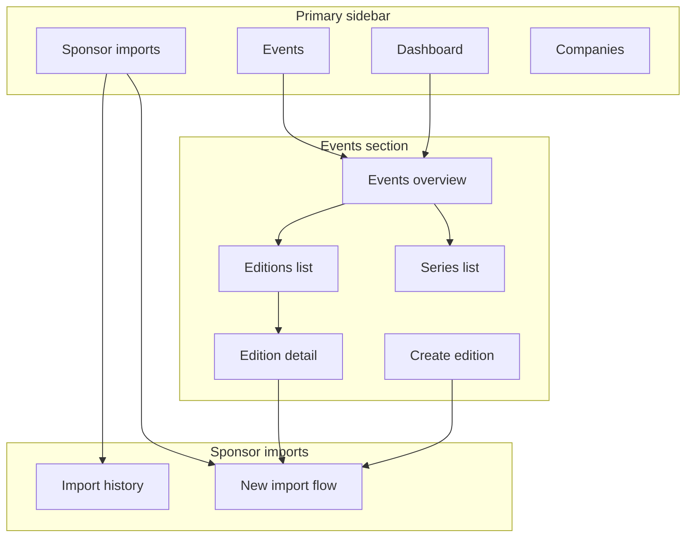
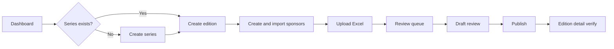

# EventPixels — Admin Information Architecture

**Status:** Approved for review before implementation  
**Version:** v1  
**Last updated:** 2026-06-03  

Complete admin IA for day-to-day operations. Synthesizes [Event Admin Workflow](./event-admin-workflow.md), sponsor import workflow, and approved database/migration design.

No implementation code.

---

## 1. Design principles

| Principle | Meaning for admins |
|-----------|------------------|
| **Edition-centric** | Most work lands on an Event Edition — profile, sponsors, imports |
| **Import is the heavy lift** | Navigation optimizes for create edition → import → publish |
| **Resume over restart** | In-progress imports surface everywhere (dashboard, edition, imports list) |
| **Warnings, not walls** | Missing dates/city never blocks; incomplete work is visible, not hidden |
| **Global discoverability** | Search finds editions, series, companies, imports from anywhere |
| **Admin-only v1** | Only `profiles.role = admin` accesses `/admin`; no Editor/staff behavior in v1 |

---

## 2. Admin navigation structure

### 2.1 Top-level nav (primary sidebar)

| Order | Label | Route | Purpose |
|-------|-------|-------|---------|
| 1 | **Dashboard** | `/admin` | Work queue + at-a-glance ops |
| 2 | **Events** | `/admin/events` | Series + editions hub |
| 3 | **Sponsor imports** | `/admin/sponsor-imports` | Import list + new import |
| 4 | **Companies** | `/admin/companies` | Global company directory |
| 5 | **View site** | `/` (new tab) | Marketing site; external link icon |

**v1.1+ (placeholder, not in nav yet):** Users, Settings, Audit log

### 2.2 Events sub-nav (secondary, within Events section)

| Label | Route |
|-------|-------|
| Overview | `/admin/events` |
| Editions | `/admin/events/editions` |
| Series | `/admin/events/series` |
| Create edition | `/admin/events/editions/new` |

### 2.3 Contextual sub-nav (edition detail only)

When viewing `/admin/events/editions/[id]`:

| Tab | Content |
|-----|---------|
| **Profile** | Edition fields |
| **Live sponsors** | `event_sponsors` read-only |
| **Imports** | Batches for this edition |

### 2.4 Sponsor import sub-nav (in-flow stepper)

Visible during active import (not global sidebar):

`Upload` → `Validation` → `Review` → `Draft` → `Publish`

Plus persistent **Batch context bar**: edition · file · status · Save & exit · Discard

### 2.5 Global chrome (all admin pages)

| Element | Position | Behavior |
|---------|----------|----------|
| **Admin search** | Top bar, center-left | Cross-entity search (§5) |
| **Admin identity** | Top bar, right | Email + role badge |
| **Back to site** | Top bar / footer | Marketing home |
| **Breadcrumbs** | Below top bar | `Admin → Section → …` |

### 2.6 Navigation map



---

## 3. Screen inventory

### 3.1 Dashboard (1)

| ID | Screen | Route |
|----|--------|-------|
| A-01 | Admin dashboard | `/admin` |

### 3.2 Events — Series (4)

| ID | Screen | Route |
|----|--------|-------|
| E-S01 | Events overview | `/admin/events` |
| E-S02 | Series list | `/admin/events/series` |
| E-S03 | Create series | `/admin/events/series/new` |
| E-S04 | Series detail / edit | `/admin/events/series/[id]` |

### 3.3 Events — Editions (4)

| ID | Screen | Route |
|----|--------|-------|
| E-E01 | Editions list | `/admin/events/editions` |
| E-E02 | Create edition | `/admin/events/editions/new` |
| E-E03 | Edition detail / edit | `/admin/events/editions/[id]` |
| E-E04 | Slug change confirm | Modal on E-E03 |

### 3.4 Sponsor imports (14)

| ID | Screen | Route / type |
|----|--------|--------------|
| I-01 | Import history hub | `/admin/sponsor-imports` |
| I-02 | Select edition | `/admin/sponsor-imports/new` (step 1) |
| I-03 | Upload file | step 2 |
| I-04 | Column mapping | step 3 |
| I-05 | Validation results | step 4 |
| I-06 | Matching progress | overlay |
| I-07 | Review queue | step 5 |
| I-08 | Import to draft progress | overlay |
| I-09 | Draft review | step 6 |
| I-10 | Pre-publish checklist | step 7 |
| I-11 | Publish progress | overlay |
| I-12 | Publish success | step 8 |
| I-13 | Import batch detail | `/admin/sponsor-imports/[batchId]` |
| I-14 | Discard import modal | Modal |

### 3.5 Companies (4)

| ID | Screen | Route |
|----|--------|-------|
| C-01 | Companies list | `/admin/companies` |
| C-02 | Create company | `/admin/companies/new` |
| C-03 | Company detail / edit | `/admin/companies/[id]` |
| C-04 | Merge duplicates | v1.1 placeholder |

### 3.6 Cross-cutting (3)

| ID | Screen | Type |
|----|--------|------|
| X-01 | Admin search results | `/admin/search?q=` |
| X-02 | Unauthorized | Redirect |
| X-03 | Empty / error states | Inline |

**Total v1 screens: 30** (24 full pages + 4 modals/overlays + 2 cross-cutting)

---

## 4. Screen hierarchy

```
/admin
├── Dashboard (A-01)
├── /events
│   ├── Overview (E-S01)
│   ├── /series
│   │   ├── List (E-S02)
│   │   ├── /new (E-S03)
│   │   └── /[id] (E-S04)
│   └── /editions
│       ├── List (E-E01)
│       ├── /new (E-E02) ──primary──► Sponsor import (pre-filled)
│       └── /[id] (E-E03)
│           ├── Tab: Profile
│           ├── Tab: Live sponsors
│           └── Tab: Imports
├── /sponsor-imports
│   ├── List (I-01)
│   ├── /new (I-02 … I-12 flow)
│   └── /[batchId] (I-13)
├── /companies
│   ├── List (C-01)
│   ├── /new (C-02)
│   └── /[id] (C-03)
└── /search (X-01)
```

**Depth rule:** Max 3 clicks from dashboard to any actionable screen. Import flow is deeper but linear (stepper).

---

## 5. Primary user journeys

### Journey 1 — New event end-to-end (most common)

**Actor:** Admin · **Frequency:** Weekly



| Step | Screen | Key action |
|------|--------|------------|
| 1 | Dashboard or Events | Start |
| 2 | Create series (if needed) | Save series |
| 3 | Create edition | **Create & import sponsors** |
| 4 | Upload → mapping → validation | Fix errors |
| 5 | Review queue | Accept domain matches; resolve conflicts |
| 6 | Draft review | Confirm diff vs live |
| 7 | Pre-publish → Publish | Acknowledge additive |
| 8 | Edition detail | Verify live sponsor count |

**Time expectation:** 30–90 min for 200–500 sponsors (mostly review).

---

### Journey 2 — Resume in-progress import

**Actor:** Admin · **Trigger:** Dashboard widget or edition imports tab

| Entry | Destination |
|-------|-------------|
| Dashboard “Resume imports” | Last step by batch `status` |
| Edition detail → Resume | Same |
| Import history → Resume | Same |

| Batch status | Resume screen |
|--------------|---------------|
| `uploaded` | Column mapping or upload |
| `review` | Validation or review queue |
| `draft` | Draft review |

---

### Journey 3 — Add sponsors to existing edition (second import)

**Actor:** Admin · **Precondition:** No active draft on edition

1. Edition detail → **Import sponsors**
2. Upload new Excel → review → draft → publish (additive)
3. Live sponsors not in file unchanged

---

### Journey 4 — Historical backfill

**Actor:** Admin · **Notes:** Dates/city often missing

1. Create series (if needed)
2. Create edition — skip dates/city; heed warnings
3. **Create & import sponsors** immediately
4. Optionally return to edition profile later

---

### Journey 5 — Fix edition metadata

**Actor:** Admin

1. Admin search → edition
2. Edition detail → Profile tab
3. Edit website, dates, city, name
4. Slug change → warning modal
5. Save — no import required

---

### Journey 6 — Company maintenance (outside import)

**Actor:** Admin

1. Companies list → search duplicate
2. Company detail → edit website, logo, description
3. Or Create company (rare — import usually creates companies)

---

### Journey 7 — Discard bad import

**Actor:** Admin · **Entry:** Any in-progress import screen

1. Discard import (modal)
2. Confirm — draft links removed; companies kept
3. Edition detail → start fresh import

---

### Journey 8 — Morning check-in (daily ops)

**Actor:** Admin · **Duration:** 2–5 min

1. Open Dashboard
2. Scan: imports in progress · editions needing profile · recent publishes
3. Click through to resume or fix

---

## 6. Global search requirements

### 6.1 Scope

Single admin search bar queries:

| Entity | Fields searched | Result links to |
|--------|-----------------|-----------------|
| **Event editions** | name, slug, year, series name | Edition detail |
| **Event series** | name, slug | Series detail |
| **Companies** | name, slug, domain | Company detail |
| **Sponsor imports** | filename, edition name | Import batch detail |

**v1.1:** Organizers, keywords

### 6.2 Behavior

| Behavior | Spec |
|----------|------|
| Trigger | Top bar; `⌘K` / `Ctrl+K` shortcut |
| Min chars | 2 |
| Results limit | 10 per entity type; “View all” → full search page |
| Grouping | Editions · Series · Companies · Imports |
| Highlight | Match substring in name/slug |
| Empty | Suggested actions: Create edition, New import |

### 6.3 Search result row format

| Type | Primary | Secondary |
|------|---------|-----------|
| Edition | Name (year) | Series · slug · N live sponsors |
| Series | Name | N editions |
| Company | Name | domain · N events sponsored |
| Import | Filename | Edition · status · date |

### 6.4 Full search page (`/admin/search`)

- Query param `q`
- Tabbed or filtered results by entity
- Same filters as respective list pages (narrowed by search)

---

## 7. Filters and bulk actions

### 7.1 Editions list (E-E01)

**Filters**

| Filter | Options |
|--------|---------|
| Series | Multi-select |
| Year | Range / select |
| City | Multi-select |
| Import status | None · In progress · Published · Discarded |
| Live sponsors | Zero · Has sponsors |
| Profile completeness | Missing website · missing dates · missing city |
| Search | Name, slug |

**Row actions**

View · Import sponsors · Resume import

**Bulk actions (v1)**

None — editions created individually.

**Bulk actions (v1.1)**

Export edition list CSV

---

### 7.2 Series list (E-S02)

**Filters:** Search name/slug · has editions · no editions

**Bulk actions:** None v1

---

### 7.3 Import history (I-01)

**Filters**

| Filter | Options |
|--------|---------|
| Status | uploaded · review · draft · published · discarded |
| Edition | Search/select |
| Date | Created · published range |
| Uploaded by | Admin user |

**Row actions**

Resume · View · Download report

**Bulk actions:** None v1 (imports are discrete jobs)

---

### 7.4 Review queue (I-07)

**Filters**

| Filter | Options |
|--------|---------|
| Row status | needs_review · auto_ready · resolved · excluded |
| Match type | Domain · name · create new · conflict · already on edition |
| Tier | Integer rank |
| Confidence | High · medium · low |
| Duplicate | Duplicate rows only |
| Search | Company name, domain |

**Bulk actions**

| Action | Effect |
|--------|--------|
| **Accept all exact domain matches** | auto_ready → resolved |
| **Exclude selected** | → excluded |
| **Set tier for selected** | Update mapped_tier_rank |

---

### 7.5 Draft review (I-09)

**Filters:** Change type (new · tier updated · unchanged) · tier · excluded from publish · missing website · search

**Bulk actions**

| Action | Effect |
|--------|--------|
| **Exclude selected from publish** | `excluded_from_publish = true` |
| **Set tier for selected** | Update draft link tier |

---

### 7.6 Companies list (C-01)

**Filters**

| Filter | Options |
|--------|---------|
| Search | Name, domain, slug |
| Sponsored events | Has sponsors · none |
| Created via import | v1.1 (row traceability) |
| Missing data | No website · no logo |

**Row actions**

View · Edit

**Bulk actions (v1.1)**

Export · merge duplicates

---

### 7.7 Live sponsors tab (edition detail)

**Filters:** Tier · search company name

**Bulk actions (v1)**

None — live edits are post-publish manual or via re-import tier update.

**v1.1:** Unlink sponsor from edition (admin tool; additive policy aware)

---

## 8. Dashboard widgets

### 8.1 Layout (A-01)

```
┌─────────────────────────────────────────────────────────────┐
│  Admin Dashboard                                             │
├──────────────────────────┬──────────────────────────────────┤
│  WORK QUEUE (primary)    │  QUICK ACTIONS                    │
│  · Imports in progress   │  · Create edition                 │
│  · Editions need profile │  · New sponsor import             │
│  · Drafts ready publish  │  · Create company                 │
├──────────────────────────┴──────────────────────────────────┤
│  RECENT ACTIVITY (audit timeline)                            │
├──────────────────────────┬──────────────────────────────────┤
│  EDITIONS OVERVIEW       │  IMPORT STATS (30 days)           │
│  · By import status      │  · Published batches              │
│  · Missing metadata      │  · Sponsors added                 │
└──────────────────────────┴──────────────────────────────────┘
```

### 8.2 Widget catalog

| Widget | Data source | Click action |
|--------|-------------|--------------|
| **Imports in progress** | Batches `status` ∈ uploaded, review, draft | Resume import |
| **Ready to publish** | Batches `status = draft` + review acknowledged optional | Draft review |
| **Editions missing website** | Editions null website | Edition profile |
| **Editions missing dates/city** | Null dates or city | Edition profile |
| **Active draft per edition** | Partial unique batches | Edition detail |
| **Recent publishes** | Batches `published` last 7d | Import detail |
| **Recent activity** | `sponsor_import_admin_action_logs` + batch events | Import/ edition detail |
| **Quick: Create edition** | — | E-E02 |
| **Quick: New import** | — | I-02 (edition select) |

### 8.3 Work queue priority order

1. Imports in `review` with unresolved rows (blocking)
2. Imports in `draft` not yet published
3. Imports in `uploaded` / early `review` (stalled)
4. Editions with zero sponsors but website present (research ready)
5. Profile warnings (missing metadata)

### 8.4 Empty dashboard

First-time admin: hero CTA **Create your first event edition** with numbered steps (series → edition → import).

---

## 9. Permissions (v1 — admin only)

### 9.1 Access rule

| Role | `profiles.role` | Admin area (`/admin`) |
|------|-----------------|------------------------|
| **Admin** | `admin` | **Full access** — all screens and actions |
| **Member** | `member` | **No access** — redirect to marketing site |
| **Staff** | `staff` | **No access in v1** — treated same as member for admin routes |

**v1 implementation:**

- Gate all `/admin` routes with existing `isAdminRole` (`role === 'admin'` only).
- Do **not** implement Editor/staff role checks, conditional nav, or permission matrices in v1.
- Do **not** add role-based UI hiding beyond the layout gate.

### 9.2 Admin capabilities (v1)

All authenticated admin users can perform every v1 operation:

| Area | View | Create | Edit | Discard | Publish |
|------|------|--------|------|---------|---------|
| Dashboard | ✓ | — | — | — | — |
| Event series | ✓ | ✓ | ✓ | — | — |
| Event editions | ✓ | ✓ | ✓ | — | — |
| Sponsor imports | ✓ | ✓ | ✓ | Discard batch | Publish sponsors |
| Companies | ✓ | ✓ | ✓ | — | — |
| Live sponsors | ✓ | — | via import | — | via import |
| Admin search | ✓ | — | — | — | — |

Deletion of series, editions, or companies is **out of scope for v1** (no delete UI).

### 9.3 Audit attribution

All write actions record the acting admin’s `profiles.id`:

- Edition create/edit (`created_by` where applicable)
- Import upload, bulk accept, publish, discard
- Row `decision_by`
- `sponsor_import_admin_action_logs.actor_id`

### 9.4 Deferred to v1.1+

- **Editor / staff operational roles** — subset permissions, publish policy
- **User management** — assign roles
- **Role-based nav** — hide sections by permission
- **Admin-only publish toggle**

---

## 10. Day-to-day operating model

### Typical team personas (operational, not system roles)

| Persona | Primary screens | Frequency |
|---------|-----------------|-----------|
| **Research lead** | Excel prep (offline) | Per event |
| **Import operator** | Create edition, import flow, review | Weekly |
| **Publisher** | Draft review, pre-publish, publish | After each import |
| **Curator** | Edition profile, companies list, search | Ongoing |

In v1 a single **admin account** may perform all personas; there is no separate Editor login.

### Admin weekly rhythm

| Day | Activity |
|-----|----------|
| Mon | Dashboard check; resume any stalled imports |
| Mid-week | New edition + import batch from researcher Excel |
| Thu | Review queue / bulk domain accept |
| Fri | Publish drafts; fix edition metadata warnings |

---

## 11. IA ↔ route migration from today

| Today | v1 target |
|-------|-----------|
| `/admin` cards only | Dashboard widgets |
| `/admin/events/new` | `/admin/events/editions/new` |
| No series admin | `/admin/events/series/*` |
| No import UI | `/admin/sponsor-imports/*` |
| `/admin/companies/new` only | `/admin/companies` list + new + detail |
| 3 flat nav items | 5 primary nav + Events sub-nav |

---

## 12. Implementation alignment

v1 delivery follows the five-phase [Implementation Roadmap](./implementation-roadmap.md):

1. Events admin  
2. Sponsor import migration  
3. Sponsor import API  
4. Sponsor import UI  
5. QA and test plan  

Admin IA screens ship across phases 1, 4, and 5 — not by role, but by dependency order. Permissions remain **admin-only** throughout; no Editor/staff work in any v1 phase.

### Screen delivery by roadmap phase

| Roadmap phase | Admin IA screens delivered |
|---------------|----------------------------|
| **1 — Events admin** | Nav shell, dashboard (basic), series CRUD, editions list/create/detail, companies list/detail, slug modal |
| **2 — Migration** | *(no UI)* |
| **3 — Import API** | *(no UI)* |
| **4 — Import UI** | Import history, full import flow, edition import tab, batch detail, discard modal |
| **5 — QA** | Dashboard widgets (full), admin search + ⌘K, live sponsors tab, polish |

### Explicitly deferred past v1

- Editor / staff permissions
- User management
- Series/edition/company delete
- Bulk live sponsor unlink

---

## 13. Document history

| Date | Change |
|------|--------|
| 2026-06-03 | Initial admin IA from approved workflows |
| 2026-06-03 | v1 permissions simplified: admin-only; roadmap alignment |

---

## 14. Related documents

| Document | Path |
|----------|------|
| Implementation roadmap | [implementation-roadmap.md](./implementation-roadmap.md) |
| Event admin workflow | [event-admin-workflow.md](./event-admin-workflow.md) |
| Sponsor import DB design | [sponsor-import-database-design.md](./sponsor-import-database-design.md) |
| Sponsor import migrations | [sponsor-import-migration-design.md](./sponsor-import-migration-design.md) |
