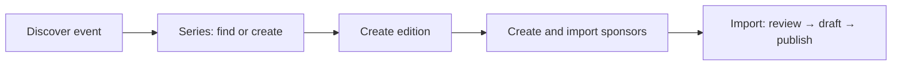
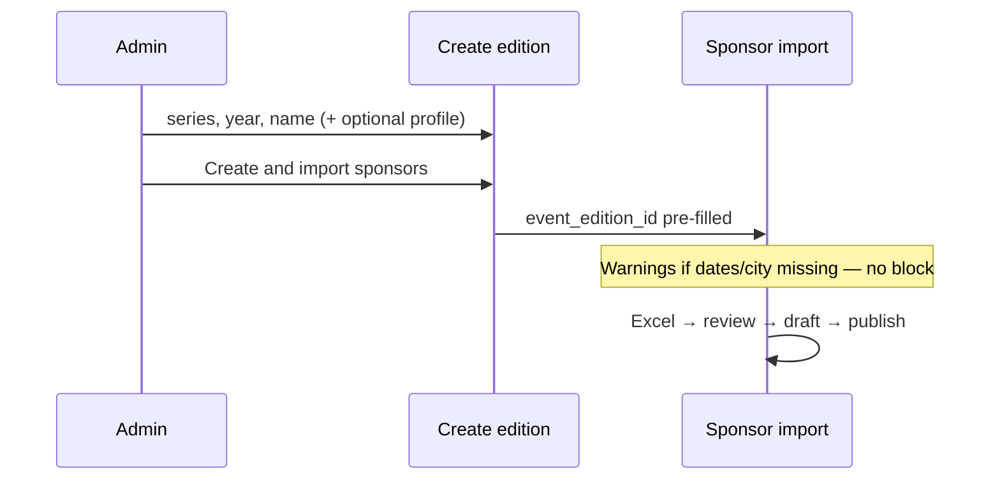

# EventPixels — Event Series & Edition Admin Workflow

**Status:** Approved  
**Version:** v1  
**Last updated:** 2026-07-04 (Organizer UX amendment)  

Admin workflow for creating and managing **Event Series** and **Event Editions** before sponsor import. Complements [Sponsor Import — Database Design](./sponsor-import-database-design.md).

No SQL or implementation code — operational workflow and UX only.

---

## 1. Operational sequence



| Step | Action |
|------|--------|
| 1 | Discover a new event (research) |
| 2 | Create or identify the **Event Series** |
| 3 | Create the **Event Edition** |
| 4 | Populate edition profile (website, dates, city recommended) |
| 5 | **Create & Import Sponsors** (primary path) |
| 6–8 | Sponsor import: review → draft → publish |

---

## 2. Locked business decisions

| # | Decision | v1 behavior |
|---|----------|-------------|
| 1 | **Series immutable** | `series_id` cannot change after edition is created |
| 2 | **Year immutable** | `year` cannot change after edition is created |
| 3 | **Slug editable** | Admins may edit `slug` with strong warnings (URL / sponsor links) |
| 4 | **Website highly recommended** | Prompt at creation; warning if empty; not a hard block |
| 5 | **Dates + city strategically important** | Drive future filtering and discovery |
| 6 | **Import without dates/city** | **Allowed** — especially for historical events |
| 7 | **Missing dates/city** | **Warnings only**, never hard blocks for save or sponsor import |
| 8 | **Create & Import Sponsors** | **Primary CTA** after edition creation |
| 9 | **Multiple editions per series + year** | **Allowed** — e.g. TOKEN2049 Singapore 2026 and TOKEN2049 Dubai 2026 |
| 10 | **Edition identity** | Globally unique `slug` (hard); `series_id + year + city_id` is **admin warning only** |
| 11 | **No `UNIQUE(series_id, year)`** | Removed — one series/year can have many occurrences |

### Edition uniqueness model

| Layer | Rule |
|-------|------|
| **Database (hard)** | `UNIQUE(slug)` on `event_editions` |
| **Database (removed)** | ~~`UNIQUE(series_id, year)`~~ — blocks multi-city years |
| **Admin (soft)** | Warn when sibling editions share `series_id + year` |
| **Admin (soft)** | Stronger warn when `series_id + year + city_id` all match and city is set |
| **Missing city** | No tuple uniqueness; rely on distinct `name` + `slug` + sibling warnings |

**Slug auto-generation:** `slugify(name)`; append `year` only if the slug does not already end with that year (admins may include the year in the edition name). Selected city is not added to the auto-slug.

**Series logo (manual-only):** Event logos are manual-only. On create, only website URL is shown — no logo is fetched automatically. On edit, paste a Logo URL to download and store in Supabase, or clear the field and save to remove the logo. There is no Logo.dev, Brandfetch, Clearbit, og:image, or favicon auto-fetch for events.

### Sponsor import prerequisites

| Requirement | Rule |
|-------------|------|
| Event Edition must exist | **Hard gate** — `event_edition_id` required |
| Edition before import | **Always** — no inline edition creation inside import (v1) |
| Series before edition | **Always** — edition must belong to a series |
| Website / dates / city | **Not required** for sponsor import |

---

## 3. Admin information architecture

```
Admin
├── Dashboard
├── Events
│   ├── Event Series
│   │   ├── List
│   │   ├── Create
│   │   └── Detail / edit
│   └── Event Editions
│       ├── List
│       ├── Create  →  primary: Create & Import Sponsors
│       └── Detail / edit  →  sponsor import hub
├── Sponsor imports
└── Companies
```

**Handoff point:** Edition create success and Edition detail both route to sponsor import with `event_edition_id` pre-filled.

---

## 4. Event Series

### 4.1 Create Event Series

**Route concept:** `/admin/events/series/new`

#### Required fields

| Field | Validation |
|-------|------------|
| **Name** | Non-empty; unique (`event_series.name`) |
| **Slug** | Auto from name; unique (`event_series.slug`); URL-safe |

#### Optional fields

`description`, `website_url`, `logo_url`, keywords (`event_series_keyword`)

#### Buttons

| Button | Action |
|--------|--------|
| **Create series** | Save → offer **Create edition for this series** |
| **Cancel** | → Series list |

#### Duplicate UX

On name entry, suggest existing similar series before creating a duplicate.

---

### 4.2 Edit Event Series

**Route concept:** `/admin/events/series/[id]`

- Editable: name, slug, description, website, logo, keywords
- Lists child editions with sponsor/import status
- **Create edition** CTA (series pre-selected)

---

## 5. Event Edition

### 5.1 Field tiers

| Field | Create | After create | Import gate | Notes |
|-------|--------|--------------|-------------|-------|
| **series_id** | Required | **Immutable** | — | Locked after save |
| **year** | Required | **Immutable** | — | Locked after save |
| **name** | Required | Editable | — | |
| **slug** | Required (auto) | **Editable + warnings** | — | See §5.4 |
| **website_url** | **Highly recommended** | Editable | Warning if empty | Not blocking |
| **start_date** | Optional | Editable | Warning if empty | Discovery / filters |
| **end_date** | Optional | Editable | Warning if empty | `start ≤ end` if both set |
| **city_id** | Optional | Editable | Warning if empty | Discovery / filters |

---

### 5.2 Create Event Edition

**Route concept:** `/admin/events/editions/new`

#### Form sections

**Identity (required)**

- Event series (select; link to create series if empty)
- Year
- Edition name
- Slug preview (editable via advanced control)

**Event details (recommended)**

- Website URL — *Highly recommended. Researchers use this to collect sponsors.*
- Start date / End date — *Important for discovery and filtering.*
- City — *Important for discovery and filtering.*

**Warnings (inline, non-blocking)**

| Condition | Message |
|-----------|---------|
| No website | *Website is strongly recommended for sponsor research.* |
| No start or end date | *Dates help users find this event. Historical editions may omit dates.* |
| No city | *City improves event discovery and filtering.* |
| Sibling editions (series + year) | *Other editions exist for this series in {year}.* Lists siblings with links; save still allowed |
| Same series + year + city | *An edition already exists for this series, year, and city.* Link to existing; save still allowed |
| No city but siblings exist | *Add city or include location in name/slug to disambiguate.* |

#### Validation rules

| Rule | Severity |
|------|----------|
| `series_id` required | Error |
| `year` integer required | Error |
| `name` non-empty | Error |
| `slug` globally unique | **Error** (only hard uniqueness rule) |
| `start_date ≤ end_date` | Error (when both set) |
| Invalid URL format | Error (when URL provided) |
| Missing website | **Warning** |
| Missing dates | **Warning** |
| Missing city | **Warning** |
| Sibling editions (same series + year) | **Warning** |
| Same series + year + city | **Warning** |

#### Buttons

| Button | Priority | Action |
|--------|----------|--------|
| **Create & import sponsors** | **Primary** | Save edition → redirect to sponsor import with edition pre-selected |
| **Create edition only** | Secondary | Save → edition detail |
| **Cancel** | — | → Editions list |

#### Success state (after Create & import sponsors)

Skip intermediate success page; land directly on sponsor import **Upload** step with edition context bar populated.

#### Success state (after Create edition only)

Edition detail with prominent **Import sponsors** CTA.

---

### 5.3 Edit Event Edition

**Route concept:** `/admin/events/editions/[id]`

#### Edition detail tabs

| Tab | Purpose |
|-----|---------|
| **Profile** | Edition fields, venue picker, **Organizers** section (edition metadata), research metadata |
| **Live sponsors** | Live roster (`event_sponsors`) — add, edit tier, reorder, remove |
| **Imports** | Sponsor import batches for this edition |

Organizer curation lives on **Profile** — same metadata class as venue, website, city, and dates. Company detail shows read-only **Organizer roles** (links to edition Profile). See [Phase — Organizer v1 Scope](./phase-organizer-scope.md) and [Organizer UX Amendment](./phase-organizer-ux-amendment-scope.md).

#### Profile — Organizers section

| Affordance | Behavior |
|------------|----------|
| List | Companies linked as organizers with `role_label` and order |
| Add | Company search picker; default role **Organizer** |
| Edit role | Drawer; max 80 chars |
| Reorder | Move Up / Down (no last-reviewed bump) |
| Remove | Confirm modal — company not deleted |

#### Immutable fields (read-only UI)

| Field | Display |
|-------|---------|
| Event series | Name + link; no change control |
| Year | Read-only |

Copy: *Series and year cannot be changed. Create a new edition for a different occurrence (city, year, or series).*

#### Editable fields

`name`, `slug` (with warnings), `website_url`, `start_date`, `end_date`, `city_id`, `venue_id`, **Last reviewed**, **Primary source**

#### Research metadata — Last reviewed automation

| Rule | Behavior |
|------|----------|
| **Create edition** | `last_reviewed_at` is always `NULL`. Filling website, dates, city, or venue on create does **not** count as review. |
| **Save profile** | Changing name, slug, dates, website, city, or venue sets **Last reviewed** to the current server time automatically. |
| **Manual backfill** | Saving **only** Last reviewed and/or Primary source preserves the submitted values (no extra auto-bump). |
| **Live sponsors** | Add, remove, or tier rank/label edit on the Live sponsors tab auto-updates **Last reviewed**. |
| **Organizers** | Add, remove, or role-label edit in the Profile **Organizers** section auto-updates **Last reviewed**. |
| **Reorder / move** | Same-tier Move Up/Down on Live sponsors or Profile organizers does **not** auto-update **Last reviewed**. |
| **Import publish** | Publishing a draft batch auto-updates **Last reviewed** when live sponsor rows are inserted, tier-updated, or tier-label synced. Draft-only steps do not. |

Copy for researchers: *Last reviewed advances automatically when you save meaningful profile changes, edit the live sponsor roster or organizer list, or publish an import. Creation alone does not count as review. Set the date manually only when backfilling historical research.*

See [Phase — Edition Last Reviewed Automation](./phase-edition-last-reviewed-automation-scope.md).

#### Header

Edition name · Year · Series · Slug · Live sponsor count · Import status badge

#### Sponsor import panel

| State | CTA |
|-------|-----|
| No active import | **Import sponsors** |
| Active import | **Resume import** + status |
| Published import, no active draft | **Import sponsors** (new batch) |

#### Warnings panel (persistent until resolved)

Show non-blocking warnings for missing website, dates, or city — same copy as create form.

#### Buttons

| Button | Action |
|--------|--------|
| **Save profile** | Update editable fields |
| **Import sponsors** / **Resume import** | → Sponsor import |
| **View public event** | Marketing URL |
| **View sponsor search** | `/sponsors?event={slug}` |

---

### 5.4 Slug edit warnings

When admin edits `slug`:

**Modal content:**

- *Changing the slug breaks existing links to this event.*
- *Sponsor search URLs using `?event={slug}` will change.*
- *Bookmarks and external references may fail.*

**Required acknowledgment:** checkbox before save.

**Show:**

- Old slug → New slug
- Affected URL previews

---

## 6. Linking editions to sponsor import

### Hard rules

| Rule | Behavior |
|------|----------|
| `event_edition_id` required | Every `sponsor_import_batches` row references an edition |
| Edition immutable on batch | Cannot change edition mid-import |
| One active batch per edition | Block second import; offer resume/discard |
| No edition in import flow | Block; redirect to create edition |

### Entry points

| From | Pre-filled edition |
|------|-------------------|
| **Create & import sponsors** | Yes — primary path |
| Edition detail → Import sponsors | Yes |
| Editions list → Import | Yes |
| Sponsor imports → New | No — edition select required |

### Import UI context bar

Always show: Series · Edition name · Year · **Edit edition** link · Import status

### Import without dates/city

**Allowed.** Edition detail and import flow may show informational warnings but **do not** block upload, review, draft, or publish.

---

## 7. Empty and error states

### No series exists

Create edition form: *Create an event series first* → `/admin/events/series/new`

### No editions exist (sponsor import)

*No event editions yet. Create an edition to import sponsors.*

- **Create event edition** (primary)

### Import with no edition selected

**Continue** disabled until edition selected.

### Active draft on edition

*This edition has an unpublished sponsor import.*

- **Resume import**
- **Discard import**

---

## 8. Screen inventory (v1)

| Screen | Purpose |
|--------|---------|
| Events hub | Navigate series / editions |
| Series list | Find series |
| Create / edit series | Series CRUD |
| Editions list | Index + import status |
| Create edition | **Create & import sponsors** primary |
| Edition detail | Profile (incl. Organizers) · Live sponsors · Imports |
| Sponsor import (existing) | Upload → publish |

---

## 9. Relationship to sponsor import workflow



Full import screens: see sponsor import admin UI specification (upload through import history).

---

## 10. v1 implementation notes (non-schema)

| Area | Guidance |
|------|----------|
| Edition create API | Accept minimum required fields; do not require dates/city for save |
| Existing strict API | Align validation with warnings-not-blocks policy for optional fields |
| Primary button | **Create & import sponsors** on create form |
| Immutable UI | Disable series/year on edit; server should reject changes |
| Slug change | Client warning modal; server allows update with uniqueness check |

---

## 11. Document history

| Date | Change |
|------|--------|
| 2026-06-03 | Initial approved workflow |
| 2026-06-03 | Locked immutability, slug, warnings, Create & Import Sponsors |
| 2026-07-04 | Edition detail tabs (Organizers); last-reviewed rules for organizer writes |
| 2026-07-04 | Organizer UX amendment: Profile embed; public Organizers tab documented in organizer design |

---

## 12. Decision reference

| Topic | Value |
|-------|-------|
| Series after create | Immutable on edition |
| Year after create | Immutable |
| Slug | Editable with warnings |
| Website | Highly recommended; warning if missing |
| Dates, city | Strategically important; warnings only |
| Sponsor import without dates/city | Allowed |
| Primary post-create CTA | **Create & import sponsors** |
| Edition required for import | Yes |
| Inline edition create in import | No (v1) |
