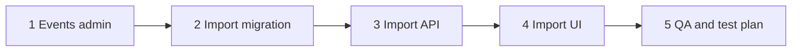

# EventPixels — Implementation Roadmap v1 (Historical)

**Status:** Historical — superseded as the project-wide roadmap
**Version:** v1
**Last updated:** 2026-07-24
**Canonical project-wide roadmap:** [implementation-roadmap.md](./implementation-roadmap.md)

This document preserves the original **Events Admin + Sponsor Import** five-phase delivery plan. It is **not** the project-wide implementation roadmap. Use it for v1 phase history, exit criteria, and residual Phase 5 items only.

Phased delivery plan for admin operations: events setup → sponsor import → QA.

**Permissions:** Admin-only for all phases. Only `profiles.role = admin` accesses `/admin`. No Editor/staff behavior in v1.

No code in this document — scope, dependencies, deliverables, and exit criteria per phase.

---

## Overview



| Phase | Name | Primary output |
|-------|------|----------------|
| 1 | Events admin ✅ | Series + edition + companies admin UI and APIs |
| 2 | Sponsor import migration ✅ | Database schema live in Supabase |
| 3 | Sponsor import API ✅ | Service-role import lifecycle endpoints |
| 4 | Sponsor import UI ✅ | Full Excel import admin experience |
| 5 | QA and test plan | Verified, merge-ready v1 |

**Critical path:** 1 → 2 → 3 → 4 → 5 (strict order for import; phase 1 companies list can parallelize within phase 1).

---

## Cross-cutting constraints (all phases)

| Constraint | Rule |
|------------|------|
| Auth | `isAdminRole` only; layout gate on `/admin` |
| Writes | Service role for import tables; admin API routes for mutations |
| Public site | No changes to marketing queries for import tables |
| Edition before import | `event_edition_id` required for any batch |
| Docs | [event-admin-workflow.md](./event-admin-workflow.md), [sponsor-import-database-design.md](./sponsor-import-database-design.md), [admin-information-architecture.md](./admin-information-architecture.md) |

---

## Phase 1 — Events admin ✅ Complete

### Goal

Admins can create and manage Event Series and Event Editions, maintain companies, and reach **Create & import sponsors** — before import schema exists, the CTA may route to a placeholder or disabled state until phase 4.

### Dependencies

- Existing: `event_series`, `event_editions`, `companies`, `profiles`, `cities`
- Existing: `/admin` layout gate, partial `/admin/events/new`, `/admin/companies/new`

### Deliverables

#### 1.1 Admin shell and navigation

| Item | Detail |
|------|--------|
| Primary nav | Dashboard, Events, Sponsor imports (stub), Companies, View site |
| Events sub-nav | Overview, Editions, Series, Create edition |
| Breadcrumbs | Section-aware |
| Route migration | `/admin/events/new` → `/admin/events/editions/new` (redirect old URL) |

#### 1.2 Dashboard (basic)

| Item | Detail |
|------|--------|
| Quick actions | Create edition, Create company |
| Stub widgets | “Sponsor imports — coming in phase 4” or empty |
| Links | Events overview, editions list |

*Full work-queue widgets ship in phase 5 after import data exists.*

#### 1.3 Event Series

| Screen | Route |
|--------|-------|
| Series list | `/admin/events/series` |
| Create series | `/admin/events/series/new` |
| Series detail / edit | `/admin/events/series/[id]` |

**API:** POST/PATCH series (admin auth, service role or authenticated admin client per project pattern).

**Fields:** name, slug (auto), description, website_url (create); logo_url editable on edit only (manual paste — event logos are manual-only).

#### 1.4 Event Editions

| Screen | Route |
|--------|-------|
| Events overview | `/admin/events` |
| Editions list | `/admin/events/editions` |
| Create edition | `/admin/events/editions/new` |
| Edition detail | `/admin/events/editions/[id]` |

**API changes:**

- Align POST/PATCH validation with [event-admin-workflow.md](./event-admin-workflow.md): minimum create = series + year + name; website/dates/city **warnings not blocks**.
- PATCH: reject `series_id` and `year` changes; allow slug with uniqueness check.
- GET edition detail: live sponsor count, import status placeholder.

**Primary CTA:** **Create & import sponsors** → `/admin/sponsor-imports/new?editionId=` (stub until phase 4).

**Edition detail tabs:**

- Profile (v1)
- Live sponsors (read-only list from `event_sponsors`)
- Imports (stub table until phase 4)

#### 1.5 Companies

| Screen | Route |
|--------|-------|
| Companies list | `/admin/companies` |
| Create company | `/admin/companies/new` (enhance existing) |
| Company detail / edit | `/admin/companies/[id]` |

**Company rules (locked):** website required on create/edit; slug editable with warnings (slug change modal).

**Edition uniqueness (locked):** multiple editions per `series_id + year` allowed; `UNIQUE(slug)` is the hard rule; `series + year + city` is admin-warning only. Migrations: `20260604120000_…` + fix `20260609120000_event_editions_drop_series_year_unique_fix.sql` (drops live constraint `events_series_id_year_key`; not part of sponsor import Phase 2).

#### 1.6 Shared utilities

| Utility | Purpose |
|---------|---------|
| Domain normalizer | Shared module (used by import API in phase 3) |
| Slug helper | Edition + series slug generation |
| City/series loaders | Existing patterns (`getSeriesOptions`, `getCityOptions`) |

### Exit criteria (phase 1)

- [x] Admin nav matches IA (import link is stub)
- [x] Series CRUD works end-to-end
- [x] Edition create with **Create & import sponsors** saves edition and redirects with `editionId`
- [x] Edition edit: series/year read-only; slug editable with warning modal
- [x] Warnings shown for missing website/dates/city; save succeeds
- [x] Editions list with filters (missing website, dates, city)
- [x] Companies list + detail + create (website required; slug editable with warnings)
- [x] Live sponsors tab + imports stub tab on edition detail
- [x] Sponsor imports hub + post-create handoff stubs (no functional import)
- [x] Non-admin users cannot access `/admin`
- [x] `npm run build` passes

### Out of scope (phase 1)

- Sponsor import tables or UI (beyond stub)
- Admin global search (phase 5)
- Delete series/edition/company
- Editor/staff roles

---

## Phase 2 — Sponsor import migration ✅ Complete

### Goal

Apply approved schema to Supabase: 4 import tables + live sponsor uniqueness + RLS.

### Dependencies

- Phase 1 not strictly required for DDL, but apply to **staging/local first**, then production before phase 3 deploy.
- [sponsor-import-migration-design.md](./sponsor-import-migration-design.md) phases A–J.

### Deliverables

| # | Deliverable |
|---|-------------|
| 2.1 | Pre-flight verification (duplicate live sponsors — confirmed clean) |
| 2.2 | Single migration file: enums, 4 tables, FKs (rows ↔ draft_links order), indexes |
| 2.3 | `UNIQUE (event_editions_id, company_id)` on `event_sponsors` |
| 2.4 | Partial unique: one active batch per edition |
| 2.5 | RLS enabled on all `sponsor_import_*`; no anon/authenticated policies |
| 2.6 | REVOKE client grants on import tables |
| 2.7 | Post-migration verification checklist V1–V8 |

### Exit criteria (phase 2)

- [x] Migration applies cleanly on target environment
- [x] All four import tables queryable via service role
- [x] Anon/authenticated cannot SELECT import tables
- [x] Duplicate live sponsor INSERT fails (constraint smoke test)
- [x] Second active batch same edition fails (partial unique smoke test)
- [x] No regression on existing `event_sponsors` reads (14 rows intact)
- [x] Migration recorded in `supabase/migrations/`

### Out of scope (phase 2)

- Application code
- Storage bucket for Excel files (phase 3/4)

---

## Phase 3 — Sponsor import API ✅ Complete

### Goal

Server-side admin API implementing full batch lifecycle: upload metadata → validate → match → review decisions → draft → publish → discard.

### Dependencies

- Phase 2 migration applied
- Phase 1 edition APIs (edition must exist)
- Supabase Storage bucket for source files (create in this phase if missing)

### Deliverables

#### 3.1 Core modules (server)

| Module | Responsibility |
|--------|----------------|
| `normalizeDomain` | Shared URL/domain normalization |
| `parseSpreadsheet` | xlsx/csv → row DTOs |
| `validateRows` | Blocking/warning issues, integer tier, duplicate cluster keys |
| `matchRows` | Exact domain → `auto_ready`; else `needs_review` |
| `materializeDraft` | Create/reuse companies; upsert draft links |
| `publishDraft` | Additive upsert to `event_sponsors` |
| `discardBatch` | Delete draft links; batch → discarded |

#### 3.2 API routes (admin auth + service role writes)

| Endpoint group | Operations |
|----------------|------------|
| **Batches** | Create (upload), get, list by edition, discard |
| **Batch lifecycle** | Save column mapping, run validation, run matching |
| **Rows** | List (paginated, filtered), get, patch decision, bulk accept domain |
| **Draft** | Import-to-draft, list draft links, patch draft link tier/exclude |
| **Publish** | Acknowledge review, publish |
| **Reports** | Outcome CSV export |
| **Action log** | Append on bulk/lifecycle events |

#### 3.3 Batch status transitions (enforced in API)

```
uploaded → review → draft → published
uploaded | review | draft → discarded
```

#### 3.4 Guards (API-level)

| Guard | Enforcement |
|-------|-------------|
| One active batch per edition | DB partial unique + 409 response |
| Import-to-draft | No `needs_review`, no pending duplicates, no blocking validation |
| Publish | `status = draft`, `review_acknowledged_at` set |
| Additive publish | Upsert live links only |
| Admin only | 401/403 non-admin |

#### 3.5 Storage

| Item | Detail |
|------|--------|
| Bucket | Private admin-only bucket for source files |
| Path convention | `{batchId}/{originalFilename}` |
| Batch columns | `source_file_storage_path`, checksum, format, sheet, row count |

### Exit criteria (phase 3)

- [x] Integration tests or manual script: happy path upload → publish
- [x] Domain auto-accept sets `auto_ready`; name-only sets `needs_review`
- [x] Additive publish: existing live sponsors not in file remain
- [x] Discard: draft links gone; companies remain
- [x] Duplicate in-file blocks import-to-draft until resolved
- [x] `event_sponsors` uniqueness enforced on publish
- [x] Action log entries on upload, bulk accept, import-to-draft, publish, discard
- [x] All routes reject non-admin
- [x] `npm run build` passes

### Out of scope (phase 3)

- Admin UI (phase 4)
- Apollo enrichment
- Async job queue (synchronous processing acceptable v1 for hundreds of rows; document timeout limits)

---

## Phase 4 — Sponsor import UI ✅ Complete

### Goal

Full admin UI for Excel-first sponsor import per [admin-information-architecture.md](./admin-information-architecture.md) import screens.

### Dependencies

- Phase 1: edition create/detail, nav, **Create & import sponsors** deep link
- Phase 2: schema live
- Phase 3: all API routes

### Deliverables

#### 4.1 Import entry points

| Entry | Behavior |
|-------|----------|
| Nav → Sponsor imports | History hub |
| **Create & import sponsors** | Skip edition select; edition pre-filled |
| Edition detail → Import | Pre-filled |
| Edition imports tab | List batches + resume |

#### 4.2 Import flow screens

| Step | Screen |
|------|--------|
| 1 | Edition select (if no `editionId`) |
| 2 | Upload + template download |
| 3 | Column mapping |
| 4 | Validation results + duplicate resolution |
| 5 | Matching progress (overlay) |
| 6 | Review queue + row drawer + bulk accept |
| 7 | Import to draft progress |
| 8 | Draft review + diff vs live |
| 9 | Pre-publish checklist |
| 10 | Publish progress + success |
| — | Discard modal |
| — | Batch detail / history |

#### 4.3 UX requirements

| Requirement | Detail |
|-------------|--------|
| Batch context bar | Edition, file, status, Save & exit, Discard |
| Stepper | Upload → Validation → Review → Draft → Publish |
| Pagination | Review queue 50 rows/page |
| Sticky footer | Resolved / needs review counts; Import to draft CTA |
| Warnings | Edition missing dates/city in context bar — non-blocking |
| Resume | Route by batch `status` per IA |
| Active draft block | Edition select + edition detail |

#### 4.4 Dashboard upgrade (minimal)

| Widget | Detail |
|--------|--------|
| Imports in progress | List with Resume links |
| Replace stub | Sponsor imports nav fully active |

*Remaining dashboard widgets → phase 5.*

#### 4.5 Edition detail — Imports tab (live)

- Batch list filtered by `event_edition_id`
- Resume / view / download report

### Exit criteria (phase 4)

- [x] End-to-end UI: upload Excel → publish → live sponsors visible on edition tab
- [x] **Create & import sponsors** path works without edition re-select
- [x] Resume from history and dashboard
- [x] Bulk accept exact domain matches
- [x] Duplicate-in-file resolution blocks progress until done
- [x] Additive publish copy on checklist
- [x] Discard flow with company retention message
- [x] One active draft per edition enforced in UI
- [x] Save & exit preserves batch state
- [x] `npm run build` passes

### Out of scope (phase 4)

- Global admin search (phase 5)
- Full dashboard widgets
- Editor roles

---

## Phase 5 — QA and test plan

### Goal

Systematic verification, regression safety, and production readiness for v1 admin + sponsor import.

### Dependencies

- Phases 1–4 complete

### Deliverables

#### 5.1 Test plan document (checklists)

| Area | Coverage |
|------|----------|
| Auth | Admin access; member/staff denied `/admin` |
| Events | Series create; edition create/edit immutability; slug warning; warnings-only fields |
| Import happy path | 50+ row Excel; domain auto-accept; publish |
| Import edge cases | Duplicates, conflicts, exclude, additive, tier update |
| Discard | Draft gone; companies remain |
| Concurrency | Second batch same edition blocked |
| Public regression | Event page, sponsor search unchanged for non-imported edition |
| RLS | Import tables not readable by anon client |

#### 5.2 Dashboard (full)

| Widget | Ship |
|--------|------|
| Work queue | Imports in progress, ready to publish, profile warnings |
| Recent activity | Action log timeline |
| Recent publishes | Last 7 days |
| Import stats | 30-day counts |

#### 5.3 Admin global search

| Item | Detail |
|------|--------|
| Top bar search | Editions, series, companies, imports |
| ⌘K shortcut | Open search palette |
| Full results page | `/admin/search?q=` |

#### 5.4 Live sponsors tab polish

- Tier filter, search, link to company admin

#### 5.5 Performance checks

| Scenario | Target |
|----------|--------|
| 500 row import | Validation + match < 30s (document actual) |
| Review queue pagination | Smooth scroll/filter |
| Publish | Single transaction; no partial live state |

#### 5.6 Manual QA scripts

| Script | Steps |
|--------|-------|
| QA-01 | New event E2E (series → edition → import → publish) |
| QA-02 | Resume interrupted import |
| QA-03 | Historical edition (no dates/city) import |
| QA-04 | Second additive import same edition |
| QA-05 | Discard and re-import |
| QA-06 | Member login cannot reach admin |

#### 5.7 Sign-off checklist

- [ ] All phase 1–4 exit criteria met
- [ ] QA scripts passed on staging
- [ ] Production migration applied
- [ ] Smoke test on production (create test edition or use staging data policy)
- [ ] Docs updated with any implementation deviations

### Exit criteria (phase 5)

- [ ] QA sign-off recorded
- [ ] No P0/P1 open bugs
- [ ] Build + deploy pipeline green
- [ ] v1 ready for production use

### Out of scope (phase 5)

- Editor/staff roles
- Automated E2E test suite (optional stretch; manual scripts required minimum)
- Apollo enrichment

---

## Timeline suggestion (not binding)

| Phase | Relative effort |
|-------|-----------------|
| 1 — Events admin | Medium |
| 2 — Migration | Small |
| 3 — Import API | Large |
| 4 — Import UI | Large |
| 5 — QA | Medium |

Phases 3 and 4 are the bulk of work. Phase 1 unblocks realistic testing with real editions.

---

## Risk register (implementation)

| Risk | Phase | Mitigation |
|------|-------|------------|
| API validation mismatch with workflow doc | 1 | Align edition POST/PATCH in phase 1 |
| Long-running import timeout | 3 | Batch row limits; progress polling |
| 500-row UI sluggish | 4 | Pagination; virtualized table stretch |
| Storage bucket missing | 3 | Create before upload API |
| `staff` users expect admin | 1 | Document admin-only; no staff UI hints |

---

## Document history

| Date | Change |
|------|--------|
| 2026-06-03 | Initial v1 roadmap; admin-only permissions |
| 2026-07-24 | Marked Phases 2–4 (Sponsor Import migration / API / UI) ✅ Complete to match shipped implementation; Phase 5 unchanged |
| 2026-07-24 | Reclassified as historical v1 (Events Admin + Sponsor Import). Project-wide canonical index moved to [implementation-roadmap.md](./implementation-roadmap.md) (`ROAD-002`) |

---

## Related documents

| Document | Path |
|----------|------|
| Canonical implementation roadmap (index) | [implementation-roadmap.md](./implementation-roadmap.md) |
| Admin IA | [admin-information-architecture.md](./admin-information-architecture.md) |
| Event admin workflow | [event-admin-workflow.md](./event-admin-workflow.md) |
| Sponsor import DB | [sponsor-import-database-design.md](./sponsor-import-database-design.md) |
| Sponsor import migration | [sponsor-import-migration-design.md](./sponsor-import-migration-design.md) |
