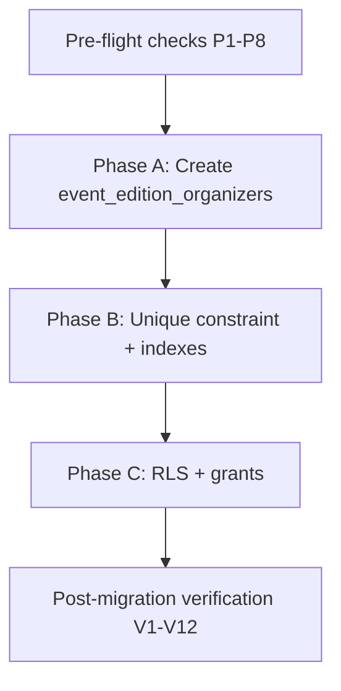
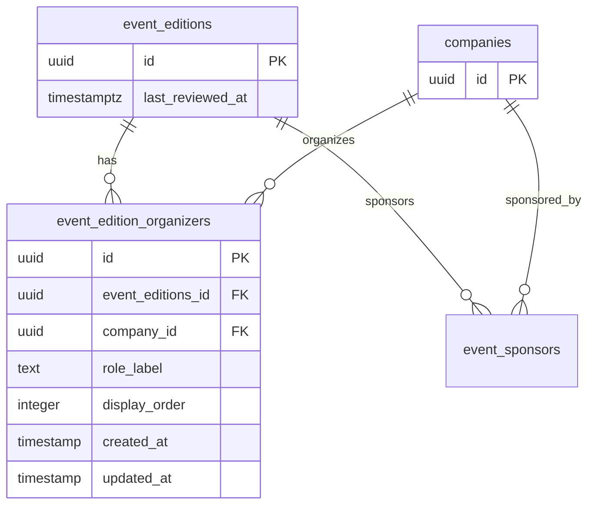
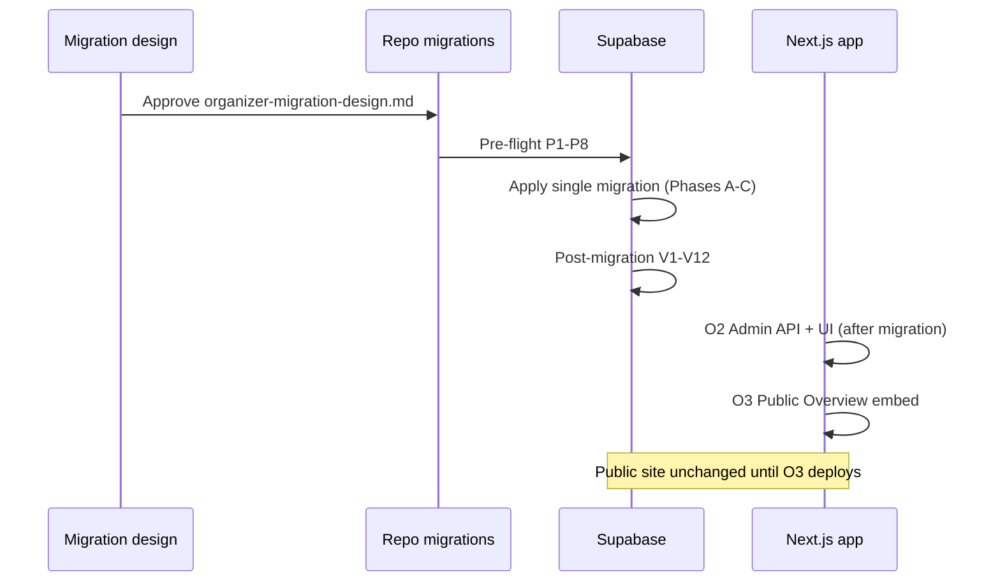

# EventPixels Organizer — Migration Design Document

**Status:** Applied  
**Version:** v1  
**Last updated:** 2026-07-04  
**Prerequisites:** [Organizer Design](./organizer-design.md) (approved), [Phase — Organizer v1 Scope](./phase-organizer-scope.md) (approved)

This document defines the **migration plan, ordering, dependencies, constraints, RLS, verification, and rollout strategy** for Organizer v1. It does **not** contain SQL, implementation tasks, or application code.

For entity boundaries and product rules, see [organizer-design.md](./organizer-design.md). For application deliverables, see [phase-organizer-scope.md](./phase-organizer-scope.md).

---

## 1. Migration goals

| Goal | Success criteria |
|------|------------------|
| Add edition↔company organizer links | `event_edition_organizers` table with approved v1 columns |
| Reuse companies as organizer entity | FK `company_id` → `companies.id`; **no** `organizers` table |
| Enforce one link per company per edition | `UNIQUE (event_editions_id, company_id)` |
| Public read for Event Detail Overview | RLS: anon/authenticated `SELECT` on **all** organizer rows (no tier gate) |
| Protect parent catalog rows | `ON DELETE RESTRICT` on edition and company FKs |
| Zero automatic data mutation | No backfill; table empty after apply |
| Safe production rollout | Pre-flight checks pass; public site unaffected until app deploy (O3) |
| Enable company merge extension | Schema supports repointing `company_id` (application change in O2, not this migration) |

**Live data verdict:** Migration is **additive only** — one new table; **no** changes to `event_editions`, `companies`, `event_sponsors`, or `event_series`. No row updates required on apply.

---

## 2. Schema direction

### 2.1 What the migration adds

| Object | Type | Purpose |
|--------|------|---------|
| `event_edition_organizers` | **New table** | Edition-scoped organizer join (company + role + order) |

### 2.2 What the migration does not add or change

| Item | Policy |
|------|--------|
| `organizers` standalone table | **Do not create** — rejected legacy direction |
| `event_organizers` table name | **Do not create** — name reserved for rejected legacy stub |
| Columns on `event_editions` | **No** organizer FK column — links live in join table only |
| Columns on `companies` | **No** organizer-specific fields |
| Changes to `event_sponsors` | **None** |
| Sponsor import tables | **None** |
| Triggers on `event_editions` or `companies` | **None** for organizer v1 |
| `last_reviewed_at` column changes | **None** — column already exists on `event_editions` |

### 2.3 Naming lock

The v1 join table name is **`event_edition_organizers`** (explicit edition scope). This avoids collision with aspirational code and backup docs that reference **`event_organizers` → `organizers`**, which was never applied in `supabase/migrations/`.

---

## 3. Pre-migration verification (read-only)

Run **before** any DDL is applied. Block migration if checks fail.

| # | Check | Expected | On failure |
|---|-------|----------|------------|
| P1 | `public.event_editions` exists with `id` PK | Table present | Stop — edition FK unsafe |
| P2 | `public.companies` exists with `id` PK | Table present | Stop — company FK unsafe |
| P3 | `public.event_editions.last_reviewed_at` column | Column present (nullable OK) | Stop — last-reviewed integration incomplete |
| P4 | Legacy `public.organizers` table | **Does not exist** | If exists: **stop and assess** — v1 design rejects separate entity; do not repoint legacy data without ops plan |
| P5 | Legacy `public.event_organizers` table | **Does not exist** | If exists: **stop and assess** — must not create second join with same name |
| P6 | `event_editions` / `companies` RLS pattern | RLS enabled; anon/authenticated SELECT on catalog | Note — mirror for join table |
| P7 | `event_sponsors` RLS reference | Tier-gated anon SELECT documented | Note — organizer RLS is **broader** (all rows) |
| P8 | Baseline row counts | Record `COUNT(*)` on `event_editions`, `companies` | Post-migration: unchanged parent counts |

**Expected production state (2026-07-04 repo):** P4 and P5 pass — legacy organizer tables were never migrated. Re-run P4/P5 on target environment before apply.

---

## 4. Migration dependency graph

Organizer v1 is a **single-table** migration with no alterations to existing tables.



### 4.1 External dependencies

| Dependency | Required by |
|------------|-------------|
| `public.event_editions` | `event_edition_organizers.event_editions_id` FK |
| `public.companies` | `event_edition_organizers.company_id` FK |
| `public.event_editions.last_reviewed_at` | **Not** migration — application touch on organizer writes (O2) |
| Company merge RPC | **Not** migration — application extends repoint logic (O2) |

### 4.2 Ordering rationale

1. Create table with columns and FKs (Phase A).
2. Add unique constraint and indexes (Phase B) — after table exists.
3. Enable RLS and grants (Phase C) — after table exists.

No circular FK. No dependency on venues, sponsor import, or company_domains.

---

## 5. Join table design — `event_edition_organizers`

### 5.1 Purpose

Store **one row per (edition, company)** organizer relationship with:

- Human-readable **`role_label`** on the link
- **`display_order`** for stable public and admin list ordering

Company identity and profile fields remain on **`companies`**. Edition context remains on **`event_editions`**.

### 5.2 Entity relationship (post-migration)



**Orthogonality:** `event_edition_organizers` and `event_sponsors` are independent. The same `(event_editions_id, company_id)` pair may exist in **both** tables.

---

## 6. Column definitions (Phase A)

| Column | Type (conceptual) | Nullable | Default | Notes |
|--------|-------------------|----------|---------|-------|
| `id` | uuid | NO | `gen_random_uuid()` | PK |
| `event_editions_id` | uuid | NO | — | FK → `event_editions.id` |
| `company_id` | uuid | NO | — | FK → `companies.id` |
| `role_label` | text | NO | `'Organizer'` | Max 80 chars (§7) |
| `display_order` | integer | NO | — | Dense 1..n within edition; app-assigned on insert |
| `created_at` | `timestamp without time zone` | NO | `now()` | Match catalog join conventions |
| `updated_at` | `timestamp without time zone` | NO | `now()` | **Application-maintained** on admin writes |

**Explicitly excluded:** `created_by`, `updated_by`, provenance, soft-archive, import-batch references, logo override, series FK.

### 6.1 Timestamp conventions (locked)

| Column | Maintenance |
|--------|-------------|
| `created_at` | DB default `now()` on insert |
| `updated_at` | **Application** sets on INSERT, PATCH (`role_label`), DELETE (remaining rows renumbered), and reorder |

**No** `BEFORE UPDATE` trigger for `updated_at` — matches `venues` and catalog admin pattern (server modules own the touch).

### 6.2 `display_order` semantics

| Rule | Policy |
|------|--------|
| Scope | Per `event_editions_id` only (not per tier) |
| Initial value on add | Next integer = `MAX(display_order) + 1` for edition, or `1` if first |
| After remove | Renumber remaining rows to dense 1..n |
| Reorder | Swap/adjust via admin API; no free numeric input |
| Nullability | **NOT NULL** in v1 (stricter than legacy nullable `event_sponsors.display_order`) |

---

## 7. Constraints (Phase A + B)

### 7.1 Primary and foreign keys

| Type | Definition |
|------|------------|
| PK | `id` |
| FK | `event_editions_id` → `event_editions.id` **ON DELETE RESTRICT** |
| FK | `company_id` → `companies.id` **ON DELETE RESTRICT** |
| NOT NULL | All columns except none — all columns NOT NULL |

### 7.2 Uniqueness

| Constraint | Definition | Rationale |
|------------|------------|-----------|
| One organizer link per company per edition | **`UNIQUE (event_editions_id, company_id)`** | Design locked — role changes update the row |

**Not unique:** `(event_editions_id, display_order)` — order is managed by application renumbering; unique index on order alone would block swaps during reorder.

### 7.3 Check constraints (required)

| Check | Definition | Layer |
|-------|------------|-------|
| `role_label` non-empty | `char_length(trim(role_label)) >= 1` | **Database** (required) + application |
| `role_label` max length | `char_length(role_label) <= 80` | **Database** (required) + application |
| `display_order` positive | `display_order >= 1` | **Database** (required) + application |

**Decision (locked):** All three CHECK constraints are **required in the migration** (Phase B). Application validation in [phase-organizer-scope.md §8](./phase-organizer-scope.md) remains primary for user-facing errors; DB checks defend against service-role bugs and direct SQL inserts.

---

## 8. Foreign key strategy

### 8.1 Referential integrity

| FK | References | ON DELETE | ON UPDATE |
|----|------------|-----------|-----------|
| `event_editions_id` | `event_editions.id` | **RESTRICT** | NO ACTION (default) |
| `company_id` | `companies.id` | **RESTRICT** | NO ACTION (default) |

### 8.2 Delete behavior (locked)

| Parent action | Child `event_edition_organizers` behavior |
|---------------|----------------------------------------|
| Delete `event_editions` row | **Blocked** by RESTRICT — editions are not hard-deleted in v1 admin |
| Delete `companies` row | **Blocked** by RESTRICT — companies are not hard-deleted in v1 admin |
| Admin removes organizer from edition | **DELETE join row** via API — parent rows unchanged |
| Company merge (duplicate → canonical) | **Application** repoints or deletes duplicate join rows — not FK cascade |

**No `ON DELETE CASCADE`:** Organizer links must not disappear silently if a parent row were deleted via SQL console.

**No `ON DELETE SET NULL`:** All FK columns are NOT NULL; SET NULL is incompatible with v1 schema.

### 8.3 Company merge interaction (application — post-migration)

The migration **does not** modify `merge_companies` RPC. O2 application work must:

1. Repoint `event_edition_organizers.company_id` from duplicate → canonical (mirror sponsor repoint).
2. Resolve `(event_editions_id, company_id)` unique violations when both companies had organizer links on the same edition (same resolution family as sponsor merge).
3. Touch `last_reviewed_at` on affected editions (§13).

Schema must exist before merge RPC extension is deployed.

---

## 9. Indexes (Phase B)

| Index | Columns | Type | Rationale |
|-------|---------|------|-----------|
| `event_edition_organizers_edition_company_unique` | `(event_editions_id, company_id)` | **UNIQUE** | One link per company per edition |
| `event_edition_organizers_edition_order_idx` | `(event_editions_id, display_order)` | B-tree | List organizers for edition (admin + public) |
| `event_edition_organizers_company_id_idx` | `(company_id)` | B-tree | Admin company detail — organizer history |

**Optional (defer unless slow):** partial indexes — not required for v1 empty-table launch.

**Hot-path query patterns:**

- Edition Organizers tab: `WHERE event_editions_id = ? ORDER BY display_order ASC`
- Public Overview embed: same
- Company admin history: `WHERE company_id = ?`

---

## 10. RLS requirements (Phase C)

### 10.1 Policy intent

Organizer links are **fully public** catalog data — unlike `event_sponsors`, where anon users see only `tier_rank = 1`.

| Role | `event_edition_organizers` access |
|------|-----------------------------------|
| `anon` | **`SELECT` all rows** (`USING (true)`) |
| `authenticated` | **`SELECT` all rows** (`USING (true)`) |
| `anon`, `authenticated` | **No** INSERT, UPDATE, DELETE |
| `service_role` | Bypasses RLS (admin API) |

### 10.2 Implementation pattern

Mirror **`event_series` / `event_editions` / `venues`** public-read pattern from [20260514180000_rls_tiered_sponsors_public_reads.sql](../supabase/migrations/20260514180000_rls_tiered_sponsors_public_reads.sql) — **not** the tier-filtered `event_sponsors` anon policy.

**Actions (conceptual):**

1. `ALTER TABLE event_edition_organizers ENABLE ROW LEVEL SECURITY`
2. Create `event_edition_organizers_select_anon_all` policy
3. Create `event_edition_organizers_select_authenticated_all` policy
4. `REVOKE ALL` on table from `anon`, `authenticated`
5. `GRANT SELECT` on table to `anon`, `authenticated`

### 10.3 Contrast with `event_sponsors`

| Table | Anon SELECT |
|-------|-------------|
| `event_sponsors` | `tier_rank = 1` only |
| `event_edition_organizers` | **All rows** |

Public edition fetch must not assume tier gating for organizers.

---

## 11. Verification strategy

### 11.1 Verify script

Deliver read-only script: **`supabase/verify/organizers_v1_post_migration.sql`** (authoring in O1 implementation — not part of this design doc).

Script should be safe to run repeatedly (SELECT-only / catalog inspection).

### 11.2 Post-migration checklist

#### Schema (V1–V5)

| # | Verification | Method |
|---|--------------|--------|
| V1 | `event_edition_organizers` exists with approved columns | `\d event_edition_organizers` or MCP `list_tables` |
| V2 | PK on `id` | Catalog inspection |
| V3 | FKs to `event_editions` and `companies` with **RESTRICT** | `pg_constraint` / catalog |
| V4 | `UNIQUE (event_editions_id, company_id)` | Catalog inspection |
| V5 | Indexes on `(event_editions_id, display_order)` and `(company_id)` | Catalog inspection |
| V5b | CHECK constraints on `role_label` (1–80) and `display_order >= 1` | Catalog inspection |

#### RLS (V6–V7)

| # | Verification | Method |
|---|--------------|--------|
| V6 | RLS enabled; SELECT policies for anon + authenticated | Policy list |
| V7 | Anon can SELECT all organizer rows; anon INSERT denied | Supabase client smoke test |

#### Data state (V8–V9)

| # | Verification | Method |
|---|--------------|--------|
| V8 | Table row count = **0** immediately after migration | `SELECT COUNT(*) FROM event_edition_organizers` |
| V9 | Parent table row counts unchanged vs P8 baseline | Compare counts |

#### Constraint behavior (V10)

| # | Verification | Method |
|---|--------------|--------|
| V10 | Insert duplicate `(event_editions_id, company_id)` fails | Service role test → unique violation |
| V11 | Insert with invalid FK fails | Service role test |
| V12 | `DELETE FROM event_editions` where organizer rows exist → RESTRICT | Service role test (expect failure if test row inserted) |

### 11.3 Regression checks (post app deploy — O2/O3)

These are **not** migration-only but listed for end-to-end verification:

- Public Event Detail Overview shows organizers when rows exist
- Anon session sees all organizer rows for an edition (not tier-filtered)
- Legacy `organizers` embed removed from application queries

---

## 12. Rollout plan

### 12.1 Deployment sequence



### 12.2 Environment order

| Step | Environment | Action |
|------|-------------|--------|
| 1 | Local / branch DB | Pre-flight → apply migration → verify script |
| 2 | Staging (if available) | Apply migration; smoke test admin API (O2) |
| 3 | Production | Pre-flight → apply migration |
| 4 | Production | Deploy O2 admin, then O3 public |

**Rule:** Apply migration **before** any application code that reads or writes `event_edition_organizers`.

### 12.3 Data rollout (locked)

| Rule | Policy |
|------|--------|
| Backfill organizers on existing editions | **No** |
| Seed from `event_sponsors` or heuristics | **No** |
| Migrate legacy `organizers` / `event_organizers` data | **N/A** — tables do not exist in repo migrations |
| Post-apply table state | **Zero rows** until admin curation |

### 12.4 Feature exposure after migration alone

| Layer | State |
|-------|--------|
| Database | Empty `event_edition_organizers` table |
| Public marketing site | **No change** — no code reads table until O3 |
| Admin | **No change** until O2 |

No feature flag required for public traffic pre-O3.

### 12.5 Migration file strategy (locked)

| Property | Value |
|----------|-------|
| Files | **1** single timestamped migration |
| Contents | Phases A → B → C in order |
| Filename pattern | `YYYYMMDDHHMMSS_organizers_v1.sql` (timestamp at authoring time) |
| Split migrations | **Not** used for v1 |

---

## 13. Legacy organizer query cleanup considerations

### 13.1 Current codebase state (pre-migration)

Aspirational application code references a **non-existent** schema:

| Location | Legacy pattern |
|----------|----------------|
| `src/lib/queries/events.ts` | `event_organizers ( *, organizers (*) )` embed on edition detail select |
| `src/lib/queries/organizers.ts` | `getOrganizersByEventEdition` queries `event_organizers` → `organizers` |
| `docs/operations/backup-policy.md` | Lists `event_organizers` in catalog (aspirational) |

**Repo migrations:** No `organizers` or `event_organizers` tables exist under `supabase/migrations/`.

### 13.2 Migration vs application cleanup boundary

| Concern | Owner |
|---------|-------|
| Create `event_edition_organizers` table | **Migration (O1)** |
| Remove/replace legacy query embeds | **Application (O2/O3)** — deploy after migration |
| Update backup-policy catalog list | **Documentation** — with O4 doc sync |
| Drop legacy tables if found in an environment | **Out of v1 scope** — P4/P5 block until assessed; no legacy data to migrate |

### 13.3 Replacement query shape (application intent)

Edition detail fetch should embed:

```
event_edition_organizers (
  id, role_label, display_order,
  companies ( … public company fields … )
)
```

Ordered by `display_order ASC`. **Do not** introduce `organizers` table or rename new table to `event_organizers`.

### 13.4 Deploy ordering for query cleanup

1. Migration applied (table exists).
2. Deploy server queries that target `event_edition_organizers` **before** or **with** first admin UI that writes rows.
3. Remove dead `getOrganizersByEventEdition` / legacy select fragments to avoid runtime errors against missing tables.

**Risk if order wrong:** Application deployed with new embed **before** migration → query errors on missing table. Migration without app change → **safe** (unused empty table).

---

## 14. `last_reviewed_at` integration considerations

### 14.1 Migration boundary

The migration **does not**:

- Add or alter `event_editions.last_reviewed_at`
- Create triggers on `event_edition_organizers` to touch editions
- Backfill `last_reviewed_at` when organizers are later added

Research freshness updates remain **application responsibility** in O2 per [organizer-design.md §10](./organizer-design.md) and [phase-organizer-scope.md §6](./phase-organizer-scope.md).

### 14.2 Write paths requiring auto-touch (application O2)

| Action | Touch `event_editions.last_reviewed_at`? |
|--------|------------------------------------------|
| INSERT organizer link | **Yes** → `now()` |
| DELETE organizer link | **Yes** |
| UPDATE `role_label` (actual change) | **Yes** |
| Reorder `display_order` only | **No** |
| No-op update | **No** |

Use existing `touchEditionLastReviewed` helper (or equivalent) — same semantics as live sponsor add/remove/tier-label edit.

### 14.3 Company merge (application O2+)

When merge RPC repoints organizer join rows:

- Touch **each affected edition** whose organizer rows changed — align with sponsor merge behavior in [phase-edition-last-reviewed-automation-scope.md §5.4](./phase-edition-last-reviewed-automation-scope.md).

Migration must **not** assume merge RPC is updated in the same deploy as DDL — document deploy order: migration first, merge extension before or with organizer admin ship if merge can occur concurrently.

### 14.4 Documentation updates (O4)

| Document | Action |
|----------|--------|
| [phase-edition-last-reviewed-automation-scope.md](./phase-edition-last-reviewed-automation-scope.md) | Add § for organizer join writes |
| [event-admin-workflow.md](./event-admin-workflow.md) | Extend Last reviewed copy |

---

## 15. Risks and rollback considerations

### 15.1 Risks and mitigations

| Risk | Likelihood | Impact | Mitigation |
|------|------------|--------|------------|
| Legacy `organizers` table exists in production but not repo | Low | P4/P5 fail; blocks apply | Pre-flight on target DB; ops plan if found |
| App queries legacy embed before migration | Medium | Runtime errors | Deploy migration before O2/O3; grep for `organizers (` |
| App deploy before migration | Medium | Query/mutation errors on missing table | Enforce deploy order in release checklist |
| Anon RLS too restrictive (tier gate copied from sponsors) | Medium | Public Overview hides organizers for anon | Use full SELECT policy; V7 smoke test |
| Unique violation on duplicate add | Low | 409 to admin | DB unique + app handling |
| Company merge without organizer repoint | Medium | Orphan links on merged-away company | Extend merge RPC in O2 before heavy organizer curation |
| Service role insert bypasses `role_label` length | Low | Bad data | DB CHECK constraints (§7.3 — required) |
| `display_order` gaps after manual SQL | Low | Cosmetic sort issues | App renumber on reorder/remove |

### 15.2 Rollback strategy

| Scenario | Rollback action | Data impact |
|----------|-----------------|-------------|
| Migration failed mid-file | Fix SQL; re-run in transaction | No partial state if transactional |
| Migration applied; app not deployed | Schema only; table empty | **No user impact** |
| Migration applied; O2 partial | Fix app forward | Organizer rows may exist |
| Must fully revert schema | New migration: `DROP TABLE event_edition_organizers` | **Loses all organizer link data** |

**Production rule:** Prefer forward fixes. Full table drop only if zero production organizer rows **or** data loss is acceptable.

**Rollback order (if required):**

1. Drop RLS policies on `event_edition_organizers`
2. `DROP TABLE event_edition_organizers`

**No** rollback steps on parent tables — migration does not alter them.

### 15.3 Coexistence with in-flight releases

| Release state | Guidance |
|---------------|----------|
| Migration live, old app live | **Safe** — old app ignores new table |
| New app live, migration not applied | **Unsafe** — fix by applying migration or reverting app |
| Partial O2 (API without UI) | **Safe** if no public routes call failing embeds |

---

## 16. Constraint summary (quick reference)

| Table | Constraint | Type |
|-------|------------|------|
| `event_edition_organizers` | `id` | PK |
| `event_edition_organizers` | `(event_editions_id, company_id)` | UNIQUE |
| `event_edition_organizers` | `event_editions_id` → `event_editions.id` | FK, ON DELETE RESTRICT |
| `event_edition_organizers` | `company_id` → `companies.id` | FK, ON DELETE RESTRICT |
| `event_edition_organizers` | `role_label` length 1–80 | CHECK (required) |
| `event_edition_organizers` | `display_order >= 1` | CHECK (required) |
| `event_edition_organizers` | RLS enabled; SELECT all for anon/auth | Security |

---

## 17. Resolved migration decisions

| # | Topic | Resolution (locked) |
|---|-------|-------------------|
| 1 | Table name | **`event_edition_organizers`** |
| 2 | Migration file count | **Single file** — Phases A–C |
| 3 | Parent table changes | **None** |
| 4 | Legacy table names | **Do not create** `organizers` or legacy `event_organizers` |
| 5 | FK ON DELETE | **RESTRICT** on both FKs |
| 6 | Anon RLS | **SELECT all rows** — no tier gate |
| 7 | Backfill | **None** |
| 8 | `updated_at` trigger | **None** — application-maintained |
| 9 | `role_label` default | **`'Organizer'`** at DB default |
| 10 | DB CHECK on label/order | **Required** — `role_label` 1–80 chars; `display_order >= 1` |
| 11 | Merge RPC change | **Application O2** — not in migration |
| 12 | `last_reviewed_at` triggers | **None** — application touch only |

---

## 18. Related documents

| Document | Path |
|----------|------|
| Organizer design (approved) | [organizer-design.md](./organizer-design.md) |
| Organizer implementation scope (approved) | [phase-organizer-scope.md](./phase-organizer-scope.md) |
| Venue migration design (pattern) | [venue-migration-design.md](./venue-migration-design.md) |
| Edition last reviewed automation | [phase-edition-last-reviewed-automation-scope.md](./phase-edition-last-reviewed-automation-scope.md) |
| RLS reference migration | [20260514180000_rls_tiered_sponsors_public_reads.sql](../supabase/migrations/20260514180000_rls_tiered_sponsors_public_reads.sql) |

---

## 19. Maintenance rule

**Migration design approval (2026-07-04):** Status set to **Approved**.

**Applied (2026-07-04):** Migrations `20260708120000_organizers_v1.sql` and `20260709120000_company_merge_organizers.sql` authored and applied. Verify script: `supabase/verify/organizers_v1_post_migration.sql`.

| Step | Action | Status |
|------|--------|--------|
| 1 | Author `supabase/migrations/YYYYMMDDHHMMSS_organizers_v1.sql` | ✅ |
| 2 | Author `supabase/verify/organizers_v1_post_migration.sql` | ✅ |
| 3 | Apply migration in O1 per [phase-organizer-scope.md §10](./phase-organizer-scope.md) | ✅ |
| 4 | Set this document status to **Applied** | ✅ |

---

**End of organizer migration design (v1).**
