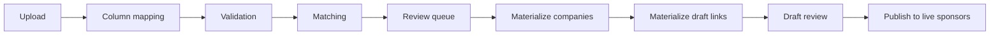
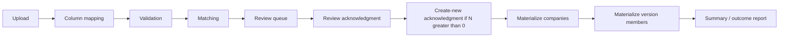

# Partner Alumni Import — Redesign Proposal

**Status:** Approved with locked additions (2026-07-06)  
**Version:** v1.1 (redesign)  
**Last updated:** 2026-07-06  
**Prerequisites:** [Partner Alumni Design v2](./partner-alumni-design.md), [Phase — Partner Alumni v2 Scope](./phase-partner-alumni-scope.md)

This document replaces the current Partner Alumni **drawer bulk upload** (PA3′) with a **batch-based import workflow** modeled on Sponsor Import operational quality.

**Implementation gate:** PA-IMP-1 and all subsequent phases may begin only after this document reflects the locked decisions in §2. No code changes until then.

---

## 1. Why redesign

### 1.1 Incident summary (NFT NYC, 2026-07-05)

A 461-row official Partner Alumni file was imported into version `7fd89aa6-…`. The result was corrupt:

- Column mis-mapping (`#` → company name; company label → website field)
- 445 duplicate `companies` rows created (numeric names `"12"`, `"14"`, …)
- 0 links to existing catalog companies (MoonPay, OpenSea, etc.)
- Version was set **current** → public tab would have shown nonsense data

Cleanup completed 2026-07-05: current pointer unset, version deleted, 445 bogus companies removed. **NFT NYC must not be re-imported until the new workflow passes golden-file QA (§19).**

### 1.2 Root causes (workflow, not just parser)

| Failure | Current PA3′ drawer | Sponsor Import |
|---------|---------------------|----------------|
| Ephemeral state | Client parses file; preview JSON in memory | Server batch + persisted rows |
| Column mapping | Auto-guess; optional drawer step | **Required** saved mapping step |
| Website normalization | `normalizeDomainFromWebsite` on raw text | `resolveCompanyWebsiteIdentity` — rejects label text |
| Match status UX | Relabels engine statuses; **create_new auto-imports** | Keeps `auto_ready` / `needs_review`; review queue |
| Review defaults | Review rows **skipped**; create_new **selected** | Domain matches bulk-accepted; create-new is explicit action |
| Audit trail | Commit summary only | Action log, outcome CSV, batch history |
| Safety gates | Weak low-import warning | Blocking validation, review ack, import guards |
| Discard / resume | None | Full batch lifecycle |

The approved design intent (§9.3 of [partner-alumni-design.md](./partner-alumni-design.md)) already calls for **comparable operational quality** to sponsor bulk upload. PA3′ did not meet that bar.

---

## 2. Locked decisions (approved)

These decisions are **non-negotiable** for implementation. They override any earlier draft language that conflicts.

| # | Decision | Requirement |
|---|----------|-------------|
| **LD-1** | **No default create-new** | Rows with no match (`needs_review` + no proposal) must **never** be pre-selected for import. Users must **explicitly approve** every company creation — per row or via a deliberate bulk action. |
| **LD-2** | **Reuse website identity** | Partner Alumni Import must call **`resolveCompanyWebsiteIdentity`** from Sponsor Import (`src/lib/domain/hostedPlatformWebsite.ts`). Do **not** use `normalizeDomainFromWebsite` or any PA-specific domain shortcut. Same rules, same rejection of label text. |
| **LD-3** | **Persist `match_method`** | Every imported row must store a durable `match_method` value. Minimum enum: `domain`, `alias`, `exact_name`, `manual`, `create_new`. Set at match time; update on row decision (`manual`) or materialize (`create_new`). |
| **LD-4** | **Golden QA file** | The official **NFT NYC 461-row Partner Alumni file** is the golden QA artifact. The redesign is **not complete** until that file imports successfully with expected matching behavior and **without creating duplicate companies**. |
| **LD-5** | **Trust over speed** | Partner Alumni Import prioritizes **trust and auditability** over speed. The workflow must be closer to Sponsor Import (full-page stepper, persisted batch, review queue, action log) than to the current drawer-based bulk upload. No shortcuts that skip review or hide create-new counts. |
| **LD-6** | **Mass create-new acknowledgment** | Any bulk or batch-level action that would create **N new companies** must show **N prominently** and require **explicit acknowledgment** before materialize proceeds. Silent or implicit mass creation is forbidden. |

---

## 3. Design goals

| # | Goal |
|---|------|
| G1 | **Workflow parity** with Sponsor Import trust model (batch, steps, persisted rows, review queue) |
| G2 | **Reuse** shared matching, validation, and company materialization — do **not** fork identity logic (**LD-2**) |
| G3 | **Version-scoped** target: `event_partner_alumni_version_companies` only |
| G4 | **Never** auto-set `current_version_id` on import (OQ9) |
| G5 | **Never** touch `event_sponsors` or sponsor import code paths |
| G6 | Support **400+ rows** with chunked materialization |
| G7 | **Fail closed** on ambiguous mapping and mass create-new (**LD-1**, **LD-6**) |
| G8 | Recoverable imports (discard, resume, outcome report) |
| G9 | **Auditability first** — persisted rows, action log, outcome CSV, `match_method` on every row (**LD-3**, **LD-5**) |
| G10 | **Golden-file sign-off** before declaring redesign complete (**LD-4**) |

---

## 4. Non-goals

- Re-import NFT NYC until golden-file QA passes (§19)
- Changes to Sponsor Import tables, APIs, or UI
- Changes to `event_sponsors` or edition sponsor publish flow
- Auto-setting current version after import
- Tier columns, draft sponsor links, or edition-scoped live publish
- Public Partner Alumni tab logic changes (beyond using a correctly imported version later)
- Speed optimizations that bypass review, hide create-new counts, or reduce audit trail

---

## 5. Reference workflow — Sponsor Import (quality bar)



**Persisted artifacts:** batch, rows, action log, source file in storage, outcome CSV.

**Key trust behaviors (Partner Alumni must mirror these):**

- Column mapping saved on batch before validation
- Validation uses `resolveCompanyWebsiteIdentity`; blocking vs warning issues
- Duplicate-in-file clustering with canonical/duplicate roles
- Matching stores engine status (`auto_ready`, `needs_review`) — not relabeled
- Bulk accept domain matches; per-row decision drawer
- Bulk create-new is **opt-in**, not default — **LD-1**
- Review acknowledgment before materialize
- Chunked materialize with progress
- Publish is a separate explicit step (N/A for PA — import ends at version members)

---

## 6. Proposed workflow — Partner Alumni Import



### 6.1 Step comparison

| Step | Sponsor Import | Partner Alumni Import (proposed) |
|------|----------------|----------------------------------|
| **Upload** | Batch per edition; file → storage | Batch per **version**; file → storage (separate bucket or prefix) |
| **Column mapping** | company_name, website, tier_rank, tier_label, notes | company_name, website, **display_order** (optional), notes (optional) |
| **Validation** | Tier required; **`resolveCompanyWebsiteIdentity`** | No tier; **company name required**; **same `resolveCompanyWebsiteIdentity` rules (LD-2)** |
| **Matching** | + live edition sponsor context | + **already on version** context (like `on_roster`) |
| **Review queue** | Bulk accept domains; row decisions | **Same patterns** — bulk accept domains/alias auto-ready; **no rows pre-selected for create-new (LD-1)** |
| **Review ack** | Required before import-to-draft (Draft step checkbox) | Recorded when user clicks **Import to version** (no separate checkbox) |
| **Create-new ack** | Bulk create-new is opt-in | **Required when N new companies > 0 (LD-6)** — show count, block until confirmed |
| **Materialize companies** | Chunked; creates/links companies | **Reuse** `materializeCompanies` patterns |
| **Materialize links** | Draft sponsor links + tiers | **Version members** + display_order assignment |
| **Publish** | → `event_sponsors` | **None** — import ends at version members |
| **Set as current** | N/A | **Separate admin action** (OQ9) |

### 6.2 Admin entry point

Replace `PartnerAlumniBulkUploadDrawer` with **“Import companies”** on the series Partner Alumni panel:

- **Full-page flow** (not drawer) — `/admin/events/series/[id]/partner-alumni/versions/[versionId]/import/[batchId]`
- Layout matches sponsor import: context bar + stepper
- Target version shown prominently; **blocked if version is deleted or wrong series**

---

## 7. Data model (new tables)

**Do not extend** `sponsor_import_*` tables. Add parallel PA-specific tables:

### 7.1 `partner_alumni_import_batches`

| Column | Purpose |
|--------|---------|
| `id` | UUID PK |
| `event_series_id` | FK — series scope |
| `event_partner_alumni_version_id` | FK — import target (**RESTRICT** if version deleted mid-flight) |
| `status` | `uploaded` → `review` → `imported` → `discarded` |
| `processing_phase` | `parsing`, `validating`, `matching`, `materializing_companies`, `materializing_members`, … |
| `source_filename`, `source_file_storage_path`, `source_file_format`, `source_sheet_name` | Same pattern as sponsor |
| `source_row_count` | Parsed data rows |
| `column_mapping` | JSON — saved mapping |
| `review_acknowledged_at` | Required before materialize |
| `create_new_acknowledged_at` | Required when pending create-new count > 0 (**LD-6**) |
| `create_new_acknowledged_count` | N at time of acknowledgment (audit) |
| `imported_at` | When version members written |
| `created_by`, timestamps | Audit |

**No `published_at`** — there is no public publish step.

### 7.2 `partner_alumni_import_rows`

Mirror `sponsor_import_rows` **minus tier fields**, plus PA-specific fields:

| Column | Purpose |
|--------|---------|
| Raw | `raw_company_name`, `raw_website`, `raw_display_order`, `raw_notes` |
| Normalized | `normalized_company_name`, `normalized_website`, `normalized_domain` |
| Validation | `validation_issues`, `has_blocking_validation` |
| Duplicate file | `duplicate_cluster_key`, `duplicate_role`, `duplicate_resolution`, … |
| Match | `status` (`needs_review`, `auto_ready`, `resolved`, `excluded`), **`match_method`** (**LD-3**), `match_confidence`, `proposed_company_id`, `conflict_type` |
| Version context | `already_on_version_member_id`, `intended_member_action` (`create_new_link`, `skip`, `update_order`) |
| Decision | `decision_type`, `resolved_company_id`, `decision_by`, `decision_at` |
| Outcome | `version_member_id` (after materialize), `import_error` |

#### 7.2.1 `match_method` persistence (**LD-3**)

**Required on every row** that reaches matching. Stored in DB and included in outcome CSV.

| Value | When set |
|-------|----------|
| `domain` | Engine matched via normalized domain |
| `alias` | Engine matched via company alias |
| `exact_name` | Engine matched via exact normalized name (still in review queue until confirmed) |
| `manual` | Researcher chose an existing company via row decision drawer |
| `create_new` | Researcher explicitly approved new company creation (row decision or bulk create-new) |

**Rules:**

- Set initial `match_method` during matching from engine proposal type.
- Update to `manual` when researcher overrides to a different existing company.
- Update to `create_new` only when researcher **explicitly** approves creation (**LD-1**).
- Rows with no proposal and no decision: `match_method` null or `excluded`; **never** `create_new` by default.
- After materialize: final `match_method` must reflect what actually happened (including `create_new` for rows where a new company was created).

**Status values:** Use **same engine statuses as sponsor import** — do not invent `matched` / `create_new` preview labels in the UI or API.

### 7.3 `partner_alumni_import_action_logs`

Same shape as sponsor action log, plus PA-specific events:

- Standard: `upload`, `column_mapping_saved`, `validation_run`, `matching_run`, `bulk_accept_domain_matches`, `materialize_companies_chunk`, `materialize_members_chunk`, `import_completed`, `discard`
- PA-specific: `create_new_acknowledged` (payload includes `count: N`)

### 7.4 Storage

- Bucket: `partner-alumni-imports` (dedicated bucket — see OQ-PAI-2 resolution)
- Path pattern: `{batch_id}/{filename}`
- Same retention/discard cleanup as sponsor imports

---

## 8. Shared code reuse (explicit)

| Module | Reuse |
|--------|-------|
| `companyImportMatching.ts` | **As-is** — `buildImportMatchContext`, `matchImportRowIdentity` |
| `importWebsiteSelection.ts` | **As-is** — `finalizeImportRowWebsites`, duplicate cluster keys |
| `hostedPlatformWebsite.ts` | **As-is — mandatory (LD-2)** — `resolveCompanyWebsiteIdentity` in validation; **never** `normalizeDomainFromWebsite` for import identity |
| `parseSpreadsheet.ts` | **Extract or duplicate** column mapping + `parseWithColumnMapping` pattern (no tier columns in PA mapping) |
| `columnMappingUi.ts` | **As-is** |
| `materializeCompanies.ts` | **Reuse** with PA row type adapter |
| `matchRows.ts` | **Pattern** — PA variant adds `already_on_version` instead of `already_on_live_sponsor` |
| `batchGuards.ts`, `actionLog.ts`, `storage.ts` | **Mirror** for PA batches |
| `importRowMatchReason.ts`, `RowDecisionDrawer` | **Adapt** — same UX components where possible |

**Do not modify** sponsor import files in place; extract shared helpers only when duplication would drift (prefer copy-then-extract in a follow-up if needed).

---

## 9. Parsing & column mapping (hard requirements)

Lessons from NFT NYC official file layout:

```
Row 1: Partner Alumni | (stray cell)     ← title row — skip
Row 2: # | Company Name | Website/Domain  ← header row
Row 3+: data
```

| Requirement | Detail |
|-------------|--------|
| Title row detection | Skip rows matching `Partner Alumni`, etc. — **server-side** after parse |
| Header scan | Scan first N rows; **never** blind col0/col1 fallback if title row present |
| Mapping step | **Always** show mapping confirmation on first upload; auto-guess pre-fills only |
| Required columns | `company_name` required; `website` recommended; `display_order` optional |
| Positional fallback | Only when single headerless 2-column CSV — show explicit warning |
| Preview sample | Show first 5 raw rows + mapped preview before validation runs |

---

## 10. Validation rules (PA-specific)

| Rule | Severity |
|------|----------|
| Missing company name | **Blocking** |
| Missing website | **Warning** (match may still work via exact name) |
| Unparseable website | **Blocking** |
| Community / social-only website (`no_identity`) | **Warning** — needs review |
| Invalid display_order (non-integer or < 1) | **Warning** — assign on materialize |
| Duplicate rows in file | Cluster — canonical + duplicates (same as sponsor) |
| Row count > 500 | **Blocking** at upload |

**Website normalization (LD-2):** Identical to sponsor import — call **`resolveCompanyWebsiteIdentity`**. Set `normalized_domain` only when result is `status: "domain"`. **Never** treat `"moonpay"` or `"Amazon Web Services (AWS)"` as domains. **Do not** use `normalizeDomainFromWebsite` in the import pipeline.

---

## 11. Matching & review (trust model)

### 11.1 Match context

Load full directory (paginated):

- `companies` + `company_domains` + aliases — same as today
- **Plus:** existing members on target version (`already_on_version_member_id`)

### 11.2 Row statuses (unchanged from engine)

| Engine | Meaning | Default UI action |
|--------|---------|-------------------|
| `auto_ready` + domain/alias | High-confidence match | Eligible for **bulk accept** (not pre-imported until accepted or materialize) |
| `needs_review` + exact_name | Name match — confirm | **No default decision** — researcher confirms (**LD-1**) |
| `needs_review` + domain_name_mismatch | Domain match, name differs | Show proposed company — confirm |
| `needs_review` + no proposal | No match | **Excluded by default** — **never pre-selected**; create-new is explicit per row (**LD-1**) |
| `already on version` | Duplicate member | Skip / update order only |

### 11.3 Default selection rules (**LD-1**)

| Row type | Default checkbox / import selection |
|----------|-------------------------------------|
| `auto_ready` (domain/alias) | **Not imported** until bulk accept or individual confirm |
| `needs_review` (exact_name, mismatch) | **Not imported** — no default decision |
| No match / no proposal | **Excluded** — checkbox **off**, not in materialize set |
| Explicit create-new decision | **Only** after user action |

**Forbidden:** Pre-selecting all unmatched rows, auto-checking “create new” on load, or importing rows with `decision_type = create_new` without user action.

### 11.4 Bulk actions (mirror sponsor)

- **Bulk accept domain matches** (and alias auto-ready per `AUTO_READY_MATCH_METHODS`)
- **Bulk exclude** selected rows
- **Bulk create new** — only for **explicitly selected** rows without blocking validation; shows count **N** before apply; **never** default-all (**LD-1**, **LD-6**)

### 11.5 Safety gates (incident-driven + locked)

| Gate | Behavior |
|------|----------|
| **No default create-new** | Materialize rejects any row with `create_new` decision that lacks `decision_by` / explicit user action (**LD-1**) |
| **Mass create-new acknowledgment** | Before materialize: if pending create-new count = **N > 0**, UI shows **“This import will create N new companies”**; block until user confirms; persist `create_new_acknowledged_at` + count on batch (**LD-6**) |
| Mass create-new threshold | Additionally warn/block if N > 10% of rows unless acknowledgment includes explicit count (same ack satisfies both) |
| Low match rate | Warn if `< 10%` auto_ready + resolved matched after review |
| Column mapping unchanged | Block if user skips mapping step on ambiguous file |
| Zero rows materialized | Block completion with clear error |
| Version deleted mid-batch | Batch → `discarded`; no partial member writes without transaction |
| Duplicate companies | Block/warn if materialize would create companies whose normalized name already exists in directory (reuse sponsor guards where applicable) |

### 11.6 Review acknowledgment step

Two acknowledgments may be required before materialize:

1. **Review acknowledgment** — persisted when the user clicks **Import to version** (server `acknowledgeReview()` runs before materialize; no separate pre-click checkbox on the Review step, aligned with Sponsor Import Review)
2. **Create-new acknowledgment** — only when N > 0; must display N prominently (**LD-6**)

Both timestamps logged in batch + action log.

---

## 12. Materialize & commit

### 12.1 Chunked pipeline

1. **Materialize companies** — reuse sponsor chunk pattern (`MATERIALIZE_COMPANIES_DEFAULT_CHUNK = 50`); only rows with explicit decisions
2. **Materialize version members** — insert/update `event_partner_alumni_version_companies`
   - Respect `UNIQUE (version_id, company_id)`
   - Assign `display_order`: row value → else append after max existing
   - Skip `already on version` unless decision says update order
3. **Finalize `match_method`** on each row per §7.2.1

### 12.2 Transaction boundaries

- Each chunk is idempotent (cursor-based, same as sponsor)
- On failure: batch stays in `review` with `processing_phase` cleared; rows record `import_error`
- **No** auto-set `current_version_id`

### 12.3 Outcome report

CSV columns (minimum):

`excel_row_number`, `raw_company_name`, `normalized_domain`, `status`, **`match_method`**, `resolved_company_id`, `action`, `version_member_id`, `import_error`

Every materialized row must have non-null `match_method` in report and DB.

---

## 13. API routes (proposed)

Base: `/api/admin/event-series/[seriesId]/partner-alumni/versions/[versionId]/import/...`

| Method | Route | Purpose |
|--------|-------|---------|
| POST | `.../batches` | Upload file → create batch + parse rows |
| GET | `.../batches/[batchId]` | Batch + summary (includes pending create-new count **N**) |
| POST | `.../batches/[batchId]/column-mapping` | Save mapping |
| POST | `.../batches/[batchId]/validate` | Run validation |
| POST | `.../batches/[batchId]/match` | Run matching; persist `match_method` |
| GET | `.../batches/[batchId]/rows` | Paginated rows |
| PATCH | `.../batches/[batchId]/rows/[rowId]` | Row decision; update `match_method` |
| POST | `.../batches/[batchId]/rows/bulk-accept-domains` | Bulk accept |
| POST | `.../batches/[batchId]/rows/bulk-decisions` | Bulk exclude / create-new (returns affected count) |
| POST | `.../batches/[batchId]/acknowledge-review` | Review ack |
| POST | `.../batches/[batchId]/acknowledge-create-new` | Create-new ack with `{ count: N }` (**LD-6**) |
| POST | `.../batches/[batchId]/materialize-companies/chunk` | Chunk companies |
| POST | `.../batches/[batchId]/materialize-members/chunk` | Chunk version members |
| POST | `.../batches/[batchId]/discard` | Discard batch |
| GET | `.../batches/[batchId]/report` | Outcome CSV |

**Deprecate** (after migration):

- `POST .../companies/bulk/preview`
- `POST .../companies/bulk/commit`

---

## 14. UI components (proposed)

| Component | Based on |
|-----------|----------|
| `PartnerAlumniImportFlow` | `SponsorImportFlow` — **full page, not drawer (LD-5)** |
| `ImportContextBar` | Series name + version label + filename |
| `ImportStepper` | upload → mapping → validation → review → summary |
| `ColumnMappingStep` | Same — fewer columns |
| `ValidationStep` | Same summary counts |
| `ReviewQueueStep` | Same bulk actions + `RowDecisionDrawer`; **no default create-new selection (LD-1)** |
| `CreateNewAcknowledgmentModal` | Shows **N new companies**; required before materialize when N > 0 (**LD-6**) |
| `ImportSummaryStep` | Replaces PublishStep — imported/skipped/**created** counts + link back to version |
| `DiscardImportModal` | Same |

Remove: `PartnerAlumniBulkUploadDrawer` (after cutover).

---

## 15. Implementation phases

| Phase | Deliverable | Exit |
|-------|-------------|------|
| **PA-IMP-1** | Migration: PA import tables (incl. `match_method`, create-new ack columns) + storage bucket + RLS | Verify SQL |
| **PA-IMP-2** | Server: batch CRUD, parse, validate (**`resolveCompanyWebsiteIdentity`**), match, persist `match_method` | Unit + integration tests |
| **PA-IMP-3** | Server: materialize companies + version members (chunked); create-new guards | 400+ row test |
| **PA-IMP-4** | Admin UI: full-page stepper flow; create-new ack modal; no default selection | Manual QA checklist |
| **PA-IMP-5** | Deprecate drawer + old preview/commit routes | No references in UI |
| **PA-IMP-6** | **Golden-file QA** — NFT NYC file on non-current version (§19) | Sign-off; then optional Set as current |

**Estimated deprecation:** PA3′ drawer marked deprecated in PA-IMP-4; removed PA-IMP-5.

**Redesign complete when:** PA-IMP-6 golden-file QA passes (**LD-4**), not merely when code ships.

---

## 16. QA checklist (acceptance)

### 16.1 General

- [ ] Full-page import flow (not drawer) matches sponsor stepper pattern (**LD-5**)
- [ ] Validation uses `resolveCompanyWebsiteIdentity` — label text never becomes domain (**LD-2**)
- [ ] Every materialized row has persisted `match_method` in DB and outcome CSV (**LD-3**)
- [ ] Unmatched rows **not** pre-selected; create-new requires explicit action (**LD-1**)
- [ ] Create-new acknowledgment shows **N** and blocks materialize until confirmed (**LD-6**)
- [ ] Bulk accept domain matches works for 100+ rows
- [ ] Exact-name matches in review queue — **not** auto-imported
- [ ] Mass create-new gate blocks without acknowledgment
- [ ] Import 400+ rows completes via chunks
- [ ] `current_version_id` unchanged after import
- [ ] Discard batch leaves version unchanged
- [ ] Outcome CSV matches DB state
- [ ] Sponsor import smoke test unchanged
- [ ] `event_sponsors` row count unchanged
- [ ] No duplicate companies created when importing known catalog names

### 16.2 Golden file (**LD-4**) — see §19

---

## 17. Open questions (resolved / remaining)

| # | Question | Resolution |
|---|----------|------------|
| OQ-PAI-1 | Dedicated import page vs drawer/modal? | **Resolved: full page** (LD-5) |
| OQ-PAI-2 | Reuse sponsor storage bucket with prefix vs new bucket? | **New bucket** `partner-alumni-imports` |
| OQ-PAI-3 | Mass create-new threshold (10%)? | **10%** warn threshold; **always** require explicit N acknowledgment when N > 0 (LD-6) |
| OQ-PAI-4 | Allow import into **current** version? | **Yes** — warn prominently; no auto public change until researcher reviews public roster |
| OQ-PAI-5 | Extract shared `import-core` package now vs duplicate first? | **Duplicate first**, extract in PA-IMP-5 if stable |
| OQ-PAI-6 | NFT NYC re-import timing | **After PA-IMP-6 golden-file QA** to non-current version only |
| OQ-PAI-7 | Default create-new behavior? | **Resolved: never default (LD-1)** |
| OQ-PAI-8 | Website identity function? | **Resolved: `resolveCompanyWebsiteIdentity` only (LD-2)** |
| OQ-PAI-9 | `match_method` persistence? | **Resolved: required enum (LD-3)** |

---

## 18. Approval record

| Item | Status |
|------|--------|
| Workflow steps (§6) | Approved |
| Locked decisions (§2) | Approved 2026-07-06 |
| New tables (§7) | Approved |
| Shared reuse boundaries (§8) | Approved |
| Safety gates (§11.5) | Approved |
| Golden-file completion criterion (§19) | Approved |
| Old API deprecation (§13) | Approved |
| Implementation phases (§15) | Approved |

**Approver:** Product owner  
**Date:** 2026-07-06

---

## 19. Golden QA file — NFT NYC Partner Alumni (**LD-4**)

### 19.1 Artifact

- **File:** Official NFT NYC Partner Alumni spreadsheet (~461 data rows)
- **Series:** NFT NYC (`26c56d83-cd31-4a7a-b372-98dcdf041840`)
- **Target:** Empty **non-current** version (create dedicated QA version if needed)
- **Precondition:** Corrupt import cleaned 2026-07-05; no bogus numeric-name companies in directory

### 19.2 Expected behavior

| Check | Expected |
|-------|----------|
| Parse | Title row skipped; columns map to `#` / Company Name / Website/Domain |
| Validation | Domains from real URLs; label-only cells flagged, not treated as domains |
| Match rate | Majority of rows match **existing** catalog companies (MoonPay, OpenSea, Coinbase, etc.) |
| Create-new | Only rows researcher **explicitly** approves; default excluded count >> 0 initially |
| Duplicates | **Zero** new companies whose names are numeric row indices or duplicate existing catalog entries |
| Members | ~400+ version members linked to real `company_id`s |
| Audit | Every row has `match_method`; outcome CSV complete |
| Side effects | `current_version_id` unchanged; `event_sponsors` unchanged |

### 19.3 Completion criterion

The redesign is **not considered complete** until:

1. PA-IMP-6 executed end-to-end with this file
2. All §16.2 / §19.2 checks pass
3. Sign-off recorded in project state

Only after sign-off may researchers re-import NFT NYC for production use (Set as current remains a separate explicit action).

---

## 20. Related documents

| Document | Path |
|----------|------|
| Partner Alumni design v2 | [partner-alumni-design.md](./partner-alumni-design.md) |
| Phase scope (PA3′ superseded by this redesign) | [phase-partner-alumni-scope.md](./phase-partner-alumni-scope.md) |
| Corrupt import cleanup script | [supabase/verify/nft_nyc_pa_corrupt_cleanup.sql](../supabase/verify/nft_nyc_pa_corrupt_cleanup.sql) |
| Sponsor import (reference implementation) | `src/features/sponsor-import/` |
| Website identity (shared) | `src/lib/domain/hostedPlatformWebsite.ts` |

---

**End of Partner Alumni Import redesign proposal.**
