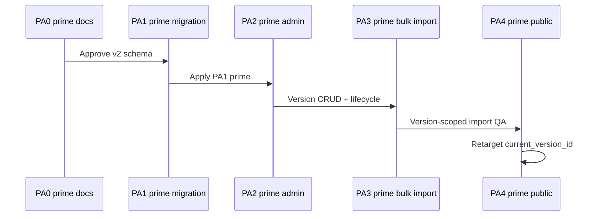

# EventPixels Partner Alumni — Migration Design Document

**Status:** Approved (v2 target) — v1 applied; **PA1′ migration authored; apply pending**  
**Version:** v2  
**Last updated:** 2026-07-05  
**Prerequisites:** [Partner Alumni Design v2](./partner-alumni-design.md) (approved), [Phase — Partner Alumni v2 Scope](./phase-partner-alumni-scope.md) (approved)

This document defines the **target schema**, **evolution path from v1**, constraints, RLS, verification, and rollout for Partner Alumni **v2 (version model)**.

**Supersedes:** v1 migration design (draft + snapshot + `latest_snapshot_id`). v1 SQL (`20260710120000_partner_alumni_v1.sql`) remains in the repository as applied or authored history until PA1′ ships.

For product rules, see [partner-alumni-design.md](./partner-alumni-design.md). For application deliverables, see [phase-partner-alumni-scope.md](./phase-partner-alumni-scope.md).

---

## 1. Migration goals (v2)

| Goal | Success criteria |
|------|------------------|
| Series-scoped program container | `event_partner_alumni` with `current_version_id` |
| Versioned editable rosters | `event_partner_alumni_versions` + members table |
| **No draft table** | `event_partner_alumni_companies` **dropped** |
| Explicit public pointer | `current_version_id` replaces `latest_snapshot_id` |
| Large roster support | Member table indexed for 400+ rows per version |
| Draft-private / server-mediated public reads | Anon/authenticated **no direct SELECT** on version tables; public via server + `current_version_id` (OQ7) |
| Zero sponsor schema changes | No changes to `event_sponsors` |
| Safe evolution from v1 | Corrective migration path documented |

---

## 2. v1 → v2 schema delta

### 2.1 Deprecated (v1 — remove in PA1′)

| Object | v1 role | v2 action |
|--------|---------|-----------|
| `event_partner_alumni_companies` | Draft roster | **DROP** |
| `event_partner_alumni.latest_snapshot_id` | Public pointer | **DROP** → `current_version_id` |
| `event_partner_alumni.recognition_label` | Program header | **DROP** (move to version) |
| `event_partner_alumni.primary_source_url` | Program header | **DROP** (move to version) |
| `event_partner_alumni_snapshots.verified_at` | Publication time | **DROP or rename** → not used as version trigger |
| Immutability semantics | Product-only in v1 | **Removed** — versions mutable |

### 2.2 Evolved (v1 → v2)

| v1 table | v2 table (target name) | Changes |
|----------|------------------------|---------|
| `event_partner_alumni_snapshots` | `event_partner_alumni_versions` | Rename; add `updated_at`, `version_label`, `source_checked_at`; allow UPDATE/DELETE |
| `event_partner_alumni_snapshot_companies` | `event_partner_alumni_version_companies` | Rename FK column; add `updated_at`; allow UPDATE/DELETE |

### 2.3 Unchanged conceptually

| Object | Notes |
|--------|-------|
| `event_partner_alumni` | Program row retained; columns change |
| FK to `event_series`, `companies` | RESTRICT unchanged |
| One program per series | UNIQUE `event_series_id` |

---

## 3. Target schema (v2)

### 3.1 Entity relationship

```mermaid
erDiagram
  event_series ||--o| event_partner_alumni : has
  event_partner_alumni ||--o{ event_partner_alumni_versions : versions
  event_partner_alumni ||--o| event_partner_alumni_versions : current
  event_partner_alumni_versions ||--o{ event_partner_alumni_version_companies : members
  companies ||--o{ event_partner_alumni_version_companies : member
  event_series ||--o{ event_editions : editions
  event_editions ||--o{ event_sponsors : sponsors

  event_partner_alumni {
    uuid id PK
    uuid event_series_id FK UK
    uuid current_version_id FK
    timestamp created_at
    timestamp updated_at
  }

  event_partner_alumni_versions {
    uuid id PK
    uuid event_partner_alumni_id FK
    text version_label
    text recognition_label
    text primary_source_url
    timestamptz source_checked_at
    timestamp created_at
    timestamp updated_at
  }

  event_partner_alumni_version_companies {
    uuid id PK
    uuid event_partner_alumni_version_id FK
    uuid company_id FK
    integer display_order
    timestamp created_at
    timestamp updated_at
  }
```

### 3.2 `event_partner_alumni` (program)

| Column | Type | Nullable | Notes |
|--------|------|----------|-------|
| `id` | uuid | NO | PK |
| `event_series_id` | uuid | NO | FK → `event_series.id`; **UNIQUE** |
| `current_version_id` | uuid | YES | FK → `event_partner_alumni_versions.id` |
| `created_at` | timestamp | NO | |
| `updated_at` | timestamp | NO | |

### 3.3 `event_partner_alumni_versions`

| Column | Type | Nullable | Notes |
|--------|------|----------|-------|
| `id` | uuid | NO | PK |
| `event_partner_alumni_id` | uuid | NO | FK → program |
| `version_label` | text | YES | Admin label |
| `recognition_label` | text | YES | Max 200 chars (CHECK) |
| `primary_source_url` | text | YES | Max 2048 chars (CHECK) |
| `source_checked_at` | timestamptz | YES | Metadata only |
| `created_at` | timestamp | NO | |
| `updated_at` | timestamp | NO | |

### 3.4 `event_partner_alumni_version_companies`

| Column | Type | Nullable | Notes |
|--------|------|----------|-------|
| `id` | uuid | NO | PK |
| `event_partner_alumni_version_id` | uuid | NO | FK → version |
| `company_id` | uuid | NO | FK → `companies.id` |
| `display_order` | integer | NO | CHECK ≥ 1 |
| `created_at` | timestamp | NO | |
| `updated_at` | timestamp | NO | |

### 3.5 Constraints (locked)

| Constraint | Definition |
|------------|------------|
| One program per series | `UNIQUE (event_series_id)` |
| One member per company per version | `UNIQUE (version_id, company_id)` |
| `display_order >= 1` | CHECK on members |
| Label/url max length | CHECK on version header fields |

### 3.6 Indexes (locked)

| Index | Columns | Rationale |
|-------|---------|-----------|
| Program series unique | `(event_series_id)` | One program per series |
| Version by program | `(event_partner_alumni_id, created_at DESC)` | Admin version list |
| Members by version order | `(event_partner_alumni_version_id, display_order)` | Roster display |
| Members by company | `(company_id)` | Company detail / merge |
| Current version lookup | `(id)` on versions via program FK | Public resolution |

---

## 4. RLS requirements (v2)

### 4.1 Policy intent (OQ7 — locked)

| Table | anon / authenticated | service_role |
|-------|---------------------|--------------|
| `event_partner_alumni` | **No SELECT** | Full access |
| `event_partner_alumni_versions` | **No SELECT** | Full access |
| `event_partner_alumni_version_companies` | **No SELECT** | Full access |

**Locked approach:** Public routes resolve **`current_version_id` server-side** (service role on program row, then fetch that version + members). Non-current versions are never exposed on marketing surfaces. After PA1′, **revoke** v1 anon/authenticated SELECT policies on snapshot/version tables.

**Rejected alternative:** RLS policies comparing `version.id = program.current_version_id` via security definer view — higher complexity; not chosen.

### 4.2 Contrast with v1 RLS

| v1 | v2 |
|----|-----|
| Draft table private | **No draft table** (dropped; rows discarded — OQ4) |
| All snapshots public SELECT | **No anon/authenticated SELECT** on versions — server-only public reads (OQ7) |

### 4.3 Contrast with `event_sponsors`

Partner Alumni member reads are **not** tier-gated. Sponsor counts remain edition-scoped and unchanged.

---

## 5. PA1′ corrective migration plan (locked)

**Strategy (OQ3 — locked):** **Rename/evolve in place.** Convert existing snapshot tables into version tables. **Do not** create a parallel version system alongside snapshots.

**Data (OQ4 — locked):** **Discard** all rows in `event_partner_alumni_companies` (draft). No production Partner Alumni data exists; no draft promotion required.

**Public reads (OQ7 — locked):** Resolve current version **server-side** via `current_version_id`. After PA1′, revoke anon/authenticated broad SELECT on version tables (v1 granted SELECT on all snapshots); public routes use service role for pointer + targeted fetch.

### 5.1 Planned migration file

| Property | Value |
|----------|-------|
| Filename (planned) | `supabase/migrations/20260711120000_partner_alumni_v2_versions.sql` |
| Verify script (planned) | `supabase/verify/partner_alumni_v2_post_migration.sql` |
| Depends on | `20260710120000_partner_alumni_v1.sql` applied |

### 5.2 Step-by-step DDL plan (authoring checklist)

Execute in a **single transactional migration** in this order:

#### Phase 1 — Drop draft layer

| Step | Action |
|------|--------|
| 1.1 | `DROP TABLE public.event_partner_alumni_companies` (CASCADE policies/indexes) |
| 1.2 | Document: all draft rows discarded — acceptable per OQ4 |

#### Phase 2 — Rename snapshot → version tables

| Step | Action |
|------|--------|
| 2.1 | `ALTER TABLE event_partner_alumni_snapshots RENAME TO event_partner_alumni_versions` |
| 2.2 | `ALTER TABLE event_partner_alumni_snapshot_companies RENAME TO event_partner_alumni_version_companies` |
| 2.3 | Rename FK column `event_partner_alumni_snapshot_id` → `event_partner_alumni_version_id` on member table |
| 2.4 | Rename indexes and constraints to `*_versions_*` / `*_version_companies_*` naming (follow v1 index patterns) |
| 2.5 | Update table/column COMMENTS to version semantics (editable roster container) |

#### Phase 3 — Version header columns

| Step | Action |
|------|--------|
| 3.1 | Add `version_label text` (nullable) |
| 3.2 | Add `source_checked_at timestamptz` (nullable) |
| 3.3 | Add `updated_at timestamp NOT NULL DEFAULT now()` |
| 3.4 | **`verified_at`:** drop column **or** copy to `source_checked_at` then drop (no v1 production snapshots expected; if empty, drop directly) |
| 3.5 | Retain `recognition_label`, `primary_source_url`, `created_at` on version row |

#### Phase 4 — Version member columns

| Step | Action |
|------|--------|
| 4.1 | Add `created_at timestamp NOT NULL DEFAULT now()` |
| 4.2 | Add `updated_at timestamp NOT NULL DEFAULT now()` |

#### Phase 5 — Program pointer (replace latest_snapshot)

| Step | Action |
|------|--------|
| 5.1 | Add `current_version_id uuid` FK → `event_partner_alumni_versions(id) ON DELETE RESTRICT` |
| 5.2 | **Data backfill:** `UPDATE event_partner_alumni SET current_version_id = latest_snapshot_id WHERE latest_snapshot_id IS NOT NULL` (no-op if empty) |
| 5.3 | Drop `latest_snapshot_id` column and its index |
| 5.4 | Drop program-level `recognition_label`, `primary_source_url` (metadata lives on version rows; empty DB — no copy needed) |
| 5.5 | Add index on `current_version_id` WHERE NOT NULL |

#### Phase 6 — RLS revision (OQ7)

| Step | Action |
|------|--------|
| 6.1 | **Program table:** keep RLS + REVOKE for anon/authenticated (unchanged) |
| 6.2 | **Version table:** DROP policies `event_partner_alumni_snapshots_select_*`; REVOKE SELECT from anon/authenticated |
| 6.3 | **Member table:** DROP policies `event_partner_alumni_snapshot_companies_select_*`; REVOKE SELECT from anon/authenticated |
| 6.4 | Rationale: public reads resolved server-side via `current_version_id`; historical versions not exposed via direct client queries |

#### Phase 7 — Post-apply verification

| Step | Action |
|------|--------|
| 7.1 | Assert `event_partner_alumni_companies` does not exist |
| 7.2 | Assert `latest_snapshot_id` column does not exist |
| 7.3 | Assert `current_version_id` exists |
| 7.4 | Assert renamed tables and FK column names |
| 7.5 | Anon SELECT denied on version + member tables (smoke test) |

### 5.3 When v1 migration **not applied**

Skip v1 file; author a **single v2-first migration** that creates program + versions + version_companies directly (same end state as Phases 1–6 above without renames). Prefer this only on fresh databases that never applied v1.

### 5.4 When v1 migration **applied (expected path)**

Apply **`20260711120000_partner_alumni_v2_versions.sql`** per §5.2. Expected row counts: zero across all Partner Alumni tables.

### 5.5 When v1 has snapshot data (unexpected)

| Data | Action |
|------|--------|
| Snapshots | Become versions; `latest_snapshot_id` → `current_version_id` |
| Snapshot members | Unchanged rows under renamed member table |
| Draft rows | **Discard** per OQ4 (do not merge into versions) |
| `verified_at` | Map to `source_checked_at` if retained for audit, then drop `verified_at` |

### 5.6 Rollback

Forward-fix preferred. Full drop order (if required):

1. Drop RLS policies
2. Drop `event_partner_alumni_version_companies`
3. Drop `event_partner_alumni_versions`
4. Drop `event_partner_alumni`

---

## 6. Verification strategy

### 6.1 Verify script

Deliver: **`supabase/verify/partner_alumni_v2_post_migration.sql`** (replaces v1 verify script after PA1′).

### 6.2 Post-migration checklist

| # | Check |
|---|-------|
| V1 | Three tables exist (program, versions, version_companies) — **no draft table** |
| V2 | `current_version_id` on program; **no** `latest_snapshot_id` |
| V3 | FKs RESTRICT as specified |
| V4 | UNIQUE constraints on program series and version members |
| V5 | RLS: anon denied on program; current-version read path smoke-tested |
| V6 | `event_sponsors` unchanged |

---

## 7. Rollout plan



**Deploy order:** PA0′ docs → PA1′ migration → PA2′ admin → PA3′ import → PA4′ public → PA5 merge/QA.

**Rule:** Do not deploy v2 application code before PA1′ migration.

---

## 8. Risks and mitigations

| Risk | Mitigation |
|------|------------|
| v1 code deployed against v2 schema | Feature-flag or branch; deploy migration before app |
| Public leak of non-current versions | Server-only pointer resolution; RLS tests |
| Delete current version breaks public | Admin safeguard (OQ2) + OQ8 block empty set-current |
| 400+ member insert timeout | Batch insert in bulk commit; index on `(version_id, display_order)` |
| Company merge without version repoint | PA5 merge extension |

---

## 9. Resolved migration decisions (v2)

| # | Topic | Resolution |
|---|-------|------------|
| 1 | Draft table | **Drop** `event_partner_alumni_companies`; **discard rows** (OQ4) |
| 2 | Snapshot tables | **Rename in place** → versions (OQ3) |
| 3 | Public pointer | **`current_version_id`** |
| 4 | `verified_at` | **Drop** (or one-time map → `source_checked_at` if rows exist) |
| 5 | Immutability | **Removed** at product and API layer |
| 6 | Sponsor tables | **Unchanged** |
| 7 | PA1′ file | **`20260711120000_partner_alumni_v2_versions.sql`** (planned) |
| 8 | Backfill | **None** |
| 9 | Public RLS | **Server-side** current resolution; revoke v1 public SELECT on all versions (OQ7) |
| 10 | Parallel version tables | **Rejected** — evolve snapshots only (OQ3) |
| 11 | Set as current on empty version | **Blocked** — requires ≥1 member (OQ8) |
| 12 | Bulk import auto-set current | **No** — explicit Set as current only (OQ9) |

---

## 10. Open questions (remaining — post PA1′ locks)

| # | Question | Blocks |
|---|----------|--------|
| OQ5 | Public **`source_checked_at`** display format (month precision?) | PA4′ UI |
| OQ6 | **`version_label`** max length (recommend 200) | Validation |
| OQ10 | Public company detail in PA4′ or defer to PA5? | Phase split |

**Locked (no longer open):** OQ1 copy-from-current default, OQ2 block delete current, OQ3 rename/evolve, OQ4 discard draft, OQ7 server-side public resolution, OQ8 block set-current on empty version, OQ9 no auto-set-current on bulk import.

---

## 11. Related documents

| Document | Path |
|----------|------|
| Partner Alumni design v2 | [partner-alumni-design.md](./partner-alumni-design.md) |
| Implementation scope v2 | [phase-partner-alumni-scope.md](./phase-partner-alumni-scope.md) |
| v1 migration (historical) | `supabase/migrations/20260710120000_partner_alumni_v1.sql` |

---

**End of Partner Alumni migration design (v2 target).**
