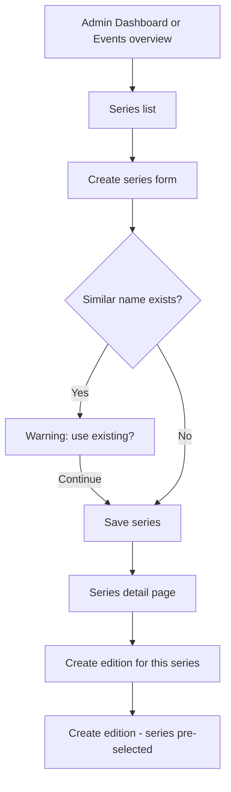
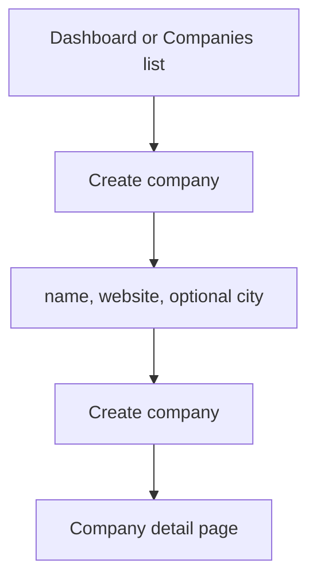

# Phase 1 — Events Admin: Implementation Scope

**Status:** Implemented (Phase 1 complete)  
**Version:** v1  
**Last updated:** 2026-06-03  

Complete scope for Phase 1 per [implementation-roadmap.md](./implementation-roadmap.md). Reference document — implementation matches this scope.

**Permissions:** Admin-only (`profiles.role = admin`). No Editor/staff behavior.

---

## 1. Exact screens to build (Phase 1)

### 1.1 New screens (15)

| ID | Screen | Route | Type |
|----|--------|-------|------|
| P1-A01 | Admin dashboard (enhanced) | `/admin` | Replace card grid |
| P1-A02 | Events overview | `/admin/events` | New |
| P1-A03 | Event series list | `/admin/events/series` | New |
| P1-A04 | Create event series | `/admin/events/series/new` | New |
| P1-A05 | Event series detail / edit | `/admin/events/series/[id]` | New |
| P1-A06 | Event editions list | `/admin/events/editions` | New |
| P1-A07 | Create event edition | `/admin/events/editions/new` | New (replaces `/admin/events/new`) |
| P1-A08 | Event edition detail | `/admin/events/editions/[id]` | New |
| P1-A09 | Edition profile tab | (tab on P1-A08) | New |
| P1-A10 | Edition live sponsors tab | (tab on P1-A08) | New |
| P1-A11 | Edition imports tab (stub) | (tab on P1-A08) | New stub |
| P1-A12 | Slug change confirmation modal | Modal on P1-A08 / P1-A07 | New |
| P1-A13 | Companies list | `/admin/companies` | New |
| P1-A14 | Company detail / edit | `/admin/companies/[id]` | New |
| P1-A15 | Sponsor imports placeholder | `/admin/sponsor-imports` | New stub |
| P1-A16 | Post-create import handoff (stub) | `/admin/sponsor-imports/new?editionId=` | New stub |

### 1.2 Modified screens (2)

| ID | Screen | Route | Change |
|----|--------|-------|--------|
| P1-M01 | Create company | `/admin/companies/new` | Enhance layout; success → company detail |
| P1-M02 | Create event redirect | `/admin/events/new` | Redirect → `/admin/events/editions/new` |

### 1.3 Shared components (new)

| Component | Used on |
|-----------|---------|
| Admin breadcrumbs | All admin pages |
| Events sub-nav | Events section |
| Admin page header | List + form pages |
| Warning banner (inline) | Edition create/edit |
| Empty state | Lists with no rows |
| Edition context card | Edition detail header |
| Live sponsors table | Edition tab |
| Slug preview + edit control | Series + edition forms |

### 1.4 Explicitly NOT in Phase 1

| Item | Phase |
|------|-------|
| Sponsor import flow (functional) | 4 |
| Admin global search | 5 |
| Dashboard work-queue widgets (import data) | 5 |
| Delete series / edition / company | v1.1 |
| Series keywords UI | v1.1 (optional fields in API only if easy) |
| Organizers on edition form | v1.1 |
| Editor/staff roles | v1.1 |

---

## 2. User journeys

### 2.1 Create Event Series



| Step | Screen | Action |
|------|--------|--------|
| 1 | Dashboard or `/admin/events` | Click **Events** → **Series** |
| 2 | Series list | **Create series** |
| 3 | Create series form | Enter name; slug auto-updates; optional description and website |
| 4 | Create series form | **Create series** |
| 5 | Series detail | Review; optionally **Create edition** (series pre-filled) |

**Alternate entry:** From create edition form when no series exists → link **Create event series** → return with series selected (query param or session).

---

### 2.2 Create Event Edition (primary path)

```mermaid
flowchart TD
  Start[Dashboard or Events]
  Start --> EN[Create edition]
  EN --> Series{Series selected?}
  Series -->|No| Link[Link to create series]
  Link --> EN
  Series -->|Yes| Form[Fill identity + optional profile]
  Form --> Warnings[Show warnings for missing website/dates/city]
  Warnings --> Primary[Create and import sponsors]
  Warnings --> Secondary[Create edition only]
  Primary --> Stub[/admin/sponsor-imports/new?editionId=]
  Secondary --> Detail[Edition detail]
```

| Step | Screen | Action |
|------|--------|--------|
| 1 | Dashboard quick action or Events → **Create edition** | Open form |
| 2 | Create edition | Select series (or create series first) |
| 3 | Create edition | Enter year, name; review slug preview |
| 4 | Create edition | Optionally: website, dates, city |
| 5a | **Primary** | **Create & import sponsors** → stub import page with `editionId` |
| 5b | Secondary | **Create edition only** → edition detail |

**Pre-fill:** `?seriesId=` from series detail CTA.

---

### 2.3 Create Company



| Step | Screen | Action |
|------|--------|--------|
| 1 | Dashboard or `/admin/companies` | **Create company** |
| 2 | Create company | Enter name, website; optional city |
| 3 | Create company | Submit |
| 4 | Company detail | Review; edit if needed |

**Note:** Most companies are created via sponsor import (phase 3+). Direct create remains for edge cases.

---

## 3. Fields per screen

### 3.1 Create Event Series (P1-A04)

| Field | DB column | Required | Editable | Notes |
|-------|-----------|----------|----------|-------|
| Name | `event_series.name` | **Yes** | Yes | Unique |
| Slug | `event_series.slug` | **Yes** | Yes | Auto from name; preview |
| Description | `event_series.description` | No | Yes | Textarea |
| Website URL | `event_series.website_url` | No | Yes | Optional marketing link |
| Logo URL | `event_series.logo_url` | No | Edit only | Manual paste only — event logos are manual-only |

### 3.2 Edit Event Series (P1-A05)

Same fields as create. All editable.

**Read-only section:** List of editions under this series (links to edition detail).

---

### 3.3 Create Event Edition (P1-A07)

| Field | DB column | Required | Editable after create | Notes |
|-------|-----------|----------|----------------------|-------|
| Event series | `event_editions.series_id` | **Yes** | **No** | Searchable select |
| Year | `event_editions.year` | **Yes** | **No** | Integer input |
| Edition name | `event_editions.name` | **Yes** | Yes | |
| Slug | `event_editions.slug` | **Yes** | Yes (warnings) | Auto from name + year (year appended only if not already in slug); **globally unique (hard)** |
| Website URL | `event_editions.website_url` | No* | Yes | *Highly recommended |
| Start date | `event_editions.start_date` | No | Yes | Date input |
| End date | `event_editions.end_date` | No | Yes | Date input |
| City | `event_editions.city_id` | No | Yes | Select from cities |

### 3.4 Edit Event Edition — Profile tab (P1-A09)

| Field | Editable | UI |
|-------|----------|-----|
| Series | **No** | Read-only text + link to series |
| Year | **No** | Read-only |
| Edition name | Yes | Input |
| Slug | Yes | Input + **change slug** modal |
| Website URL | Yes | Input |
| Start date | Yes | Date |
| End date | Yes | Date |
| City | Yes | Select |

**Header (read-only):** Live sponsor count · public event link · sponsor search link.

**CTAs:** **Import sponsors** (stub) · **Save profile**

---

### 3.5 Edition Live Sponsors tab (P1-A10)

Read-only table — no create/edit in phase 1.

| Column | Source |
|--------|--------|
| Company name | `companies.name` |
| Domain | `companies.domain` |
| Tier rank | `event_sponsors.tier_rank` |
| Link | Company detail |

---

### 3.6 Edition Imports tab (P1-A11) — stub

| Content | Phase 1 |
|---------|---------|
| Message | *Sponsor import available in a later release.* |
| CTA | Disabled or links to placeholder `/admin/sponsor-imports` |

---

### 3.7 Create Company (P1-M01)

| Field | DB column | Required | Notes |
|-------|-----------|----------|-------|
| Company name | `companies.name` | **Yes** | Unique |
| Website | `companies.website` | **Yes** | Drives `domain` server-side |
| City | `companies.city_id` | No | Select; default empty |
| Slug | `companies.slug` | **Yes** | Auto from name; **editable with warnings** on change |

*Domain derived from website server-side. Logo, short description, and description editable on create/edit forms.*

### 3.8 Edit Company (P1-A14)

| Field | DB column | Editable | Notes |
|-------|-----------|----------|-------|
| Name | `companies.name` | Yes | Unique |
| Website | `companies.website` | Yes | May update domain |
| Slug | `companies.slug` | Yes | Unique; **editable with warnings** (slug change modal) |
| City | `companies.city_id` | Yes | |
| Logo URL | `companies.logo_url` | Yes | |
| Short description | `companies.short_description` | Yes | |
| Description | `companies.description` | Yes | |

**Read-only:** Domain (derived; show for context) · sponsor link count · created date.

---

## 4. Validations and warnings

### 4.1 Event Series

| Rule | Type | Message |
|------|------|---------|
| Name non-empty | Error | Required |
| Name unique | Error | Series name already exists |
| Slug non-empty, URL-safe | Error | Invalid slug |
| Slug unique | Error | Slug already in use |
| Website URL format | Error | When provided, must be valid URL |
| Logo URL format | Error | When provided, must be valid URL |
| Similar name exists | Warning | Suggest existing series (client-side search) |

### 4.2 Event Edition — create & edit

| Rule | Type | Message |
|------|------|---------|
| `series_id` required | Error | Select an event series |
| `year` integer 1900–2999 | Error | Valid year required |
| `name` non-empty | Error | Required |
| `slug` non-empty, unique | Error | Slug already in use |
| `start_date ≤ end_date` | Error | When both provided |
| Date format ISO | Error | When provided |
| `city_id` valid UUID | Error | When provided |
| Website URL format | Error | When provided |
| **Website empty** | **Warning** | Strongly recommended for sponsor research |
| **Start or end date empty** | **Warning** | Dates help discovery; OK for historical events |
| **City empty** | **Warning** | City improves filtering |
| Sibling editions (same series + year) | Warning | List siblings with links; save allowed |
| Same series + year + city (city set) | Warning | Link to matching edition; save allowed |
| `slug` globally unique | Error | Only hard DB uniqueness on editions |
| Slug change on edit | Warning modal | Breaks URLs; acknowledgment required |
| `series_id` or `year` in PATCH | Error | Cannot change series or year |

**API alignment (change from today):** Current POST requires website, dates, city. Phase 1 relaxes to **warnings on client**; API accepts null/omitted for `website_url`, `start_date`, `end_date`, `city_id`.

### 4.3 Company — create & edit

| Rule | Type | Message |
|------|------|---------|
| Name non-empty | Error | Required |
| Name unique | Error | Company name already exists |
| Website non-empty | Error | Required |
| Website → valid domain | Error | Invalid website (server) |
| Slug unique | Error | Slug already in use |
| Slug change | Warning modal | May break company URLs; acknowledgment required |

### 4.4 List filters (no validation)

Edition list filters: series, year, missing website, missing dates, missing city, has sponsors (zero vs >0).

---

## 5. API routes (Phase 1 — new/modified)

| Method | Route | Purpose |
|--------|-------|---------|
| GET | `/api/admin/event-series` | List series (search) |
| POST | `/api/admin/event-series` | Create series |
| GET | `/api/admin/event-series/[id]` | Series detail |
| PATCH | `/api/admin/event-series/[id]` | Update series |
| GET | `/api/admin/event-editions` | List editions (filters) |
| GET | `/api/admin/event-editions/siblings` | Sibling editions (series + year warnings) |
| POST | `/api/event-editions` or `/api/admin/event-editions` | Create edition (relaxed validation) |
| GET | `/api/admin/event-editions/[id]` | Edition detail + sponsor count |
| PATCH | `/api/admin/event-editions/[id]` | Update edition (immutable series/year) |
| GET | `/api/admin/event-editions/[id]/sponsors` | Live sponsors list |
| GET | `/api/admin/companies` | List companies |
| POST | `/api/companies` | Create (existing; keep) |
| GET | `/api/admin/companies/[id]` | Company detail |
| PATCH | `/api/admin/companies/[id]` | Update company |

*Exact path naming (`/api/admin/...` vs `/api/events/...`) to follow existing conventions during implementation; may consolidate existing `POST /api/events`.*

---

## 6. Files to modify (existing)

### 6.1 Pages & layouts

| File | Change |
|------|--------|
| `src/app/admin/page.tsx` | Dashboard: quick actions, links, import stub notice |
| `src/app/admin/layout.tsx` | Unchanged gate; optional metadata |
| `src/app/admin/events/new/page.tsx` | Redirect to `/admin/events/editions/new` |
| `src/app/admin/events/new/NewEventEditionForm.tsx` | Move/refactor → `editions/new` with new fields, CTAs, warnings |
| `src/app/admin/events/new/loading.tsx` | Move or duplicate for new route |
| `src/app/admin/companies/new/page.tsx` | Minor layout alignment |
| `src/app/admin/companies/new/NewCompanyForm.tsx` | Success redirect to detail; slug preview optional |
| `src/app/admin/companies/new/loading.tsx` | Unchanged or shared |

### 6.2 Navigation & layout

| File | Change |
|------|--------|
| `src/lib/constants/navigation.ts` | Expand `adminNavItems` per IA |
| `src/components/layout/NavigationShell.tsx` | Admin sub-nav for Events section (if needed) |
| `src/components/layout/LayoutShell.tsx` | Unlikely change |

### 6.3 API & server

| File | Change |
|------|--------|
| `src/app/api/events/route.ts` | Relax required fields; or deprecate in favor of admin route |
| `src/features/events/server/createEventEdition.ts` | Allow nullable dates, city, website |
| *New* | `createEventSeries.ts`, `updateEventSeries.ts`, `updateEventEdition.ts`, admin list queries |
| *New* | `src/app/api/admin/...` route files |
| `src/app/api/companies/route.ts` | Unchanged POST; optional GET list |
| `src/features/companies/server/createCompanyWithLogo.ts` | Unchanged |
| *New* | `updateCompany.ts`, `getCompanyAdminDetail.ts` |

### 6.4 Queries (extend or new)

| File | Change |
|------|--------|
| `src/features/events/server/getSeriesOptions.ts` | Keep; may extend with slug |
| `src/lib/queries/events.ts` | Admin list/detail queries with filters |
| `src/lib/queries/companies.ts` | Admin list; reuse sponsor resolution |
| `src/lib/queries/sponsors.ts` | Reuse for live sponsors tab |
| `src/features/companies/server/getCityOptions.ts` | Reuse unchanged |

### 6.5 Auth (unchanged)

| File | Change |
|------|--------|
| `src/lib/auth/appProfile.ts` | No change — `isAdminRole` only |

---

## 7. New files (summary)

### Routes (pages)

```
src/app/admin/events/page.tsx
src/app/admin/events/series/page.tsx
src/app/admin/events/series/new/page.tsx
src/app/admin/events/series/[id]/page.tsx
src/app/admin/events/editions/page.tsx
src/app/admin/events/editions/new/page.tsx
src/app/admin/events/editions/[id]/page.tsx
src/app/admin/companies/page.tsx
src/app/admin/companies/[id]/page.tsx
src/app/admin/sponsor-imports/page.tsx  (stub)
```

### Components (suggested)

```
src/features/admin/components/AdminBreadcrumbs.tsx
src/features/admin/components/EventsSubNav.tsx
src/features/admin/components/AdminPageHeader.tsx
src/features/admin/components/WarningBanner.tsx
src/features/events/components/admin/EventSeriesForm.tsx
src/features/events/components/admin/EventEditionForm.tsx
src/features/events/components/admin/EditionLiveSponsorsTable.tsx
src/features/events/components/admin/SlugChangeModal.tsx
src/features/companies/components/admin/CompanyForm.tsx
```

### Server

```
src/features/events/server/createEventSeries.ts
src/features/events/server/updateEventSeries.ts
src/features/events/server/updateEventEdition.ts
src/features/events/server/getEventSeriesAdminList.ts
src/features/events/server/getEventEditionAdminList.ts
src/features/events/server/getEventEditionAdminDetail.ts
src/features/companies/server/updateCompany.ts
src/features/companies/server/getCompanyAdminList.ts
src/features/companies/server/getCompanyAdminDetail.ts
```

---

## 8. Phase 1 exit criteria (checklist)

- [x] All 16 new screens + 2 modified screens functional
- [x] Admin nav matches IA (5 primary items; Events sub-nav)
- [x] Series CRUD end-to-end
- [x] Edition create with **Create & import sponsors** → stub with `editionId`
- [x] Edition edit: series/year read-only; slug modal on change
- [x] Warnings for missing website/dates/city; save succeeds without them
- [x] Editions list with filters
- [x] Companies list + detail + create (website required; slug editable with warnings)
- [x] Live sponsors tab on edition detail
- [x] Edition imports tab (Phase 4 stub)
- [x] Sponsor imports hub + post-create handoff stubs (no functional import)
- [x] `/admin/events/new` redirects to editions/new
- [x] Non-admin cannot access `/admin` (existing layout gate)
- [x] Multiple editions per series + year supported (`UNIQUE(series_id, year)` removed)
- [x] Sibling edition warnings on create/edit; city column on lists
- [x] `npm run build` passes

---

## 9. Related documents

| Document | Path |
|----------|------|
| Implementation roadmap | [implementation-roadmap.md](./implementation-roadmap.md) |
| Event admin workflow | [event-admin-workflow.md](./event-admin-workflow.md) |
| Admin IA | [admin-information-architecture.md](./admin-information-architecture.md) |
