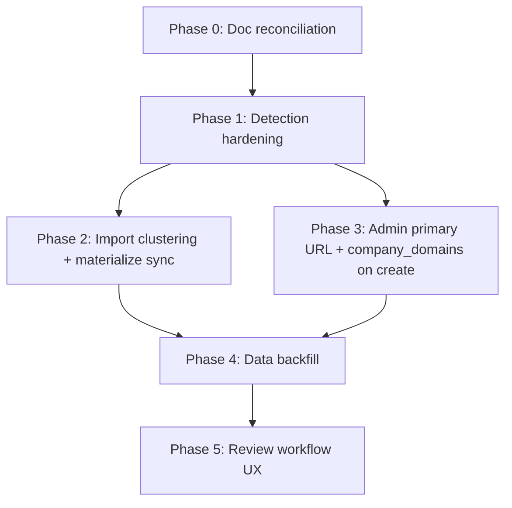

# Phase — Company Website Identity: Implementation Scope

**Status:** Approved for implementation planning  
**Version:** v1  
**Last updated:** 2026-06-25  

Implementation scope for **Company Website Canonical Identity** per [ADR-002](./adr/ADR-002-company-website-canonical-identity.md). Compares the proposed policy against the current codebase and defines phased delivery.

**Source of truth:** [ADR-002](./adr/ADR-002-company-website-canonical-identity.md) — if this scope conflicts with the ADR, the ADR wins.

**Related:** [ADR-001](./adr/ADR-001-company-identity.md), [company-domain-matching-v1.md](./implementation/company-domain-matching-v1.md)

**Permissions:** Admin-only for mutations. Public reads unchanged.

---

## 1. Summary

| Area | ADR-002 intent | Current state |
|------|----------------|---------------|
| Identity resolution (`domain` / `no_identity` / `unparseable`) | Tier-aware parsing in `hostedPlatformWebsite.ts` | **Mostly implemented** — gaps for CoinMarketCap, Mirror.xyz |
| Canonical website + identity key fields | `companies.website` + `companies.domain` | **Implemented** on admin create/edit and import validation |
| Verified domains (`company_domains`) | ADR-001 memory + primary promotion | **Implemented** — create path and merge reconciliation gaps |
| Import validation / matching / review link | Exact match + `community_website` warning | **Implemented** |
| Admin domains UI | List, add, set primary | **Implemented** — set-primary URL fidelity gap |
| Public sponsor website display | Href from website; label from domain | **Implemented** — hosted path label polish optional |
| Tier selection automation | Researcher-driven; no auto tier pick | **By design — no work** |
| Future review workflow | Upgrade queue, dashboard widgets | **Missing** |

---

## 2. ADR-002 section-by-section comparison

### §1 Purpose

| Status | Notes |
|--------|-------|
| **Partially implemented** | Behavior exists in code (`hostedPlatformWebsite.ts`, `company_domains`, import pipeline). Policy was undocumented until ADR-002. |

**Gap:** Cross-doc references (ADR-001, sponsor-import DB design, `project-state.md`) not yet updated.

---

### §2 Definitions

| Concept | Status | Implementation |
|---------|--------|----------------|
| Canonical website (`companies.website`) | **Already implemented** | Set on create/edit, import materialize |
| Identity key (`companies.domain`) | **Already implemented** | Derived via `resolveCompanyWebsiteIdentity` |
| Verified domain (`company_domains`) | **Already implemented** | Table + admin UI + import link |
| Primary verified domain | **Partially implemented** | RPC exists; promotion sets `website` to identity string only (see §7) |
| Website tier (researcher concept) | **Missing** | No stored tier; no UI tier badge |
| Identity resolution outcomes | **Already implemented** | `domain` \| `no_identity` \| `unparseable` |

---

### §3 Website selection priority

| Tier | ADR-002 | Status | Notes |
|------|---------|--------|-------|
| **Tier 1 — Official website** | Hostname identity; prefer when known | **Already implemented** | `resolveCompanyWebsiteIdentity` → `acme.com` |
| **Tier 2 — Social / directory / reference** | Directories → `no_identity`; LinkedIn company → path key | **Partially implemented** | Crunchbase, Wellfound, AngelList, Discord, Instagram → `no_identity` ✅. **CoinMarketCap / CoinGecko not in denylist** → incorrectly resolves to bare hostname ❌ |
| **Tier 3 — Hosted platform** | Path-aware keys (X, YouTube, OpenSea, Mirror, substack subdomain) | **Partially implemented** | Social + marketplace paths ✅. **Mirror.xyz** not handled → collapses to `mirror.xyz` ❌. **GitHub** → `no_identity` in code (ADR example mentions GitHub org as Tier 3 home — policy/code tension) |
| **Priority order (researcher)** | Tier 1 > 3 > 2 > empty | **No work** | Manual researcher choice; system does not auto-rank URLs in a single row |

---

### §4 Selection rules

| Rule | Status | Notes |
|------|--------|-------|
| One canonical URL per company | **Already implemented** | Single `companies.website` column |
| Tier precedence (researcher) | **No work** | Not automatable per ADR |
| Upgrade path (promote Tier 1) | **Partially implemented** | Admin edit + Set as Primary; no guided upgrade workflow |
| Public shows canonical only | **Already implemented** | `formatPublicCompanyWebsite`; no extra domains on public profile |
| URL fidelity on save | **Already implemented** | Full URL stored on create/edit |
| Identity derived from website | **Already implemented** | `companyAdmin.ts`, `createCompanyWithLogo.ts` |
| No bare shared hosts as identity | **Partially implemented** | See Tier 2 gaps (CMC) |
| Path-aware platform keys | **Partially implemented** | See Tier 3 gaps (Mirror) |
| Never fuzzy match | **Already implemented** | `companyImportMatching.ts` |
| Verified domains exact match | **Already implemented** | `matchRows.ts` loads `company_domains` |
| Researcher judgment scenarios | **Partially implemented** | Supported via admin UI; no operational queue |

---

### §5 Reference examples

| Example | ADR-002 expected | Status | Gap |
|---------|------------------|--------|-----|
| **Sorare** (Tier 1) | `sorare.com` key; auto-match | **Already implemented** | — |
| **Symbiogenesis** (Tier 1) | Project hostname key | **Already implemented** | Same as corporate hostname rules |
| **LinkedIn-only startup** (Tier 2) | `linkedin.com/company/...` key | **Already implemented** | Logo review flag via `companyNeedsLogoReview` |
| **CoinMarketCap-only** (Tier 2) | `no_identity`; `community_website` warning | **Missing** | `coinmarketcap.com` resolves as Tier 1 hostname today — **detection bug** |
| **Mirror.xyz project** (Tier 3) | Path key or `no_identity` until rules exist | **Missing** | `mirror.xyz` bare host identity — **detection bug** |

---

### §6 Import behavior

| Area | Status | Notes |
|------|--------|-------|
| Missing website → warning | **Already implemented** | `validateRows.ts` |
| Unparseable → blocking | **Already implemented** | |
| `no_identity` → `community_website` warning | **Already implemented** | For hosts in denylist |
| `normalized_domain` from identity | **Already implemented** | |
| Auto-accept: `companies.domain` | **Already implemented** | |
| Auto-accept: `company_domains.domain` | **Already implemented** | `matchRows.ts` |
| Auto-accept: name / alias | **Already implemented** | Name → `needs_review` with proposal; alias same |
| Review → link domain to `company_domains` | **Already implemented** | `maybeLinkReviewedImportDomain` |
| Duplicate cluster on `normalized_domain` | **Already implemented** | |
| `no_identity` rows must not cluster on shared bare host | **Already implemented** | `normalized_domain` null → falls back to name |
| `no_identity` rows with **same name, different URLs** | **Partially implemented** | Clusters on name — may incorrectly group distinct directory URLs with identical spreadsheet name |

---

### §7 Admin behavior

| Area | Status | Notes |
|------|--------|-------|
| Website required on create | **Already implemented** | Phase 1 |
| Re-derive identity on save | **Already implemented** | `companyAdmin.ts` |
| Logo.dev skip for hosted platform | **Already implemented** | `enrichCompanyLogo`, `isHostedPlatformWebsite` |
| Company Domains section | **Already implemented** | `CompanyDomainsSection.tsx` |
| Add verified domain | **Already implemented** | Rejects `no_identity` inputs |
| Set as Primary | **Partially implemented** | `set_company_primary_domain` sets `companies.website = domain` (identity key), **not** full canonical URL — breaks URL fidelity for path-based identities |
| Aliases (name match only) | **Already implemented** | |
| Merge + `company_domains` | **Partially implemented** | Merge RPC handles `companies.domain` order; **`company_domains` rows not explicitly reconciled** in documented merge behavior |
| Create company → `company_domains` primary row | **Missing** | `createCompany()` inserts `companies` only; backfill migration note says deferred |
| Admin list filters (hosted / logo review) | **Partially implemented** | `social_website`, `needs_logo_review` filters exist — no `no_identity` / directory-only filter |

---

### §8 Future review workflow

| Item | Status |
|------|--------|
| Upgrade queue for directory-only companies | **Missing** |
| Periodic Tier 1 discovery checks | **Missing** |
| Dashboard: “Companies on directory-only websites” | **Missing** |
| Publish guard: high % `no_identity` roster | **Missing** |
| Edition research metadata cross-link | **No work** | Separate feature; ADR-002 §8.2 informational only |
| Documentation / QA matrix | **Missing** | ADR-002 §8.4 — docs reconciliation required |

---

### §9 Non-goals

| Item | Status |
|------|--------|
| Fuzzy / AI matching | **Already aligned** — not implemented |
| Public multi-domain display | **Already aligned** |
| Auto URL selection from multiple sources | **Already aligned** |
| Scraping directories for official site | **Already aligned** |

---

## 3. Change areas (required work)

### 3.1 Detection changes required

| # | Change | ADR ref | Current | Required | Class |
|---|--------|---------|---------|----------|-------|
| D1 | Add **token directory hosts** to `no_identity` set: `coinmarketcap.com`, `coingecko.com` (and similar aggregators per locked list) | §5.4, §4.2 | CMC resolves to `coinmarketcap.com` | `no_identity` + `community_website` warning | **Code change** |
| D2 | Add **Mirror.xyz** rules: path-stable publication URLs → `mirror.xyz/{path}` identity **or** `no_identity` if path not stable | §5.5 | Collapses to `mirror.xyz` | Path-aware or denylist per ADR decision | **Code change** |
| D3 | Document **GitHub org** policy: code treats all `github.com/*` as `no_identity`; ADR cites GitHub as possible Tier 3 home | §3 Tier 3 | `no_identity` | Either amend ADR to exclude GitHub as identity **or** add `github.com/{org}` path rule | **Documentation only** OR **Code change** (product decision) |
| D4 | Audit **bare marketplace host** collapse (`opensea.io` without path → hostname key) | §3 Tier 3 | Hostname-only key for bare `/` | Confirm ADR intent; may need `no_identity` for bare marketplace roots | **Code change** (if ADR confirms) |
| D5 | Unit tests for §5 examples (Sorare, CMC, Mirror, LinkedIn) | §5 | Partial coverage in `hostedPlatformWebsite.test.ts` | Example matrix tests | **Code change** |

---

### 3.2 Import workflow changes required

| # | Change | Current | Required | Class |
|---|--------|---------|----------|-------|
| I1 | Validation uses updated detection (D1, D2) | — | `validateRows` picks up resolver changes | **Code change** (depends D1–D2) |
| I2 | Duplicate clustering for `no_identity` rows | Clusters on `normalized_company_name` | Cluster on `normalized_website` (or full URL key) when `normalized_domain` is null, so distinct CMC URLs do not merge | **Code change** |
| I3 | Review queue UI: surface `community_website` / tier hint | Warning in validation issues only | Optional badge in `RowDecisionDrawer` / validation table (“Directory reference”, “Hosted platform”) | **Code change** (optional UX) |
| I4 | Sponsor-import DB design doc: auto-accept sources | Doc stale | Document `company_domains` + alias matching | **Documentation only** |
| I5 | Link domain on materialize/create-new company | Review link only | Optionally insert primary `company_domains` when `createCompany` has non-null domain | **Code change** |

---

### 3.3 Admin workflow changes required

| # | Change | Current | Required | Class |
|---|--------|---------|----------|-------|
| A1 | **Set as Primary** preserves full URL | RPC sets `website = domain` string | Store researcher-approved URL; update `domain` identity key; sync `company_domains` | **Code change** + **Migration required** (RPC replace) |
| A2 | `createCompany` syncs primary `company_domains` row | No row inserted | Insert `is_primary = true` when `domain` non-null | **Code change** |
| A3 | Company detail: website **tier indicator** (read-only) | None | Display derived tier (Official / Hosted / Directory / None) from resolver | **Code change** |
| A4 | Admin filter: **directory-only** (`no_identity` website) | Missing | New list filter alongside `social_website` | **Code change** |
| A5 | Logo review surfacing on company detail | List filter only | Banner on detail when `companyNeedsLogoReview` | **Code change** (optional UX) |
| A6 | Merge wizard: `company_domains` reconciliation | Unclear / partial | Document + verify merge RPC moves domain rows to canonical | **Code change** if gaps found; else **Documentation only** |
| A7 | Admin IA + `project-state.md` updates | Stale | Company identity section | **Documentation only** |

---

### 3.4 Public display changes required

| # | Change | Current | Required | Class |
|---|--------|---------|----------|-------|
| P1 | Href from full `website` | **Already implemented** | — | **No work** |
| P2 | Label for path-aware identities | Label = full `domain` key (e.g. `linkedin.com/company/acme`) | Acceptable per ADR; optional friendlier label | **No work** or **Code change** (polish) |
| P3 | `no_identity` companies (CMC canonical) | Would show CMC href with host label once website stored | After D1, `domain` null → label from URL parser | **Code change** (follows D1) |
| P4 | Hide additional verified domains | **Already implemented** | — | **No work** |

---

### 3.5 Database changes required

| # | Change | Required? | Class |
|---|--------|-----------|-------|
| DB1 | Replace `set_company_primary_domain` to accept or reconstruct full `website` URL | Yes, for A1 | **Migration required** |
| DB2 | New column `companies.website_tier` or `identity_class` enum | No — tier can be derived at runtime | **No work** (unless product wants persisted tier for reporting) |
| DB3 | `company_domains.source_url` for full URL alongside identity key | Optional — reduces Set Primary ambiguity | **Migration required** only if A1 cannot derive URL from key |
| DB4 | Merge RPC: explicit `company_domains` repoint | Verify; fix if missing | **Migration required** if merge drops rows |

**Default recommendation:** Avoid new columns in v1; fix RPC + app layer to preserve `website` URL on primary promotion.

---

### 3.6 Data backfill requirements

| # | Scenario | Required? | Class |
|---|----------|-----------|-------|
| B1 | Companies with `domain = coinmarketcap.com` (or other directory hosts) from pre-D1 data | **Yes, after D1** | **Migration required** (data repair script): set `domain = NULL`; keep `website` |
| B2 | Companies with `domain = mirror.xyz` shared across projects | **Yes, after D2** | **Migration required**: null or path-specific re-key |
| B3 | Active companies with `domain IS NOT NULL` but missing `company_domains` primary | **Yes** | **Migration required** (one-time INSERT); same as implementation plan Phase 2 gap |
| B4 | Companies where `website` is full URL but `domain` is bare host while path-aware key expected | Audit after A1 | **Migration required** if audit finds drift |
| B5 | Re-run duplicate-company detection after identity repair | Recommended | **Code change** (script) + manual QA |

---

## 4. Phased implementation plan

### Phase 0 — Documentation reconciliation

| Item | Class | Exit signal |
|------|-------|-------------|
| Accept ADR-002 | **Documentation only** | Status → Accepted |
| Update ADR-001 §12 cross-ref to ADR-002 | **Documentation only** | |
| Update `company-domain-matching-v1.md` status + Phases 7–10 | **Documentation only** | |
| Update `sponsor-import-database-design.md` §2.5, §10 | **Documentation only** | |
| Update `project-state.md`, `README.md` | **Documentation only** | |
| Resolve GitHub Tier 3 policy (D3) in ADR or scope | **Documentation only** | Locked decision recorded |

---

### Phase 1 — Detection hardening

| Item | Class | Exit signal |
|------|-------|-------------|
| D1: CoinMarketCap / CoinGecko → `no_identity` | **Code change** | Tests; CMC import row → warning + null domain |
| D2: Mirror.xyz rules | **Code change** | Tests per §5.5 |
| D4: Bare marketplace roots (if confirmed) | **Code change** | Test matrix |
| D5: §5 example test suite | **Code change** | `npm run build` + unit tests green |

**No migration** in Phase 1.

---

### Phase 2 — Import workflow

| Item | Class | Exit signal |
|------|-------|-------------|
| I1: Validation picks up resolver (automatic) | **No work** separate | Covered by Phase 1 |
| I2: `no_identity` duplicate clustering on `normalized_website` | **Code change** | Test: two CMC URLs same name → not duplicates |
| I3: Review queue tier badges (optional) | **Code change** | UX review |
| I5: `createCompany` / materialize inserts primary `company_domains` | **Code change** | Verify script: no active company missing primary row |

---

### Phase 3 — Admin workflow

| Item | Class | Exit signal |
|------|-------|-------------|
| A1: Set Primary preserves full URL | **Code change** + **Migration required** | LinkedIn / OpenSea promotion keeps href |
| A2: Align with I5 if not done in Phase 2 | **Code change** | |
| A3: Tier indicator on company detail | **Code change** | |
| A4: Directory-only admin filter | **Code change** | |
| A5: Logo review banner (optional) | **Code change** | |
| A6: Merge + `company_domains` audit | **Documentation only** or **Migration required** | Merge integration test |

---

### Phase 4 — Data backfill

| Item | Class | Exit signal |
|------|-------|-------------|
| B1: Repair directory-host identity keys | **Migration required** | Post-migration verify query |
| B2: Repair `mirror.xyz` collisions | **Migration required** | |
| B3: Backfill missing `company_domains` primaries | **Migration required** | `supabase/verify/...` script |
| B4: Website/domain drift audit + fix | **Migration required** | Sample manual QA on §5 examples |

Deploy **detection (Phase 1) before backfill (Phase 4)** so new writes do not recreate bad keys.

---

### Phase 5 — Future review workflow (optional v1.1)

| Item | Class | Exit signal |
|------|-------|-------------|
| Dashboard widget: directory-only companies | **Code change** | |
| Admin queue / filter for upgrade candidates | **Code change** | |
| Publish warning: high `no_identity` % on edition | **Code change** | |
| ADR-002 §8.3 automation | **Deferred** | Product decision |

---

## 5. QA checklist (ADR-002 §5 examples)

### Detection

- [ ] `https://sorare.com` → `domain: sorare.com`
- [ ] `https://symbiogenesis.square-enix-games.com` → hostname key
- [ ] `https://www.linkedin.com/company/acme/` → `linkedin.com/company/acme`
- [ ] `https://coinmarketcap.com/currencies/example/` → `no_identity`
- [ ] `https://mirror.xyz/eth/0xabc...` → per locked D2 decision

### Import

- [ ] CMC row: `community_website` warning; no domain auto-accept
- [ ] Sorare row: auto_ready when domain verified
- [ ] Two distinct `no_identity` URLs same name: not duplicate-clustered (after I2)
- [ ] Review link creates `company_domains` row for path-aware domain

### Admin

- [ ] Create company with LinkedIn URL → website full URL; domain path key
- [ ] Set as Primary preserves full website URL (after A1)
- [ ] Add domain rejects Discord / CMC bare host
- [ ] `needs_logo_review` filter surfaces hosted companies

### Public

- [ ] Sorare sponsor profile: label `sorare.com`, href official URL
- [ ] LinkedIn-only company: href LinkedIn URL
- [ ] No additional domains listed

### Data

- [ ] No active company has `domain` in directory denylist (after B1)
- [ ] Every active company with non-null `domain` has primary `company_domains` row (after B3)

---

## 6. Exit criteria

- [ ] ADR-002 status → **Accepted**
- [ ] Phase 0 documentation updates merged
- [ ] Phase 1 detection gaps (D1, D2) closed or explicitly deferred in ADR
- [ ] Phase 3 A1 (Set Primary URL fidelity) closed or documented exception
- [ ] Phase 4 backfill run on target environment (or N/A with zero bad rows confirmed)
- [ ] §5 QA checklist passed
- [ ] `project-state.md` reflects company website identity policy

---

## 7. Explicitly out of scope

| Item | Notes |
|------|-------|
| Automated tier selection from multiple URLs in one import row | ADR-002 §9 |
| Fuzzy / AI identity | ADR-001 |
| Public display of `company_domains` | ADR-001 |
| Persisted `website_tier` column | Derived at runtime unless reporting needs it |
| Scraping official sites from directories | ADR-002 §9 |
| Edition research metadata changes | Informational link only |

---

## 8. Related documents

| Document | Path |
|----------|------|
| ADR-002 (policy) | [adr/ADR-002-company-website-canonical-identity.md](./adr/ADR-002-company-website-canonical-identity.md) |
| ADR-001 (multi-domain memory) | [adr/ADR-001-company-identity.md](./adr/ADR-001-company-identity.md) |
| Domain matching implementation | [implementation/company-domain-matching-v1.md](./implementation/company-domain-matching-v1.md) |
| Sponsor import DB design | [sponsor-import-database-design.md](./sponsor-import-database-design.md) |
| Project state | [project-state.md](./project-state.md) |

---

**End of company website identity implementation scope.**
