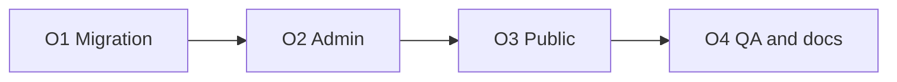

# Phase — Organizer v1: Implementation Scope

**Status:** Implemented  
**Version:** v1  
**Last updated:** 2026-07-04 (UX amendment documented — see §16)  

Implementation scope for **Organizer v1** per the approved [Organizer Design](./organizer-design.md). Defines deliverables, boundaries, validation intent, API surface, verification, and phase boundaries — not SQL, migrations, or application code.

**Source of truth:** [organizer-design.md](./organizer-design.md) — if this scope conflicts with the design doc, the design doc wins.

**Permissions:** Admin-only for all mutations (`profiles.role = admin`). Public reads use anon/authenticated `SELECT` on `event_edition_organizers` (full read — no tier gate).

---

## 1. Summary

| Area | v1 deliverable (O1–O4) | UX amendment (O5 — approved, pending implementation) |
|------|------------------------|------------------------------------------------------|
| Database | `event_edition_organizers` join table | **Unchanged** |
| Admin — edition | ~~Organizers tab~~ → **Profile** section: list, add, edit role, reorder, remove | See [phase-organizer-ux-amendment-scope.md](./phase-organizer-ux-amendment-scope.md) |
| Admin — company | Read-only **Organizer roles** on company detail | **Unchanged** |
| Public | ~~Overview section~~ → **Organizers tab** (`Overview \| Sponsors \| Venue \| Organizers`); tab always visible | See amendment doc §5 |
| Last reviewed | Auto-touch on add / remove / role-label edit; exclude reorder-only | **Unchanged** |
| Legacy cleanup | Replace rejected `event_organizers` → `organizers` query stubs | **Done (O2–O3)** |
| Lifecycle | Remove join row only — no hard delete of companies or editions | **Unchanged** |

---

## 2. v1 scope

### 2.1 In scope

| # | Deliverable |
|---|-------------|
| S1 | New table **`event_edition_organizers`** with RLS, constraints, and indexes per [organizer-migration-design.md](./organizer-migration-design.md) |
| S2 | Admin **Organizers** management on edition detail — **Profile embed** after O5 (was dedicated tab in O2–O4) |
| S3 | CRUD-style admin API for edition organizer links (add, patch role, reorder, delete) |
| S4 | Company search picker for add (reuse Add sponsor search family) |
| S5 | Server-managed **`display_order`** with Move Up / Move Down |
| S6 | Default **`role_label = "Organizer"`** on create; editable after |
| S7 | Read-only organizer history on **admin** company detail |
| S8 | Public **Organizers** tab on Event Detail — always visible; in-tab empty state when zero links (O5) |
| S9 | **`last_reviewed_at`** hooks on meaningful organizer writes |
| S10 | Company **merge** repoints organizer links to survivor (align with sponsor merge) |
| S11 | Remove or replace legacy **`getOrganizersByEventEdition`** / `organizers (*)` embeds |
| S12 | Unit tests for validation and ordering helpers; policy tests for last-reviewed wiring where applicable |

### 2.2 Explicit non-goals

| Non-goal | Notes |
|----------|-------|
| Separate **`organizers`** entity or table | Rejected per design |
| Reuse legacy table name **`event_organizers`** for v1 join | Use **`event_edition_organizers`** only |
| Series-level organizers | Edition-scoped only |
| Top-level **Organizers** admin nav / directory | Edition Profile section only |
| Standalone public **`/organizers/...`** routes | Not planned |
| Organizers on **Event Explorer** cards or series hub | Not in v1 |
| **Global admin search** for organizer links | Deferred |
| Public **“Events organized”** on `/sponsors/[slug]` | Admin company detail only in v1 |
| Excel / **sponsor-import** columns for organizers | Manual curation only |
| Automated backfill from sponsors or heuristics | No |
| **`created_by` / `updated_by`** on join row | Deferred |
| Controlled **role label enum** / picklist | Free text in v1 |
| Inline **create company** modal | Escape hatch link to `/admin/companies/new` only |
| Organizer-specific logos or fields on join row | Use `companies` presentation |
| Hard delete of companies or editions via organizer UI | Unchanged — not exposed |

---

## 3. Database deliverables

Migration SQL is defined in the approved [organizer-migration-design.md](./organizer-migration-design.md). This section defines **required outcomes** the migration must satisfy.

### 3.1 New table — `event_edition_organizers`

| Column | Nullable | Notes |
|--------|----------|-------|
| `id` | NO | uuid PK |
| `event_editions_id` | NO | FK → `event_editions.id` |
| `company_id` | NO | FK → `companies.id` |
| `role_label` | NO | Default `"Organizer"`; max 80 chars |
| `display_order` | NO | Dense 1..n within edition |
| `created_at` | NO | |
| `updated_at` | NO | |

**Explicitly not in v1:** `created_by`, `updated_by`, provenance, soft-archive, import references.

### 3.2 Constraints and relationships (required)

| Rule | Enforcement |
|------|-------------|
| `event_editions_id` → `event_editions.id` | FK, NOT NULL, **`ON DELETE RESTRICT`** |
| `company_id` → `companies.id` | FK, NOT NULL, **`ON DELETE RESTRICT`** |
| One link per company per edition | **`UNIQUE (event_editions_id, company_id)`** |
| No series FK | Organizer rows reference editions only |
| `role_label` non-empty, max 80 chars | **CHECK** constraints (required — defense in depth; see migration design §7.3) |
| `display_order` ≥ 1 | **CHECK** constraint (required) |

**Required indexes:**

- `event_edition_organizers (event_editions_id, display_order)` — list by edition
- `event_edition_organizers (company_id)` — company admin history

### 3.3 RLS (required)

Mirror catalog join pattern (`event_sponsors` public read intent, but **without** tier gate):

| Role | Access |
|------|--------|
| `anon`, `authenticated` | **`SELECT` all rows** on `event_edition_organizers` |
| Client writes | **None** |
| Admin writes | Service role via `/api/admin/...` |

### 3.4 Unchanged tables

| Table | Change |
|-------|--------|
| `companies` | No organizer-specific columns |
| `event_editions` | No organizer FK column |
| `event_series` | No change |
| `event_sponsors` | No change |

### 3.5 Data governance

| Rule | v1 |
|------|-----|
| Backfill organizers on existing editions | **No** — empty until manual curation |
| Duplicate company on same edition | **Blocked** by unique constraint |
| Same company as sponsor + organizer | **Allowed** — orthogonal joins |

### 3.6 Post-migration verification

Deliver a read-only verify script (pattern: `supabase/verify/organizers_v1_post_migration.sql`) confirming table, constraints, RLS, and zero rows on apply.

---

## 4. Admin UX scope

> **O5 amendment:** Replace §4.1–§4.2 tab model with Profile embed per [phase-organizer-ux-amendment-scope.md](./phase-organizer-ux-amendment-scope.md). API and panel capabilities unchanged.

### 4.1 Edition detail — Profile organizers section (locked after O5)

**Modified screen:**

| ID | Screen | Change |
|----|--------|--------|
| O-M01 | Edition detail Profile | **Organizers** section embedded on Profile tab (remove dedicated Organizers tab) |

**Tab order (locked after O5):**

| Order | Tab | Query param |
|-------|-----|-------------|
| 1 | Profile | `profile` (default) — includes Organizers section |
| 2 | Live sponsors | `sponsors` |
| 3 | Imports | `imports` |

Remove `tab=organizers` from edition detail tab routing.

### 4.2 Organizers section content (Profile)

| Affordance | Behavior |
|------------|----------|
| List table | All organizer links for edition, ordered by `display_order` ASC |
| Columns | Company name (link to admin company), `role_label`, actions |
| **Add organizer** | Opens company search picker |
| Edit role | Inline field or drawer — save patches `role_label` |
| **Move Up / Move Down** | Reorders within list; server renumbers `display_order` densely |
| **Remove** | Confirm modal: “Remove organizer from this edition only”; deletes join row |
| Empty state | Friendly copy when no organizers; CTA to add |
| Create company link | Text link to `/admin/companies/new` (escape hatch) |

**Picker rules (locked):**

- Companies already organizers on **this edition** → disabled in picker
- Companies that are sponsors only → **still selectable**
- No requirement to attach organizers before save or import

### 4.3 Company detail — Organizer roles (read-only)

**Modified screen:**

| ID | Screen | Change |
|----|--------|--------|
| O-M02 | Company detail | Add read-only **Organizer roles** section (mirror Sponsorships) |

| Column / field | Source |
|----------------|--------|
| Edition | Name, year, link to edition admin **Profile** |
| Series | Series name (secondary) |
| Role | `role_label` |

No add/edit/remove from company page in v1 — edition Profile Organizers section remains the write surface.

### 4.4 Explicitly not in admin v1

| Item | Notes |
|------|-------|
| Dedicated **Organizers** tab on edition detail | Removed in O5 — Profile embed only |
| Global Organizers list route | Out of scope |
| Bulk organizer import | Out of scope |
| Organizer analytics | Out of scope |
| Global admin search hit for organizers | Deferred |
| Edit organizers from company detail | Read-only history only |

### 4.5 Gates (unchanged workflows)

| Workflow | Organizers required? |
|----------|---------------------|
| Edition profile save | **No** |
| Sponsor import upload → publish | **No** |
| Edition create | **No** |

---

## 5. Public UX scope

> **O5 amendment:** Replace Overview-only display with dedicated Organizers tab per [phase-organizer-ux-amendment-scope.md](./phase-organizer-ux-amendment-scope.md).

### 5.1 Surface — Event Detail → Organizers tab (locked after O5)

| Condition | Behavior |
|-----------|----------|
| Organizers tab | **Always visible** in tab bar: Overview \| Sponsors \| Venue \| **Organizers** |
| ≥1 organizer link | Render organizer list on **Organizers** tab (`?tab=organizers`) |
| 0 organizer links | **Standard empty state inside Organizers tab** — tab **not hidden** |
| Overview tab | **No** organizers block |

Sponsors and Venue tabs unchanged.

### 5.2 Organizers tab content

| Element | Source |
|---------|--------|
| Company name | `companies.name` |
| Role label | `role_label` |
| Company link | Existing public sponsor/company profile route |
| Logo | Company logo when available |
| Order | `display_order` ASC |

Organizer content must **not** appear on Overview after O5.

### 5.3 Public queries

| Change | Detail |
|--------|--------|
| Edition detail fetch | Embed `event_edition_organizers` + `companies` for edition |
| Legacy embed | **Remove** `event_organizers ( *, organizers (*) )` from detail select |
| Explorer / series hub | **No** organizer fields |
| Public company profile | **No** “Events organized” block |

### 5.4 Unchanged public behavior

- Event Explorer cards (city only)
- Event Detail Sponsors tab and Venue tab
- Tier-gated sponsor visibility rules
- Global search and SEO metadata

---

## 6. `last_reviewed_at` policy scope

Per [organizer-design.md §10](./organizer-design.md) and [phase-edition-last-reviewed-automation-scope.md](./phase-edition-last-reviewed-automation-scope.md).

### 6.1 Auto-touch — Yes

| Write path | Touch edition `last_reviewed_at`? |
|------------|-----------------------------------|
| **POST** add organizer link | **Yes** |
| **DELETE** remove organizer link | **Yes** |
| **PATCH** `role_label` (actual change) | **Yes** |
| Company merge repointing organizer rows | **Yes per affected edition** |

Use existing `touchEditionLastReviewed` (or equivalent) — same timestamp semantics as live sponsor edits (`now()`).

### 6.2 Auto-touch — No

| Write path | Touch? |
|------------|--------|
| Reorder / Move Up / Down (`display_order` only) | **No** |
| No-op PATCH (unchanged values) | **No** |
| Edition create (no organizer rows) | **No** |

### 6.3 Documentation updates (ship with feature)

| Document | Action |
|----------|--------|
| [phase-edition-last-reviewed-automation-scope.md](./phase-edition-last-reviewed-automation-scope.md) | Add § for `event_edition_organizers` write paths |
| [event-admin-workflow.md](./event-admin-workflow.md) | Extend Last reviewed automation copy |

### 6.4 Tests

- Wiring test(s) confirming add / remove / role patch call touch helper
- Confirm reorder route does **not** call touch helper

---

## 7. API routes (v1 intent)

All routes require `requireAdminApi()`. Writes use `createAdminClient()`.

Organizer routes are **edition-nested** (mirror live sponsors):

| Method | Route | Purpose |
|--------|-------|---------|
| GET | `/api/admin/event-editions/[id]/organizers` | List organizers for edition (ordered) |
| POST | `/api/admin/event-editions/[id]/organizers` | Add link `{ company_id, role_label? }` |
| PATCH | `/api/admin/event-editions/[id]/organizers/[organizerId]` | Update `role_label` |
| DELETE | `/api/admin/event-editions/[id]/organizers/[organizerId]` | Remove link |
| POST | `/api/admin/event-editions/[id]/organizers/reorder` | Move up/down or explicit order payload |

*Exact path segments follow existing `/api/admin/event-editions/[id]/sponsors` conventions.*

**Modified routes:**

| Method | Route | Change |
|--------|-------|--------|
| GET | `/api/admin/companies/[id]` | Include read-only organizer roles list (or dedicated sub-resource) |
| — | Company merge RPC / admin | Repoint `event_edition_organizers.company_id`; touch affected editions |

**Public:** no new routes — edition page server fetch only.

---

## 8. Validation rules

### 8.1 Add organizer (POST)

| Rule | Type |
|------|------|
| `company_id` valid UUID | Error |
| Company exists | Error |
| Edition exists | Error |
| Duplicate `(event_editions_id, company_id)` | Error (409) |
| `role_label` omitted | Default **`"Organizer"`** |
| `role_label` non-empty after trim | Error |
| `role_label` length ≤ **80** | Error |
| `display_order` | Server assigns next integer at end of list |

### 8.2 Update role (PATCH)

| Rule | Type |
|------|------|
| Row belongs to edition | Error |
| `role_label` non-empty after trim | Error |
| `role_label` length ≤ **80** | Error |
| No effective change | No last-reviewed touch |

### 8.3 Reorder (POST reorder)

| Rule | Type |
|------|------|
| Row belongs to edition | Error |
| Move Up at first / Move Down at last | No-op or 409 — implementation choice |
| Resulting `display_order` dense 1..n within edition | Required |
| No last-reviewed touch | Required |

### 8.4 Remove (DELETE)

| Rule | Type |
|------|------|
| Row belongs to edition | Error |
| Deletes join row only | Required — company row untouched |
| Renumber remaining `display_order` | Required (dense 1..n) |

### 8.5 Company merge (O2 — required)

| Rule | Type |
|------|------|
| Extend existing company merge RPC to repoint `event_edition_organizers.company_id` | Required |
| Repoint organizer links from duplicate → canonical company | Required |
| Resolve duplicate `(edition, company)` pairs if both survive merge | Same semantics as sponsor merge |
| Touch `last_reviewed_at` on affected editions | Required |

---

## 9. Legacy cleanup scope

| Item | Action |
|------|--------|
| `src/lib/queries/organizers.ts` | Remove or replace with company-based query |
| `EVENT_EDITION_DETAIL_SELECT` in `events.ts` | Replace `event_organizers` / `organizers` embed with `event_edition_organizers` + `companies` |
| `docs/operations/backup-policy.md` | Update catalog table list when migration lands (not in this doc pass) |

Do **not** create an `organizers` table or revive legacy `event_organizers` → `organizers` FK shape.

---

## 10. Implementation phase boundaries

Organizer v1 is delivered in **four implementation phases** after this scope doc is approved. Migration design is documented in [organizer-migration-design.md](./organizer-migration-design.md) (approved).

### Phase O1 — Database

| Deliverable | Exit |
|-------------|------|
| [organizer-migration-design.md](./organizer-migration-design.md) approved | Prerequisite — **done** |
| Migration applied: `event_edition_organizers` + constraints + RLS | Verify script passes |
| No application code depending on table until O2 | Build may add types only |

**Out of boundary:** admin UI, public UI, API routes (except smoke tests if needed).

### Phase O2 — Admin

| Deliverable | Exit |
|-------------|------|
| Server modules: list / add / patch / delete / reorder | Unit tests pass |
| API routes under `/api/admin/event-editions/[id]/organizers` | Manual API check |
| Edition **Organizers** tab UI | Add, edit role, reorder, remove |
| Company detail read-only **Organizer roles** | Lists editions |
| `last_reviewed_at` on add / remove / role patch | Wiring tests pass |
| **Company merge RPC extension** | Repoint `event_edition_organizers.company_id` to survivor; resolve duplicate `(edition, company)` pairs; touch `last_reviewed_at` on affected editions |
| Remove dead `src/lib/queries/organizers.ts` and admin-only legacy references | No admin paths reference legacy `organizers` table |

**Out of boundary:** public Overview section, public detail select embed (`events.ts`), global search, import pipeline.

### Phase O3 — Public

| Deliverable | Exit |
|-------------|------|
| Edition detail fetch embeds organizers + companies | Server component data |
| Replace legacy `event_organizers` / `organizers` embed in `EVENT_EDITION_DETAIL_SELECT` | Uses `event_edition_organizers` + `companies` |
| **Organizers** tab on Event Detail | Renders list or empty state; tab always visible |
| Overview | **No** organizers block |
| Public RLS verified (anon sees all organizer rows) | Manual or integration check |

**Out of boundary:** Explorer cards, series hub, public company “Events organized”.

### Phase O4 — QA and documentation

| Deliverable | Exit |
|-------------|------|
| §11 QA checklist complete | All items pass |
| `npm run build` + targeted tests | Green |
| [project-state.md](./project-state.md), [README.md](./README.md), [admin-information-architecture.md](./admin-information-architecture.md), [event-admin-workflow.md](./event-admin-workflow.md), [phase-edition-last-reviewed-automation-scope.md](./phase-edition-last-reviewed-automation-scope.md) | Reconciled |
| This document status → **Implemented** | After ship |

**Deploy order:** O1 migration apply → O2 admin API + UI → O3 public embed → O4 QA + doc sync → **O5 UX amendment** (presentation only; no migration).

### Phase O5 — UX amendment (implemented)

| Deliverable | Exit |
|-------------|------|
| Remove admin Organizers tab; embed panel on Profile | Shipped |
| Add public Organizers tab; remove from Overview | Shipped |
| Living docs reconciled | **Done** (2026-07-04) |
| [phase-organizer-ux-amendment-scope.md](./phase-organizer-ux-amendment-scope.md) | **Implemented** |

**Out of boundary:** schema, API, merge, last-reviewed policy.

---

## 11. QA checklist

### Database

- [ ] `event_edition_organizers` exists with approved columns
- [ ] `UNIQUE (event_editions_id, company_id)` enforced
- [ ] FKs use `ON DELETE RESTRICT`
- [ ] CHECK constraints on `role_label` (1–80 chars) and `display_order >= 1`
- [ ] RLS: anon/authenticated `SELECT`; no client writes
- [ ] Fresh apply: zero rows; existing editions unchanged

### Admin — edition Profile organizers section

- [ ] Tab order: Profile · Live sponsors · Imports (no Organizers tab)
- [ ] Organizers section on **Profile** tab
- [ ] Empty state with Add CTA
- [ ] Add organizer via company search; default role **Organizer**
- [ ] Company already organizer on edition disabled in picker
- [ ] Company that is sponsor-only still selectable
- [ ] Edit role label; empty / >80 chars rejected
- [ ] Move Up / Move Down; dense order; no last-reviewed bump on reorder only
- [ ] Remove shows confirm modal; company not deleted
- [ ] Link to Create company works
- [ ] Same company can be sponsor (Live sponsors) and organizer (Organizers)

### Admin — company detail

- [ ] Read-only Organizer roles lists editions with role labels
- [ ] Links to edition admin work
- [ ] No write actions from company page

### Last reviewed

- [ ] Add organizer → `last_reviewed_at` updates
- [ ] Remove organizer → updates
- [ ] Role label change → updates
- [ ] Reorder only → does **not** update
- [ ] Company merge touching organizer links → affected editions touched

### Public

- [ ] Tab order: Overview · Sponsors · Venue · **Organizers**
- [ ] Organizers tab **always visible**
- [ ] Edition with organizers: Organizers tab shows list (name, role, logo, link)
- [ ] Edition without organizers: **empty state inside Organizers tab** (tab not hidden)
- [ ] Overview has **no** Organizers section
- [ ] Order matches admin `display_order`
- [ ] Sponsors tab unchanged
- [ ] Venue tab unchanged
- [ ] No `/organizers/...` route
- [ ] Public company page has no “Events organized” block

### Legacy / regression

- [ ] No queries reference `organizers` table or legacy `event_organizers` → `organizers` embed
- [ ] Sponsor import flow unchanged
- [ ] Edition create/edit without organizers unchanged
- [x] `npm run build` passes
- [x] Organizer validation / last-reviewed wiring tests pass

---

## 12. Resolved scope decisions

| # | Topic | Resolution (locked) |
|---|-------|---------------------|
| 1 | Join table name | **`event_edition_organizers`** |
| 2 | Admin UI | **Profile embed** on edition detail (O5) |
| 3 | Public empty state | **Omit section** |
| 4 | `role_label` max | **80 characters** |
| 5 | Create company | **Link escape hatch** only |
| 6 | Public company profile | **No** organized-events block in v1 |
| 7 | Global admin search | **Out of v1** |
| 8 | Audit columns on join | **None** in v1 |
| 9 | FK delete | **`ON DELETE RESTRICT`** |
| 10 | Migration prerequisite | [organizer-migration-design.md](./organizer-migration-design.md) — **Approved** |
| 11 | DB CHECK constraints | **Required** on `role_label` (non-empty, ≤80) and `display_order >= 1` |

---

## 13. Dependencies

| Dependency | Status | Notes |
|------------|--------|-------|
| [organizer-design.md](./organizer-design.md) | **Approved** | Source of truth |
| [organizer-migration-design.md](./organizer-migration-design.md) | **Applied** | O1 + merge extension migrations applied |
| [phase-1-events-admin-scope.md](./phase-1-events-admin-scope.md) | Implemented | Edition detail tabs, company picker patterns |
| Live sponsors admin | Implemented | Reorder / add patterns to mirror |
| [phase-edition-last-reviewed-automation-scope.md](./phase-edition-last-reviewed-automation-scope.md) | Implemented | Extended with organizer paths (§5.5, §7.5) |
| Company merge | Implemented | Extend repoint logic for organizer join |
| Public Event Detail tabs | Implemented → **O5:** Overview / Sponsors / Venue / Organizers |
| `companies` catalog | Live | FK target |

---

## 14. Exit criteria (v1)

- [x] Scope matches [organizer-design.md](./organizer-design.md) resolved decisions
- [x] No §2.2 non-goals shipped accidentally
- [x] Migration design doc approved and applied before production deploy
- [ ] All §11 QA items pass manual verification
- [x] Living docs updated per design §16 maintenance rule
- [x] This document status set to **Implemented**

**O4 (2026-07-04):** Automated QA green (`npm run build`; organizer validation, public mapper, and last-reviewed wiring tests). Manual §11 checklist remains for operator sign-off.

---

## 15. Related documents

| Document | Path |
|----------|------|
| Organizer design (approved) | [organizer-design.md](./organizer-design.md) |
| Organizer migration design (approved) | [organizer-migration-design.md](./organizer-migration-design.md) |
| Edition last reviewed automation | [phase-edition-last-reviewed-automation-scope.md](./phase-edition-last-reviewed-automation-scope.md) |
| Event admin workflow | [event-admin-workflow.md](./event-admin-workflow.md) |
| Admin IA | [admin-information-architecture.md](./admin-information-architecture.md) |
| Project state | [project-state.md](./project-state.md) |
| Organizer UX amendment (O5) | [phase-organizer-ux-amendment-scope.md](./phase-organizer-ux-amendment-scope.md) |
| Venue scope (pattern reference) | [phase-venue-scope.md](./phase-venue-scope.md) |

---

**Scope approval (2026-07-04):** Status set to **Approved**. Begin O1 per §10 after migration SQL is authored from [organizer-migration-design.md](./organizer-migration-design.md).

**Implementation complete (2026-07-04):** O1–O4 delivered. Legacy rejected architecture (`event_organizers` → `organizers` embed) replaced by `event_edition_organizers` + `companies`.

**UX amendment (2026-07-04):** O5 implemented — admin Profile embed + public Organizers tab. Manual QA per [phase-organizer-ux-amendment-scope.md §7](./phase-organizer-ux-amendment-scope.md).

---

## 16. UX amendment (O5)

Presentation-only revision approved after QA feedback. **Does not change** schema, API, merge, or `last_reviewed_at` policy.

| Surface | O1–O4 (shipped) | O5 (approved) |
|---------|-----------------|---------------|
| Admin | Dedicated Organizers tab | **Profile** Organizers section |
| Public | Overview organizers block (hidden when empty) | **Organizers** tab (always visible; in-tab empty state) |

Full scope: [phase-organizer-ux-amendment-scope.md](./phase-organizer-ux-amendment-scope.md).

---

**End of organizer v1 implementation scope.**
