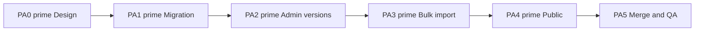

# Phase — Partner Alumni v2: Implementation Scope

**Status:** Approved (v2)  
**Version:** v2  
**Last updated:** 2026-07-05  

Implementation scope for **Partner Alumni v2** per the approved [Partner Alumni Design v2](./partner-alumni-design.md).

**Supersedes:** v1 scope (PA1–PA4 draft/Verify/snapshot phases). v1 implementation in the repository is **superseded** pending PA1′ migration and application retarget.

**Source of truth:** [partner-alumni-design.md](./partner-alumni-design.md)

**Permissions:** Admin-only for all mutations. Public reads **current version** only.

---

## 1. Summary

| Area | v2 deliverable |
|------|----------------|
| Database | Program + **versions** + **version members**; **no draft table**; `current_version_id` |
| Admin — series | Version list, **create (copy-from-current default)**, delete (block current), set current, member CRUD, **version-scoped bulk import** |
| Admin — company | Read-only recognition *(deferred — company detail out of scope)* |
| Public — edition | **Partner Alumni** tab — current version only; hidden when no current or zero members |
| Public — company | Recognition block *(deferred — company detail out of scope)* |
| Verify / snapshots | **Removed** |
| Series hub | **Out of scope** |
| Sponsor counts | **Unaffected** |

---

## 2. v2 scope

### 2.1 In scope

| # | Deliverable |
|---|-------------|
| S1 | PA1′ corrective migration: evolve v1 schema to version model per [partner-alumni-migration-design.md](./partner-alumni-migration-design.md) |
| S2 | Admin **Partner Alumni** section on series detail — **version-centric** UI |
| S3 | **Create New Version** (explicit only) |
| S4 | **Set as current** — updates `current_version_id` |
| S5 | **Delete version** — safeguarded for current |
| S6 | Version member API: add, remove, reorder on **selected version** |
| S7 | Version header API: `version_label`, `recognition_label`, `primary_source_url`, `source_checked_at` |
| S8 | **Bulk import** — preview/commit into **target version**; 400+ rows; matching/create/enrich |
| S9 | Public tab — conditional on current version with ≥1 member |
| S10 | Deep link guard: `?tab=partner-alumni` → Overview when hidden |
| S11 | Company merge repoints **version members** *(PA5)* |
| S12 | Unit tests for version lifecycle, tab visibility, import validation, ordering |

### 2.2 Explicit non-goals

| Non-goal | Notes |
|----------|-------|
| **Verify** action | **Removed** |
| **Draft roster** / `event_partner_alumni_companies` | **Removed** |
| Immutable snapshot history | **Removed** |
| `latest_snapshot_id` | **Replaced** by `current_version_id` |
| Auto-version from checked date | **Rejected** |
| Series hub public section | **Out of scope** |
| Sponsor import pipeline reuse | **Separate** — patterns only |
| Affecting sponsor counts | **No** |
| Edition `last_reviewed_at` touch | **No** |
| Unpublish as separate v1 concept | Replaced by set current / delete version |

---

## 3. Database deliverables (v2 target)

### 3.1 Tables

| Table | Purpose |
|-------|---------|
| `event_partner_alumni` | One program per series; `current_version_id` |
| `event_partner_alumni_versions` | Editable version headers |
| `event_partner_alumni_version_companies` | Editable members per version |

### 3.2 Removed

| Table | Action |
|-------|--------|
| `event_partner_alumni_companies` | **DROP** (PA1′) |

### 3.3 Evolved from v1

| v1 | v2 |
|----|-----|
| `event_partner_alumni_snapshots` | `event_partner_alumni_versions` |
| `event_partner_alumni_snapshot_companies` | `event_partner_alumni_version_companies` |
| `latest_snapshot_id` | `current_version_id` |

Detail: [partner-alumni-migration-design.md](./partner-alumni-migration-design.md).

---

## 4. Admin UX scope (v2)

### 4.1 Series detail — Partner Alumni section

| Affordance | Behavior |
|------------|----------|
| Version list | All versions; mark **current** |
| **Create New Version** | Explicit; **default copies current** (header + members); optional empty variant |
| **Set as current** | Updates public pointer — **409 if zero members** (OQ8) |
| **Delete version** | **Blocked for current** — reassign current first (OQ2) |
| Version selector | Edit header + members of selected version |
| Add / remove / reorder | On selected version |
| **Bulk upload** | Target = selected version |
| Create company link | `/admin/companies/new` escape hatch |

**Removed:** Verify, draft roster, snapshot history labels.

### 4.2 Bulk import (v2)

| Step | Behavior |
|------|----------|
| Target | Admin-selected **version_id** (required) |
| Parse | CSV/XLSX: name, website/domain, optional display_order |
| Preview | matched / new / review / on-roster / duplicate / invalid |
| Default import | **Matched** + **New company** selected; review opt-in |
| Commit | Insert members into **version**; create companies as needed; preserve order |
| Set as current | **Not** automatic — admin must explicitly Set as current (OQ9) |
| Version creation | **Not** implicit on upload — use Create New Version first if needed |
| Snapshots | **None** |

Reuse patterns from sponsor-import matching and company materialization — **not** sponsor-import tables.

---

## 5. Public UX scope (v2)

| Condition | Behavior |
|-----------|----------|
| `current_version_id` set and version has ≥1 member | Show Partner Alumni tab |
| Otherwise | Hide tab |
| Tab content | Current version header + ordered companies |
| Historical versions | **Not shown** |
| Sponsor tab / counts | **Unchanged** |

---

## 6. API routes (v2 intent)

All admin routes require `requireAdminApi()`. Series-nested under `/api/admin/event-series/[id]/partner-alumni/...`.

| Method | Route | Purpose |
|--------|-------|---------|
| GET | `.../partner-alumni` | Program + version list + current summary |
| POST | `.../partner-alumni/versions` | **Create New Version** — default **copy-from-current** (header + members); body may request `{ mode: "empty" }` |
| PATCH | `.../partner-alumni/versions/[versionId]` | Update version header |
| DELETE | `.../partner-alumni/versions/[versionId]` | Delete version — **409 if current** (OQ2) |
| POST | `.../partner-alumni/versions/[versionId]/set-current` | Set as current — **409 if zero members** (OQ8) |
| GET | `.../partner-alumni/versions/[versionId]` | Version detail + members |
| POST | `.../partner-alumni/versions/[versionId]/companies` | Add member |
| DELETE | `.../partner-alumni/versions/[versionId]/companies/[memberId]` | Remove member |
| POST | `.../partner-alumni/versions/[versionId]/companies/reorder` | Reorder |
| POST | `.../partner-alumni/versions/[versionId]/companies/bulk/preview` | Import preview |
| POST | `.../partner-alumni/versions/[versionId]/companies/bulk/commit` | Import commit |

**Removed routes:**

- `POST .../partner-alumni/verify`
- `GET .../partner-alumni/snapshots`
- Draft-scoped `.../companies` without version id *(retarget to version)*

---

## 7. Validation rules (v2 intent)

### 7.1 Version header

| Field | Rule |
|-------|------|
| `version_label` | Optional; max length TBD (e.g. 200) |
| `recognition_label` | Optional; max 200 |
| `primary_source_url` | Optional; max 2048; URL shape |
| `source_checked_at` | Optional ISO timestamp — **does not create version** |

### 7.2 Members

| Rule | Enforcement |
|------|-------------|
| `UNIQUE (version_id, company_id)` | 409 on duplicate |
| `display_order` dense 1..n | Server on reorder/remove |

### 7.3 Set as current

| Rule | Enforcement |
|------|-------------|
| Version belongs to program | Error if not |
| Version has **≥1 member** | **409 blocked** if zero members (OQ8) |

### 7.4 Bulk import

| Rule | Enforcement |
|------|-------------|
| Target version required | Error if missing |
| Auto-set as current on commit | **Rejected** — no pointer update (OQ9) |

### 7.5 Delete version

| Rule | Enforcement |
|------|-------------|
| Version is **current** (`current_version_id`) | **409 blocked** — assign another version as current first (OQ2) |
| Version is non-current | Allowed — delete version + members |
| Only version and it is current | **409 blocked** |

### 7.6 Create New Version

| Rule | Enforcement |
|------|-------------|
| Default behavior | **Copy current** version header + all members (OQ1) |
| No current version yet | Create empty first version |
| New version auto-set as current | **No** — separate Set as current action |

### 7.7 Tab visibility

| Rule | Result |
|------|--------|
| No `current_version_id` | Hidden |
| Current version 0 members | Hidden |
| Current version ≥1 member | Visible |

---

## 8. Implementation phases (v2 roadmap)

### PA0′ — Design reset ✅

| Deliverable | Status |
|-------------|--------|
| v2 design, migration design, scope docs | **Done** (2026-07-05) |

### PA1′ — Corrective migration

| Deliverable | Exit |
|-------------|------|
| **`20260711120000_partner_alumni_v2_versions.sql`** per [partner-alumni-migration-design.md §5](./partner-alumni-migration-design.md) | Applied + verify script |
| Rename snapshots → versions; drop draft; `current_version_id`; RLS v2 | Checklist §5.2 complete |

**Planning status:** **Complete** (2026-07-05). Migration SQL authored. OQ1–OQ4, OQ7 locked. **Apply migration + verify next.**

**Out of boundary:** application code.

### PA2′ — Admin versions

| Deliverable | Exit |
|-------------|------|
| Version list, **create (copy-from-current default)**, set current (**409 if zero members**), **delete (409 if current)**, member CRUD | Manual admin QA |
| Remove Verify UI and draft APIs | Code review |

### PA3′ — Version bulk import

| Deliverable | Exit |
|-------------|------|
| Preview/commit into version | 400+ row QA |
| Matching, create, enrich, order | Parity with bulk upload quality bar |
| No auto-set-current on commit | OQ9 — explicit Set as current only |

### PA4′ — Public retarget

| Deliverable | Exit |
|-------------|------|
| Read `current_version_id` | Tab + section |
| Remove snapshot/verify references | Code review |

### PA5 — Merge + QA ✅

| Deliverable | Exit |
|-------------|------|
| Merge repoint on version members | `_company_merge_process_partner_alumni` + migration `20260712120000_company_merge_partner_alumni.sql` |
| Same-version dedupe (lower `display_order`) | SQL + `partnerAlumniMergeDedupe.test.ts` |
| Sponsor counts unaffected | `getTotalSponsorCount` reads `event_sponsors` only; merge does not touch sponsors |
| Living docs → Implemented | `project-state.md` updated |

**Manual QA:** staging checklist in §10 (requires linked DB + admin session).

---

## 9. Superseded v1 work

The following shipped or partial v1 work must be **retargeted or removed** during PA2′–PA4′:

| v1 artifact | v2 disposition |
|-------------|----------------|
| `verifyPartnerAlumniAdmin` | **Remove** |
| `event_partner_alumni_companies` APIs | **Remove** |
| `SeriesPartnerAlumniPanel` Verify UX | **Replace** with version UX |
| PA3.5 draft-targeted bulk import | **Rewrite** for version target |
| `latest_snapshot_id` public reads | **Replace** with `current_version_id` |
| Snapshot terminology in UI/API | **Rename** to version |

**Salvageable:** company picker, reorder logic, public tab component shell, import parser/matcher/create patterns, admin API auth patterns.

---

## 10. QA checklist (v2)

### Database

- [x] No `event_partner_alumni_companies` table *(PA1′)*
- [x] `current_version_id` on program; no `latest_snapshot_id` *(PA1′)*
- [x] Version + member tables with v2 columns *(PA1′)*
- [x] RLS matches v2 intent *(PA1′)*
- [x] Company merge repoints version members *(PA5 migration)*

### Admin

- [x] Create New Version (explicit) *(PA2′ — code)*
- [x] Set as current changes public pointer *(PA2′)*
- [x] Set as current **blocked** when version has zero members (OQ8) *(PA2′)*
- [x] Bulk import does **not** auto-set current (OQ9) *(PA3′)*
- [x] Delete non-current version *(PA2′)*
- [x] Delete current blocked or safeguarded *(PA2′)*
- [x] Edit version header including source_checked_at without creating new version *(PA2′)*
- [x] Member add/remove/reorder on version *(PA2′)*
- [x] Bulk import 400+ rows into version *(PA3′ — parser cap 500; staging QA pending)*
- [x] **No Verify** affordance *(PA2′)*

### Public

- [x] Tab visible only when current version has ≥1 member *(PA4′)*
- [x] Tab shows current version only *(PA4′)*
- [x] Sponsor count unchanged *(PA4′/PA5 — separate tables/queries)*
- [x] Deep link guard works *(PA4′)*

### Regression

- [x] Sponsor import unchanged *(no PA3′/PA5 edits to sponsor import)*
- [x] `npm run build` passes *(PA5 verification)*
- [ ] Staging manual QA — version lifecycle, bulk 400+, merge dedupe, sponsor import smoke

---

## 11. Decision log

### 11.1 Locked (2026-07-05)

| # | Decision | Resolution |
|---|----------|------------|
| OQ1 | Create New Version default | **Copy current** — header fields + all members (OQ1) |
| OQ2 | Delete current version | **Blocked** — must Set as current on another version first |
| OQ3 | Schema evolution | **Rename/evolve** snapshot tables → versions; no parallel system |
| OQ4 | v1 draft rows | **Discard** at migration — no production data |
| OQ7 | Public current resolution | **Server-side** via `current_version_id`; revoke v1 public SELECT on all version rows |
| OQ8 | Set as current on empty version | **Blocked** — version must have ≥1 member |
| OQ9 | Bulk import auto-set current | **No** — admin must explicitly Set as current |

### 11.2 Remaining open questions

| # | Question | Blocks |
|---|----------|--------|
| OQ5 | Public **`source_checked_at`** display format (month precision?) | PA4′ UI |
| OQ6 | **`version_label`** max length (recommend 200) | Validation |
| OQ10 | Public company detail in PA4′ or defer to PA5? | Phase split |

---

## 12. Related documents

| Document | Path |
|----------|------|
| Partner Alumni design v2 | [partner-alumni-design.md](./partner-alumni-design.md) |
| Migration design v2 | [partner-alumni-migration-design.md](./partner-alumni-migration-design.md) |
| Project state | [project-state.md](./project-state.md) |

---

**Scope approval (v2):** PA0′–PA5 **implemented** (code + migrations authored). Apply `20260712120000_company_merge_partner_alumni.sql` on linked Supabase; complete staging manual QA (§10).

---

**End of Partner Alumni v2 implementation scope.**
