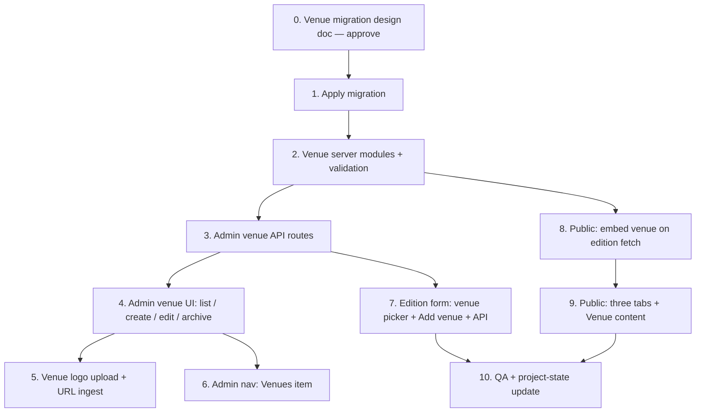

# Phase — Venue v1: Implementation Scope

**Status:** Approved  
**Version:** v1  
**Last updated:** 2026-06-25  

Implementation scope for **Venue v1** per the approved [Venue Design](./venue-design.md). Defines deliverables, boundaries, validation intent, API surface, and verification — not SQL, migrations, or application code.

**Source of truth:** [venue-design.md](./venue-design.md) — if this scope conflicts with the design doc, the design doc wins.

**Permissions:** Admin-only for all mutations (`profiles.role = admin`). Public reads use existing anon/authenticated SELECT on catalog tables.

---

## 1. Summary

| Area | v1 deliverable |
|------|----------------|
| Database | `venues` table + nullable `event_editions.venue_id` |
| Admin | Top-level **Venues** section: list, create, edit, archive, unarchive |
| Edition admin | Optional venue picker on create/edit; city–venue consistency enforced |
| Logo | `logo_url` + manual URL ingest + file upload (Event Series pattern) |
| Public | Event Edition tabs: **Overview**, **Sponsors**, **Venue** (no Exhibitors) |
| Lifecycle | Archive via `archived_at` only — **no delete** |

---

## 2. Database scope

A separate **venue migration design document** is **required** before any Supabase migration work begins. This scope doc defines *what* the migration must deliver; the migration design doc will specify SQL, ordering, constraints, and rollout.

Do not apply migrations until that document is approved.

### 2.1 New table — `venues`

| Column | Nullable | Notes |
|--------|----------|-------|
| `id` | NO | uuid PK |
| `name` | NO | Display name |
| `slug` | NO | Globally unique; server-generated with suffix fallback |
| `city_id` | NO | FK → `cities.id` |
| `website_url` | YES | Official venue site |
| `address_text` | YES | Free-form address for display + map query |
| `logo_url` | YES | Manual logo path/URL |
| `archived_at` | YES | NULL = active |
| `created_at` | NO | |
| `updated_at` | NO | |

**Explicitly not in v1:** `description`, `latitude`, `longitude`, `google_place_id`, stored map URL, capacity, venue type.

### 2.2 Column addition — `event_editions`

| Column | Nullable | References |
|--------|----------|------------|
| `venue_id` | YES | `venues.id` |

`event_editions.city_id` is **unchanged** and **not** deprecated.

### 2.3 Constraints and relationships (required)

| Rule | Enforcement |
|------|-------------|
| `venues.city_id` → `cities.id` | FK, NOT NULL |
| `event_editions.venue_id` → `venues.id` | FK, nullable |
| `venues.slug` unique | Unique index |
| City match when venue set | When `event_editions.venue_id` IS NOT NULL, `event_editions.city_id` MUST equal `venues.city_id` for the referenced row |
| Venue requires city on edition | `venue_id` may not be set when `city_id` IS NULL |
| No delete | No `ON DELETE CASCADE` that removes venue rows from admin delete (hard delete not exposed) |

**Recommended indexes (implementation choice):**

- `venues (city_id)` — picker queries
- `venues (archived_at)` or partial index for active venues — picker lists
- `event_editions (venue_id)` — linked-edition counts

### 2.4 RLS (required)

Mirror catalog tables (`event_series`, `event_editions`, `cities`):

| Role | Access |
|------|--------|
| `anon`, `authenticated` | `SELECT` on `venues` |
| Client writes | **None** |
| Admin writes | Service role via `/api/admin/...` |

### 2.5 Archive-only lifecycle

| Action | v1 behavior |
|--------|-------------|
| Archive | Set `archived_at` to current timestamp |
| Unarchive | Clear `archived_at` |
| Hard delete | **Not supported** — no admin API, no UI |
| Archived + linked editions | Allowed — `event_editions.venue_id` unchanged; venue readable on edition Venue tab and admin detail |

Active venue pickers list only rows where `archived_at IS NULL`. Archived venues remain visible on linked-edition admin views.

### 2.6 Historical location policy (data layer)

| Change | Policy |
|--------|--------|
| Typo in `name`, `address_text`, `website_url`, `logo_url` | Update same row |
| `city_id` change on existing venue | **Reject** — relocation requires new venue row |
| Relocation | New `venues` row; future editions link to new row; past editions unchanged |

### 2.7 Data governance (no schema beyond warnings)

| Rule | v1 |
|------|-----|
| Duplicate name + same `city_id` | Allowed; admin warning on create |
| Backfill `venue_id` on existing editions | **No** — stays NULL until manual assignment |
| Provenance columns on `venues` | **No** |

---

## 3. Admin scope

### 3.1 Navigation

Add **Venues** to admin primary sidebar per [venue-design.md §11.1](./venue-design.md):

| Order | Label | Route |
|-------|-------|-------|
| 1 | Dashboard | `/admin` |
| 2 | Events | `/admin/events` |
| 3 | Sponsor imports | `/admin/sponsor-imports` |
| 4 | Companies | `/admin/companies` |
| 5 | **Venues** | `/admin/venues` |
| 6 | View site | `/` |

Events sub-nav order (unchanged except confirm): Overview → Series → Editions.

Update `src/lib/constants/navigation.ts` (`adminPrimaryNavItems`) and revise [admin-information-architecture.md](./admin-information-architecture.md) §2.1 when implementing.

### 3.2 Screens to build

| ID | Screen | Route | Type |
|----|--------|-------|------|
| V-A01 | Venues list | `/admin/venues` | New |
| V-A02 | Create venue | `/admin/venues/new` | New |
| V-A03 | Venue detail / edit | `/admin/venues/[id]` | New |

**No** public routes under `/venues/...`.

### 3.3 Venues list (V-A01)

| Column / affordance | Source |
|---------------------|--------|
| Name | `venues.name` |
| City | Location formatter on `cities` embed |
| Linked editions | Count of `event_editions` where `venue_id` = venue |
| Logo thumbnail | `logo_url` when set |
| Status | Active vs archived |
| Search | Name, slug, city name (client or server — match existing admin list patterns) |

**Default view:** active venues only (`archived_at IS NULL`).

**Show archived (locked):** include a **“Show archived”** toggle on the list. When off, only active venues; when on, include archived rows (status column distinguishes them). Required for unarchive workflow.

**Defer (match existing admin lists):** server-side pagination — out of v1 unless trivial to add.

### 3.4 Create venue (V-A02)

| Field | DB column | Required | Notes |
|-------|-----------|----------|-------|
| Name | `venues.name` | **Yes** | |
| Slug | `venues.slug` | **Yes** | Auto from name; editable with warnings |
| City | `venues.city_id` | **Yes** | `AdminCitySelect` + inline Add City |
| Website URL | `venues.website_url` | No | Valid URL when provided |
| Address | `venues.address_text` | No | Free text |
| Logo URL | `venues.logo_url` | No | URL paste only on create (file upload after row exists — Event Series pattern) |

**Warnings (non-blocking):** existing venues with same `name` + `city_id`.

**CTAs:** **Create venue** → venue detail page.

### 3.5 Edit venue (V-A03)

Same fields as create, plus:

| Section | Content |
|---------|---------|
| Profile | All editable fields except `city_id` when ≥1 edition linked (see §3.7) |
| Linked editions | Read-only table: edition name, year, link to `/admin/events/editions/[id]` |
| Map preview | Dynamic Google Maps link (computed; not stored) |
| Logo | URL paste + file upload (§4) |
| Lifecycle | **Archive** / **Unarchive** — no delete |

**Slug change:** warning modal (same family as edition/company slug change).

### 3.6 Archive / unarchive (locked)

| Action | API | UI |
|--------|-----|-----|
| Archive | `POST /api/admin/venues/[id]/archive` | Confirm modal; venue hidden from default list and pickers |
| Unarchive | `POST /api/admin/venues/[id]/unarchive` | From venue detail or list with **Show archived** enabled |

`PATCH` must **not** accept `archived_at` directly — lifecycle changes go through dedicated routes only.

No delete button. No `DELETE` route.

### 3.7 City field on venue edit (locked)

| State | `city_id` on venue form |
|-------|-------------------------|
| No linked editions | Editable |
| ≥1 linked edition | **Read-only** with helper text: “Create a new venue to record a relocation.” |

Server must **reject** `city_id` changes when linked editions exist (400), even if UI is bypassed.

### 3.8 Explicitly not in admin v1

| Item | Notes |
|------|-------|
| Venue merge / dedupe tooling | Warnings only |
| Bulk venue import | Out of scope |
| Venue analytics | Out of scope |
| Global admin search including venues | Out of scope (existing search scope unchanged) |
| Hard delete | Out of scope |

---

## 4. Venue logo scope

Follow **Event Series logo** mechanics ([`eventSeriesAdmin.ts`](../src/features/events/server/eventSeriesAdmin.ts), [`EventSeriesForm`](../src/features/events/components/admin/EventSeriesForm.tsx)):

| Aspect | v1 requirement |
|--------|----------------|
| Column | `venues.logo_url` |
| URL paste | On create (via POST body) and edit (PATCH); ingest external URL into Supabase Storage when not already owned |
| File upload | `POST /api/admin/venues/[id]/logo` — multipart `file` field; **edit mode only** (requires venue `id`) |
| Allowed types | PNG, JPG, WebP |
| Max size | 2 MB (reuse `validateCompanyLogoUpload` / `MAX_COMPANY_LOGO_SIZE_BYTES`) |
| Storage bucket | Reuse `COMPANY_LOGO_BUCKET` |
| Object path (locked) | `venues/{venueId}/logo.{ext}` — e.g. `venues/abc-123/logo.png` |
| Auto-fetch | **None** — no Logo.dev or third-party discovery |
| Clear logo | Empty `logo_url` on PATCH clears stored logo (same cleanup pattern as series) |
| Public display | Edition Venue tab + venue admin detail when set |

**Not in v1:** logo required at create; automatic logo from website domain.

---

## 5. Edition integration scope

### 5.1 Modified screens

| ID | Screen | Change |
|----|--------|--------|
| V-M01 | Create edition (`EventEditionForm` create) | Add optional **Venue** field |
| V-M02 | Edit edition — Profile tab | Add optional **Venue** field; show current venue name when set |
| V-M03 | Edition admin detail header | Show venue name when `venue_id` set (read-only summary) |

### 5.2 Venue field behavior (locked)

| Edition state | Venue picker |
|---------------|--------------|
| No `city_id` | Disabled — helper: select city first |
| `city_id` set | Enabled — options: active venues where `venues.city_id` = edition `city_id` |
| Clear city | Clear `venue_id` (or block save until resolved) |
| Change city with venue set | Clear `venue_id` or require picking venue in new city before save |

**Inline Add venue:** modal scoped to current edition `city_id` (same UX family as Add City). On success, auto-select new venue.

**Picker UX (locked):** city-filtered select only — **no** “recently used venues” shortcuts in v1.

Venue never blocks edition save, sponsor import, or public listing.

### 5.3 Edition form field

| Field | DB column | Required | Notes |
|-------|-----------|----------|-------|
| Venue | `event_editions.venue_id` | No | Nullable select; “None” option |

### 5.4 Server validation on edition create/update

| Rule | Type |
|------|------|
| `venue_id` valid UUID when provided | Error |
| Referenced venue exists | Error |
| Referenced venue not archived (new attachment) | Error — cannot attach archived venue to edition |
| `city_id` required when `venue_id` set | Error |
| Edition `city_id` = venue `city_id` | Error |
| `venue_id` null | Always allowed |

**Note:** editions may retain `venue_id` pointing to an **archived** venue (historical link). Block only **new** attachments to archived venues.

### 5.5 Sponsor import

No change to import prerequisites. Venue remains optional; city/dates warnings unchanged.

---

## 6. Public scope

### 6.1 Event Edition tabs (locked)

Venue is displayed **only** inside the Event Edition experience. No standalone public venue pages.

Introduce edition sub-navigation on `/events/[slug]` (or equivalent edition route) with **exactly three tabs** in v1:

| Tab | v1 scope |
|-----|----------|
| **Overview** | Existing edition header and summary content (city formatter; stats; related editions; research info) — **no venue-specific block on Overview** |
| **Sponsors** | Existing `EventSponsorsSection` and sponsor actions |
| **Venue** | New — venue name, logo, website, address, map link (§6.2) |

**Exhibitors tab:** **not implemented** in this phase. Do not ship a placeholder Exhibitors tab.

Sponsors content moves under the Sponsors tab (not duplicated on Overview beyond any summary stats already on the header).

### 6.2 Venue tab content (when `venue_id` set)

| Element | Source |
|---------|--------|
| Venue name | `venues.name` |
| Venue logo | `venues.logo_url` when present |
| Location context | City label via existing location formatter on edition `city_id` |
| Address | `venues.address_text` when present |
| Website | `venues.website_url` — external link |
| Map link | Dynamic Google Maps search/directions URL (§6.3) |

### 6.3 Map link (computed)

Build query at render time from:

1. `venues.name`
2. `venues.address_text` (when present)
3. City embed (`cities.name`, `states.name`, `countries.name`)

Show **View map** (or equivalent) when venue is set. Do **not** store coordinates, place IDs, or map URLs in the database.

Exact URL format (`https://www.google.com/maps/search/?api=1&query=...` vs alternatives) is an implementation choice.

### 6.4 Empty states

| Condition | Venue tab |
|-----------|-----------|
| `venue_id` IS NULL | Friendly empty state (“Venue not specified”; edition may still show city on Overview) |
| `venue_id` set, archived venue | Still show venue data (historical link preserved) |

### 6.5 Public queries

Extend edition detail fetch (`getEventDetailData` or equivalent) to embed `venues` when `venue_id` is set, using the same city location embed pattern.

**Unchanged:** Event Explorer cards (city only); city pages; global search; SEO metadata (city-based location string on Overview remains acceptable).

---

## 7. API routes (v1)

All routes under `/api/admin/venues/*` require `requireAdminApi()`. Writes use `createAdminClient()`.

| Method | Route | Purpose |
|--------|-------|---------|
| GET | `/api/admin/venues` | List venues (search; `includeArchived` when **Show archived** is on) |
| POST | `/api/admin/venues` | Create venue |
| GET | `/api/admin/venues/[id]` | Venue detail + linked edition count |
| PATCH | `/api/admin/venues/[id]` | Update venue (enforce city immutability when linked) |
| POST | `/api/admin/venues/[id]/logo` | Logo file upload |
| POST | `/api/admin/venues/[id]/archive` | Set `archived_at` (lifecycle — not via PATCH) |
| POST | `/api/admin/venues/[id]/unarchive` | Clear `archived_at` (lifecycle — not via PATCH) |

**Modified routes:**

| Method | Route | Change |
|--------|-------|--------|
| POST | `/api/admin/event-editions` | Accept optional `venue_id`; validate city match |
| PATCH | `/api/admin/event-editions/[id]` | Accept optional `venue_id`; validate city match |
| GET | `/api/admin/event-editions/[id]` | Return embedded venue summary when set |

**Venue options for picker:**

| Method | Route | Purpose |
|--------|-------|---------|
| GET | `/api/admin/venues/options?cityId=` | Active venues for city (edition form) |

*Exact path naming follows existing `/api/admin/...` conventions.*

---

## 8. Validations summary

### 8.1 Venue create / update

| Rule | Type |
|------|------|
| `name` non-empty | Error |
| `slug` non-empty, URL-safe, globally unique | Error |
| `city_id` valid UUID | Error |
| `city_id` change when editions linked | Error |
| `website_url` valid URL | Error when provided |
| `logo_url` valid URL or owned storage URL | Error when provided |
| Duplicate `name` + `city_id` | Warning |
| `slug` change on edit | Warning modal |
| `archived_at` via PATCH | **Reject** — use archive/unarchive routes |

### 8.2 Edition venue attachment

See §5.4.

---

## 9. Suggested modules (implementation reference)

```
src/features/venues/
  components/admin/
    VenueForm.tsx
    VenueLinkedEditionsTable.tsx
    AdminVenueSelect.tsx
    AddVenueModal.tsx
  server/
    venueAdmin.ts
    venueLogoStorage.ts
    venueLogoIngest.ts
    getVenueAdminList.ts
    getVenueOptions.ts
    buildVenueMapsUrl.ts

src/app/admin/venues/
  page.tsx
  new/page.tsx
  [id]/page.tsx

src/app/api/admin/venues/
  route.ts
  [id]/route.ts
  [id]/logo/route.ts
  [id]/archive/route.ts
  [id]/unarchive/route.ts
  options/route.ts

src/features/events/components/detail/
  EventEditionTabs.tsx          (or equivalent)
  EventVenueSection.tsx
```

Paths are indicative — adjust to match repo conventions during implementation.

---

## 10. Explicitly excluded from v1

| Item | Notes |
|------|-------|
| Public `/venues/[slug]` pages | Not planned per design |
| Public venue directory / browse hub | Not in scope |
| Venue search on marketing site | Not in scope |
| Venue analytics / reporting | Not in scope |
| Venue merge / dedupe admin tools | Deferred; warnings only |
| Explorer card venue display | Deferred; data model supports later |
| Venue-first Explorer filtering | Not planned |
| Stored coordinates / place IDs / map URLs | Not in schema |
| `description`, venue type, capacity | Not in schema |
| Automated `venue_id` backfill | Explicitly excluded |
| Hard delete of venue rows | Archive only |
| Bulk venue import / seeding | Separate ops plan if ever needed |
| Countries / states / cities admin | Unchanged from Phase 1.1 |
| Exhibitors tab (public or admin) | Not part of venue v1 |
| “Recently used venues” picker shortcuts | Deferred |

---

## 11. Resolved scope decisions

| # | Topic | Resolution (locked) |
|---|-------|-------------------|
| 1 | Public edition tabs | **Overview**, **Sponsors**, **Venue** only — no Exhibitors tab in this phase |
| 2 | Venue picker UX | Picker only — no “recently used venues” shortcuts |
| 3 | Archive API | Dedicated `POST .../archive` and `POST .../unarchive` — not `PATCH archived_at` |
| 4 | Logo storage path | `venues/{venueId}/logo.{ext}` in `COMPANY_LOGO_BUCKET` |
| 5 | Archived venues browsing | **Show archived** toggle on venue list |
| 6 | Attach archived venue | Block new attachments only; preserve existing historical links |
| 7 | Migration prerequisite | Separate **venue migration design** document required and approved before any Supabase migration work |

No open scope decisions remain for v1 implementation.

---

## 12. Dependencies

| Dependency | Status | Notes |
|------------|--------|-------|
| [venue-design.md](./venue-design.md) | Approved | Source of truth |
| [phase-1.1-location-scope.md](./phase-1.1-location-scope.md) | Implemented | `AdminCitySelect`, Add City, location formatter |
| [phase-1-events-admin-scope.md](./phase-1-events-admin-scope.md) | Implemented | Edition form, admin nav patterns |
| `cities` hierarchy | Live | `venues.city_id` FK |
| Event Series logo pipeline | Implemented | Template for venue logo upload/ingest |
| Supabase Storage (`COMPANY_LOGO_BUCKET`) | Live | Reuse for venue logos |
| Public edition detail page | Live | Extend with Venue tab |
| Migration design doc (`venue-migration-design.md` or equivalent) | **Required — not started** | **Must be approved before** `supabase db push` or any migration SQL |
| [admin-information-architecture.md](./admin-information-architecture.md) | Stale nav | Update §2.1 when Venues ships |

**Deploy order:** migration design (approve) → migration apply → API/server → admin UI → edition form → public Venue tab → doc updates ([project-state.md](./project-state.md), README).

---

## 13. Implementation order



| Step | Deliverable | Exit signal |
|------|-------------|---------------|
| 0 | Venue migration design document | Reviewed and approved; SQL ready |
| 1 | Migration: `venues` + `event_editions.venue_id` + RLS + constraints | `supabase db push` succeeds |
| 2 | `venueAdmin.ts`, validation helpers, types | Unit tests or manual API smoke |
| 3 | `/api/admin/venues/*` CRUD + archive | Postman/curl create → archive → unarchive |
| 4 | Admin pages V-A01–V-A03 | End-to-end venue CRUD in browser |
| 5 | Logo upload + URL ingest | PNG upload + external URL paste both persist |
| 6 | `adminPrimaryNavItems` + Venues routes | Sidebar shows Venues after Companies |
| 7 | `EventEditionForm` + options API + inline Add venue | Attach/detach venue; city mismatch blocked |
| 8 | `getEventDetailData` venue embed | Edition with venue returns nested venue |
| 9 | Public edition tabs (Overview / Sponsors / Venue) + Venue content | Three tabs only; map link, logo, empty state verified |
| 10 | QA checklist (§14); update project-state | `npm run build` passes |

---

## 14. QA checklist

### Database

- [ ] `venues` table exists with approved columns
- [ ] `event_editions.venue_id` nullable FK present
- [ ] Cannot set `venue_id` when `city_id` is null (API + DB constraint if used)
- [ ] Cannot set `venue_id` when edition city ≠ venue city
- [ ] RLS: public SELECT on `venues`; no client writes

### Admin — venues

- [ ] Venues appears in sidebar after Companies
- [ ] List shows name, city, linked count, status, logo thumbnail
- [ ] Default list hides archived venues; **Show archived** toggle reveals archived rows
- [ ] Create venue with city (Add City inline works)
- [ ] Duplicate name in same city shows warning; save succeeds
- [ ] Edit venue: slug warning on change
- [ ] `city_id` read-only when editions linked; API rejects city change
- [ ] Linked editions table links to edition admin
- [ ] Archive hides venue from picker; linked editions retain `venue_id`
- [ ] Unarchive restores venue to active pickers
- [ ] No delete control anywhere

### Admin — logo

- [ ] Paste external logo URL on edit → stored in Supabase
- [ ] Upload PNG/JPG/WebP ≤ 2 MB → `logo_url` updated
- [ ] Clear logo URL removes logo
- [ ] Invalid file type / oversized file shows error

### Admin — edition

- [ ] Venue picker disabled until city selected
- [ ] Picker lists only active venues in edition city
- [ ] Inline Add venue creates row in current city and selects it
- [ ] Save edition with venue; clear venue; change city clears or blocks appropriately
- [ ] Cannot attach archived venue to edition
- [ ] Sponsor import still works with/without venue

### Public

- [ ] Public edition page has exactly three tabs: Overview, Sponsors, Venue (no Exhibitors)
- [ ] Edition with venue: Venue tab shows name, logo, city context, address, website, map link
- [ ] Edition without venue: Venue tab empty state
- [ ] Overview header still uses city formatter only (no venue name required there)
- [ ] No `/venues/...` public route exists
- [ ] Event Explorer cards unchanged (city only)

### Regression

- [ ] `npm run build` passes
- [ ] Existing edition create/edit without venue unchanged
- [ ] Location formatter behavior unchanged on Overview and Explorer

---

## 15. Exit criteria

- [ ] All §14 QA items pass (or documented exceptions)
- [ ] Scope matches [venue-design.md](./venue-design.md) resolved decisions §13
- [ ] No excluded items in §10 shipped accidentally
- [ ] [project-state.md](./project-state.md) updated: Venues row marked implemented; §7 priority cleared or reordered
- [ ] This document status set to **Implemented** when complete

---

## 16. Related documents

| Document | Path |
|----------|------|
| Venue design (approved) | [venue-design.md](./venue-design.md) |
| Venue migration design | **Required before migration** — not yet created |
| Project state | [project-state.md](./project-state.md) |
| Phase 1.1 location | [phase-1.1-location-scope.md](./phase-1.1-location-scope.md) |
| Phase 1 events admin | [phase-1-events-admin-scope.md](./phase-1-events-admin-scope.md) |
| Event admin workflow | [event-admin-workflow.md](./event-admin-workflow.md) |
| Admin IA | [admin-information-architecture.md](./admin-information-architecture.md) |
| Implementation roadmap | [implementation-roadmap.md](./implementation-roadmap.md) |

---

**End of venue v1 implementation scope (approved).**
