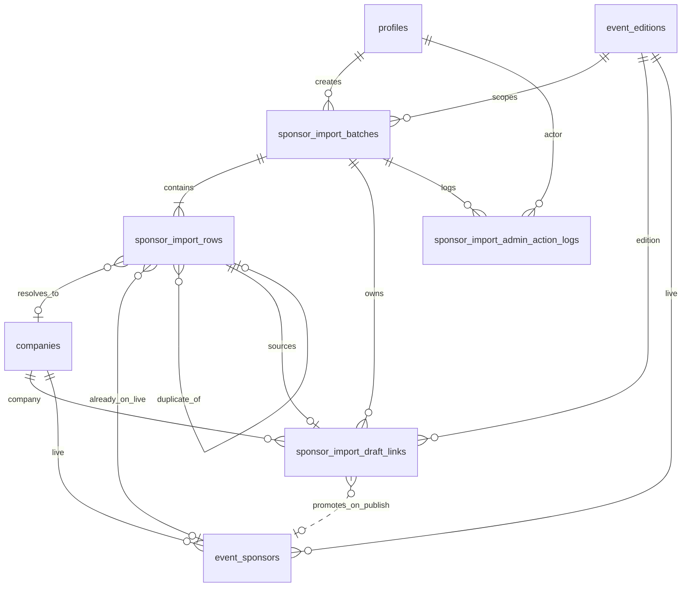

# EventPixels Sponsor Import — Database Design Document

**Status:** Approved  
**Version:** v1 (Excel-first, simplified)  
**Last updated:** 2026-06-03  

This document is the canonical basis for sponsor import architecture. It defines tables, columns, constraints, and relationships only — **no SQL or migrations** are included here.

For migration planning, see [Sponsor Import — Migration Design](./sponsor-import-migration-design.md).

---

## 1. Scope and foundations

### 1.1 Approved inputs

| Source | What it provides |
|--------|------------------|
| Live Supabase schema | `event_editions`, `companies`, `event_sponsors`, `profiles` |
| Excel-first workflow | Upload → validate → match → review → draft → publish |
| ER / concept model | Entity boundaries, cardinality, derived vs stored |
| Locked v1 business decisions | Additive publish, keep companies on discard, one draft per edition, exact-domain auto-accept only |
| Locked storage decisions | Draft links separate from live; live `(edition, company)` uniqueness |
| Final design review | Simplified to **4 import tables**; numeric tier ranks in Excel |

### 1.2 Design principles

1. **Draft and live never share storage.** Public queries read `event_sponsors` only. Draft data lives in `sponsor_import_draft_links`.
2. **Publish is the only promotion path** from draft links to live links.
3. **Additive publish only.** Publishing creates or updates live links; it never deletes live sponsors missing from the import.
4. **Discard removes draft links only.** Global `companies` rows persist.
5. **One active draft per event edition.** Enforced at batch level.
6. **Store facts and decisions; compute aggregates and reports.**
7. **Simplify v1.** No tier mapping table, no duplicate groups table, no new columns on `companies`.

### 1.3 Existing tables (reference)

| Table | Role | Import impact |
|-------|------|---------------|
| `event_editions` | Edition scope anchor | FK target for batches and draft/live links |
| `companies` | Global company directory | Matched, created, or reused during import — **no schema change in v1** |
| `event_sponsors` | **Live** edition ↔ company links + `tier_rank` | Publish target; gains uniqueness constraint |
| `profiles` | Admin attribution | FK for `created_by`, `published_by`, etc. |

---

## 2. Concept mapping summary

### 2.1 Standalone tables (new — v1)

| Concept | Table name |
|---------|------------|
| Import Batch | `sponsor_import_batches` |
| Import Row | `sponsor_import_rows` |
| Draft Sponsor Link | `sponsor_import_draft_links` |
| Admin Action Log | `sponsor_import_admin_action_logs` |

### 2.2 Deferred to v1.1 (not in v1 schema)

| Concept | Reason deferred |
|---------|-----------------|
| Tier Label Mapping | Researchers enter numeric `tier_rank` (1, 2, 3) directly in Excel |
| Duplicate-in-File Group | Row-level duplicate fields + uniqueness constraints are sufficient |
| `companies.created_by_import_batch_id` | Provenance recoverable via rows + action logs |

### 2.3 Columns on existing tables (v1)

| Table | Change |
|-------|--------|
| `event_sponsors` | `UNIQUE (event_editions_id, company_id)` only |
| `companies` | **No changes** |

### 2.4 Attributes → columns (not separate tables)

| Concept | Location |
|---------|----------|
| Source File | `sponsor_import_batches` (file metadata columns) |
| Column Mapping | `sponsor_import_batches.column_mapping` (JSON) |
| Normalized Row Values | `sponsor_import_rows` (normalized_* columns) |
| Validation Issue | `sponsor_import_rows.validation_issues` (JSON) + `has_blocking_validation` |
| Match Proposal | `sponsor_import_rows` (match_* columns) |
| Match Decision | `sponsor_import_rows` (decision_* + `resolved_company_id`) |
| Conflict | `sponsor_import_rows.conflict_type` |
| Duplicate-in-File (v1) | `sponsor_import_rows` (`duplicate_cluster_key`, `duplicate_role`, etc.) |
| Tier input (v1) | `sponsor_import_rows` (`raw_tier_rank`, `mapped_tier_rank`) |
| Already-on-Edition Case | `sponsor_import_rows.already_on_live_sponsor_id` |
| Row Review Status | `sponsor_import_rows.status` |
| Draft Import Scope | `sponsor_import_batches` when `status = 'draft'` |
| Publish Action | `sponsor_import_batches.published_at`, `published_by` |
| Discard Action | `sponsor_import_batches.discarded_at`, `discarded_by` |
| Draft Review Checklist | `sponsor_import_batches.review_acknowledged_at/by` |

### 2.5 Computed / derived (not stored)

| Concept | Derivation |
|---------|------------|
| Review Queue Summary | `COUNT(rows)` by `status`, blocking validation, pending duplicate rows |
| Import History Record | Query `sponsor_import_batches` by edition / status |
| Outcome Report (CSV) | Join batch + rows + draft links + live links at export time |
| Diff vs Live | Compare `sponsor_import_draft_links` to `event_sponsors` for edition |
| Active draft on edition | `EXISTS` batch where `event_edition_id` = X and `status` IN (`uploaded`, `review`, `draft`) |
| Auto-accept eligibility | `normalized_domain` exact match to `companies.domain` → row `status = auto_ready` |
| Publish preview counts | `+new`, `tier_updated`, `unchanged` from draft vs live diff |
| Duplicate group UI | `GROUP BY duplicate_cluster_key` on rows within batch |

---

## 3. Status enums (locked)

### 3.1 Batch status — `sponsor_import_batches.status`

| Value | Meaning | Public data touched |
|-------|---------|---------------------|
| `uploaded` | File stored, parsed, column mapping captured | None |
| `review` | Validation, matching, and admin review in progress | None |
| `draft` | Import-to-draft complete; draft links written | None (draft table only) |
| `published` | Additive publish completed | Live `event_sponsors` updated |
| `discarded` | Draft abandoned; draft links removed | None |

**Allowed transitions:**

```
uploaded → review → draft → published
uploaded → discarded
review   → discarded
draft    → discarded
```

`published` and `discarded` are terminal.

**Sub-phases (not status values):** `processing_phase` column tracks transient work: `parsing`, `validating`, `matching`, `importing_to_draft`, `publishing`.

### 3.2 Row status — `sponsor_import_rows.status`

| Value | Meaning |
|-------|---------|
| `needs_review` | Requires admin decision |
| `auto_ready` | Exact domain match; eligible for auto-accept |
| `resolved` | Decision recorded; eligible for import-to-draft |
| `excluded` | Row dropped; not imported |

**Import-to-draft guard:** Only `status = resolved` rows materialize into draft links. `auto_ready` rows must become `resolved` (bulk accept or auto-promote at import — application choice).

---

## 4. Entity relationship overview



---

## 5. Table specifications

### 5.1 `sponsor_import_batches`

#### Purpose

Root container for one Excel/CSV import job scoped to exactly one event edition. Carries batch lifecycle status, file metadata, column mapping, publish/discard audit fields, and draft-review acknowledgment.

#### Ownership

| Role | Owner |
|------|-------|
| Schema | `public` |
| Writes | Service role / admin API only |
| Reads | Admin only |

#### Lifecycle

1. Created on upload → `status = uploaded`
2. Column mapping confirmed → `uploaded` or `review`
3. Validation + matching + review → `status = review`
4. Import-to-draft succeeds → `status = draft`
5. Additive publish succeeds → `status = published` (draft links **retained** for audit)
6. Discard from `uploaded`, `review`, or `draft` → `status = discarded` (draft links deleted)

#### Conceptual columns

| Column | Type (conceptual) | Nullable | Notes |
|--------|-------------------|----------|-------|
| `id` | uuid | NO | PK |
| `event_edition_id` | uuid | NO | FK → `event_editions.id` |
| `status` | enum | NO | `uploaded`, `review`, `draft`, `published`, `discarded` |
| `processing_phase` | enum | YES | Transient UI phase |
| `source_filename` | text | NO | Original upload name |
| `source_file_storage_path` | text | NO | Stored object path |
| `source_file_format` | enum | NO | `xlsx`, `xls`, `csv` |
| `source_sheet_name` | text | YES | Multi-sheet workbooks |
| `source_row_count` | integer | NO | Excluding header |
| `source_file_checksum` | text | YES | Dedup / audit |
| `column_mapping` | json | NO | `{ company_name, website, tier_rank, notes? }` |
| `created_by` | uuid | NO | FK → `profiles.id` |
| `published_by` | uuid | YES | FK → `profiles.id` |
| `discarded_by` | uuid | YES | FK → `profiles.id` |
| `review_acknowledged_by` | uuid | YES | FK → `profiles.id` |
| `published_at` | timestamp | YES | |
| `discarded_at` | timestamp | YES | |
| `review_acknowledged_at` | timestamp | YES | Pre-publish gate |
| `discard_reason` | text | YES | Optional admin note |
| `created_at` | timestamp | NO | |
| `updated_at` | timestamp | NO | |

#### Primary key

`id`

#### Foreign keys

| Column | References |
|--------|------------|
| `event_edition_id` | `event_editions.id` |
| `created_by` | `profiles.id` |
| `published_by` | `profiles.id` |
| `discarded_by` | `profiles.id` |
| `review_acknowledged_by` | `profiles.id` |

#### Unique constraints

| Constraint | Rule |
|------------|------|
| One active import per edition | At most one row per `event_edition_id` where `status` IN (`uploaded`, `review`, `draft`) |

#### Recommended indexes

| Index | Columns | Purpose |
|-------|---------|---------|
| `idx_sib_edition_status` | `(event_edition_id, status)` | Edition history; active-draft lookup |
| `idx_sib_status_created` | `(status, created_at DESC)` | Admin import history |
| `idx_sib_created_by` | `(created_by)` | Audit by admin |

---

### 5.2 `sponsor_import_rows`

#### Purpose

One row per Excel data line. Stores raw and normalized values, validation, matching, duplicate-in-file state, admin decision, and row status.

#### Ownership

Service role / admin API only.

#### Lifecycle

1. Created on file parse
2. Validation + normalization → `validation_issues`, `mapped_tier_rank`
3. Duplicate detection → `duplicate_cluster_key`, `duplicate_role`
4. Matching → `auto_ready` or `needs_review`
5. Admin resolves → `resolved` or `excluded`
6. Import-to-draft → creates `sponsor_import_draft_links`; sets `draft_link_id`

#### Conceptual columns

**Identity & lineage**

| Column | Type | Nullable | Notes |
|--------|------|----------|-------|
| `id` | uuid | NO | PK |
| `batch_id` | uuid | NO | FK → `sponsor_import_batches.id` |
| `excel_row_number` | integer | NO | 1-based |

**Raw Excel values**

| Column | Type | Nullable | Notes |
|--------|------|----------|-------|
| `raw_company_name` | text | YES | |
| `raw_website` | text | YES | |
| `raw_tier_rank` | integer | YES | Numeric tier from Excel |

**Normalized values**

| Column | Type | Nullable | Notes |
|--------|------|----------|-------|
| `normalized_company_name` | text | YES | |
| `normalized_website` | text | YES | |
| `normalized_domain` | text | YES | Primary match key |
| `proposed_slug` | text | YES | Create-new path |
| `mapped_tier_rank` | integer | YES | Validated integer tier |

**Row status**

| Column | Type | Nullable | Notes |
|--------|------|----------|-------|
| `status` | enum | NO | `needs_review`, `auto_ready`, `resolved`, `excluded` |

**Validation**

| Column | Type | Nullable | Notes |
|--------|------|----------|-------|
| `validation_issues` | json | NO | `{ type, severity, message, resolved }[]` |
| `has_blocking_validation` | boolean | NO | Blocks import-to-draft |

**Match proposal & decision**

| Column | Type | Nullable | Notes |
|--------|------|----------|-------|
| `match_method` | enum | YES | `domain`, `slug`, `exact_name`, `fuzzy_name`, `manual` |
| `match_confidence` | enum | YES | `high` only for exact domain |
| `proposed_company_id` | uuid | YES | FK → `companies.id` |
| `conflict_type` | enum | YES | `domain_name_mismatch`, `uniqueness_violation`, `multiple_candidates` |
| `decision_type` | enum | YES | `use_matched`, `create_new`, `choose_different`, `exclude` |
| `decision_source` | enum | YES | `auto_accepted`, `admin_manual`, `bulk_action` |
| `resolved_company_id` | uuid | YES | FK → `companies.id` |
| `decision_by` | uuid | YES | FK → `profiles.id` |
| `decision_at` | timestamp | YES | |
| `decision_notes` | text | YES | |

**Duplicate-in-file (row-level, v1)**

| Column | Type | Nullable | Notes |
|--------|------|----------|-------|
| `duplicate_cluster_key` | text | YES | e.g. normalized domain within batch |
| `duplicate_role` | enum | YES | `canonical`, `duplicate`, null |
| `duplicate_of_row_id` | uuid | YES | Self-FK → `sponsor_import_rows.id` |
| `duplicate_resolution` | enum | YES | `pending`, `kept`, `excluded` |

**Already on edition (live)**

| Column | Type | Nullable | Notes |
|--------|------|----------|-------|
| `already_on_live_sponsor_id` | uuid | YES | FK → `event_sponsors.id` |
| `already_on_live_tier_rank` | integer | YES | Snapshot |
| `intended_link_action` | enum | YES | `create_new_link`, `update_tier`, `skip` |

**Post draft-import**

| Column | Type | Nullable | Notes |
|--------|------|----------|-------|
| `draft_link_id` | uuid | YES | FK → `sponsor_import_draft_links.id` |
| `import_error` | text | YES | Draft materialization failure |

**Timestamps**

| Column | Type | Nullable |
|--------|------|----------|
| `created_at` | timestamp | NO |
| `updated_at` | timestamp | NO |

#### Primary key

`id`

#### Foreign keys

| Column | References | On delete |
|--------|------------|-----------|
| `batch_id` | `sponsor_import_batches.id` | CASCADE |
| `proposed_company_id` | `companies.id` | — |
| `resolved_company_id` | `companies.id` | — |
| `decision_by` | `profiles.id` | — |
| `duplicate_of_row_id` | `sponsor_import_rows.id` | — |
| `already_on_live_sponsor_id` | `event_sponsors.id` | — |
| `draft_link_id` | `sponsor_import_draft_links.id` | — |

#### Unique constraints

`UNIQUE (batch_id, excel_row_number)`

#### Recommended indexes

| Index | Columns | Purpose |
|-------|---------|---------|
| `idx_sir_batch_status` | `(batch_id, status)` | Review queue |
| `idx_sir_batch_blocking` | `(batch_id, has_blocking_validation)` | Blocking count |
| `idx_sir_batch_duplicate_key` | `(batch_id, duplicate_cluster_key)` | Duplicate grouping |
| `idx_sir_batch_duplicate_pending` | `(batch_id, duplicate_resolution)` | Open duplicates |
| `idx_sir_normalized_domain` | `(normalized_domain)` | Domain lookup |

---

### 5.3 `sponsor_import_draft_links`

#### Purpose

**Draft-only** edition ↔ company sponsorship. Separate from `event_sponsors`. Never exposed to public queries. **Retained after publish** for audit and outcome reports.

#### Ownership

Service role / admin API only.

#### Lifecycle

1. Created on import-to-draft
2. Editable while batch `status = draft`
3. On publish: promotes to `event_sponsors` (insert or tier update); links **retained**
4. On discard: deleted with batch draft scope

#### Conceptual columns

| Column | Type | Nullable | Notes |
|--------|------|----------|-------|
| `id` | uuid | NO | PK |
| `batch_id` | uuid | NO | FK |
| `event_edition_id` | uuid | NO | FK (denormalized from batch) |
| `company_id` | uuid | NO | FK → `companies.id` |
| `tier_rank` | integer | NO | Required |
| `source_import_row_id` | uuid | YES | FK → `sponsor_import_rows.id` |
| `excluded_from_publish` | boolean | NO | Default false |
| `created_at` | timestamp | NO | |
| `updated_at` | timestamp | NO | |

#### Primary key

`id`

#### Foreign keys

| Column | References | On delete |
|--------|------------|-----------|
| `batch_id` | `sponsor_import_batches.id` | CASCADE |
| `event_edition_id` | `event_editions.id` | — |
| `company_id` | `companies.id` | — |
| `source_import_row_id` | `sponsor_import_rows.id` | — |

#### Unique constraints

`UNIQUE (batch_id, company_id)`

#### Recommended indexes

| Index | Columns | Purpose |
|-------|---------|---------|
| `idx_sidl_batch` | `(batch_id)` | Draft review |
| `idx_sidl_edition` | `(event_edition_id)` | Diff vs live |
| `idx_sidl_company` | `(company_id)` | Company admin |

---

### 5.4 `sponsor_import_admin_action_logs`

#### Purpose

Thin, append-only audit for batch-level operations. Complements attribution columns on `sponsor_import_batches` and per-row `decision_by`.

#### Ownership

Service role writes; admin reads.

#### Lifecycle

Append-only in v1.

#### Conceptual columns

| Column | Type | Nullable | Notes |
|--------|------|----------|-------|
| `id` | uuid | NO | PK |
| `batch_id` | uuid | NO | FK |
| `actor_id` | uuid | NO | FK → `profiles.id` |
| `action_type` | enum | NO | See below |
| `payload` | json | YES | Summary metadata |
| `affected_count` | integer | YES | Rows impacted |
| `created_at` | timestamp | NO | |

**`action_type` values (v1):**

`upload`, `column_mapping_saved`, `validation_run`, `matching_run`, `bulk_accept_domain_matches`, `import_to_draft`, `review_acknowledged`, `publish`, `discard`

Per-row decisions are **not** logged here — use `sponsor_import_rows.decision_by`.

#### Primary key

`id`

#### Foreign keys

| Column | References | On delete |
|--------|------------|-----------|
| `batch_id` | `sponsor_import_batches.id` | CASCADE |
| `actor_id` | `profiles.id` | — |

#### Recommended indexes

`(batch_id, created_at DESC)`

---

### 5.5 `event_sponsors` (existing — constraint only)

#### v1 change

| Constraint | Columns |
|------------|---------|
| Live sponsor uniqueness | `UNIQUE (event_editions_id, company_id)` |

Both columns should be `NOT NULL` for live links (true in production today).

#### Publish behavior (additive)

| Live state | Action |
|------------|--------|
| No live link for (edition, company) | INSERT |
| Live link exists | UPDATE `tier_rank` only |
| Live link not in draft | No action |

---

### 5.6 `companies` (existing — no v1 changes)

Global directory unchanged. Company provenance after import is traced via `sponsor_import_rows.resolved_company_id` and action logs — not via a column on `companies`.

---

## 6. Publish and discard algorithms (conceptual)

### 6.1 Import to draft

**Preconditions:**

- Batch `status = review`
- No rows with `has_blocking_validation = true`
- No rows with `duplicate_role = duplicate` AND `duplicate_resolution = pending`
- No rows with `status = needs_review`
- No rows with `status = auto_ready` unless promoted to `resolved`

**Steps:**

1. Set `processing_phase = importing_to_draft`
2. For each `resolved` row: create/reuse company; upsert draft link on `(batch_id, company_id)`; set `draft_link_id`
3. Set batch `status = draft`

### 6.2 Publish (additive)

**Preconditions:** Batch `status = draft`; `review_acknowledged_at` set.

**Steps:**

1. Set `processing_phase = publishing`
2. For each draft link where `excluded_from_publish = false`: upsert `event_sponsors`
3. Set batch `status = published`; **retain draft links**

### 6.3 Discard

**Preconditions:** Batch `status` IN (`uploaded`, `review`, `draft`).

**Steps:**

1. DELETE draft links for batch
2. Set batch `status = discarded`
3. Do **not** delete `companies`

---

## 7. Row and batch guards

| Guard | Check |
|-------|-------|
| One draft per edition | Partial unique on `event_edition_id` for active batch statuses |
| Row blocking validation | `has_blocking_validation = false` |
| Open in-file duplicates | No `duplicate_role = duplicate` with `duplicate_resolution = pending` |
| Unresolved rows | No `status = needs_review` |
| Draft uniqueness | `UNIQUE (batch_id, company_id)` on draft links |
| Live uniqueness | `UNIQUE (event_editions_id, company_id)` on `event_sponsors` |
| Publish acknowledgment | `review_acknowledged_at` IS NOT NULL |

---

## 8. RLS and access (design intent)

| Table | anon | authenticated | service_role |
|-------|------|---------------|--------------|
| `event_editions` | SELECT | SELECT | ALL |
| `companies` | SELECT | SELECT | ALL |
| `event_sponsors` | SELECT tier 1 | SELECT all | ALL |
| `profiles` | own row | own row | ALL |
| All `sponsor_import_*` | **no access** | **no access** | ALL |

---

## 9. v1 vs v1.1

| Area | v1 | v1.1 |
|------|----|------|
| Import tables | 4 | + tier mappings, enrichment |
| Tier input | Integer in Excel | String label mapping table |
| Duplicates | Row-level flags | Optional duplicate groups table |
| Company provenance column | — | `created_by_import_batch_id` |
| Apollo | — | Enrichment jobs |
| Scraping | — | Same row pipeline |

---

## 10. v1 implementation checklist

- [ ] Create 4 `sponsor_import_*` tables
- [ ] Add `UNIQUE (event_editions_id, company_id)` on `event_sponsors`
- [ ] Enforce one active import per edition (partial unique)
- [ ] RLS: deny client access to `sponsor_import_*`
- [ ] Resolve circular FK (rows ↔ draft links) in migration ordering
- [ ] Implement domain normalizer (shared server module)
- [ ] Admin API: full batch lifecycle
- [ ] Public queries: unchanged

---

## 11. Document history

| Date | Change |
|------|--------|
| 2026-06-03 | Initial database design document |
| 2026-06-03 | **Approved simplified v1:** 4 tables; removed tier mappings, duplicate groups, `companies.created_by_import_batch_id`; numeric tiers; row-level duplicates; retain draft links after publish |

---

## 12. Related decisions (reference)

| Decision | Value |
|----------|-------|
| Primary import source | Excel / CSV |
| Publish mode | Additive |
| Draft discard | Keep companies |
| Drafts per edition | One active |
| Auto-accept | Exact domain match only |
| Draft storage | `sponsor_import_draft_links` (separate from live) |
| Draft links after publish | Retain for audit |
| Live uniqueness | `UNIQUE (event_editions_id, company_id)` |
| Tier input (v1) | Numeric `tier_rank` in Excel |
| Batch status | `uploaded`, `review`, `draft`, `published`, `discarded` |
| Row status | `needs_review`, `auto_ready`, `resolved`, `excluded` |
