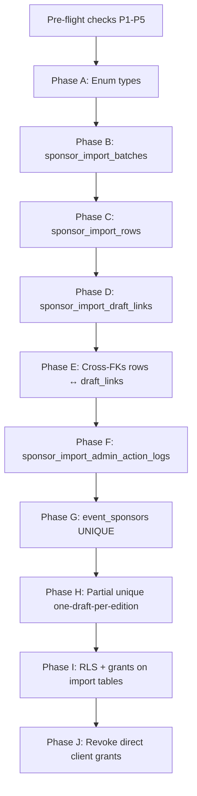
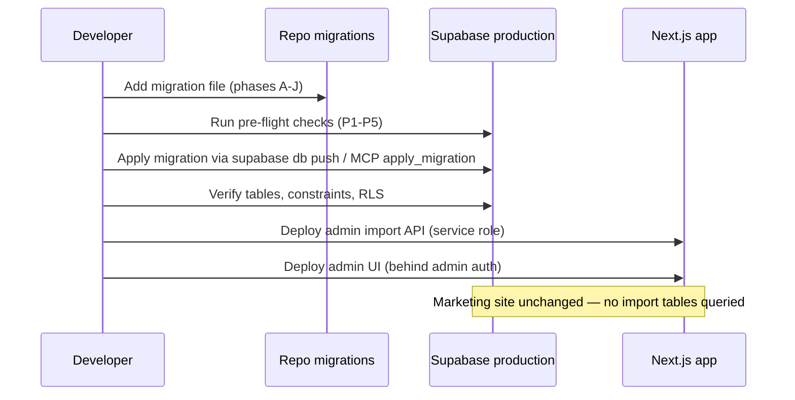

# EventPixels Sponsor Import — Migration Design Document

**Status:** Ready for implementation  
**Version:** v1  
**Last updated:** 2026-06-03  
**Prerequisite:** [Database Design Document](./sponsor-import-database-design.md) (approved)

This document defines **migration plan, ordering, dependencies, constraints, and rollout strategy**. It does **not** contain SQL.

---

## 1. Migration goals

| Goal | Success criteria |
|------|------------------|
| Add import workflow storage | 4 new `sponsor_import_*` tables with FKs and indexes |
| Protect live data integrity | `UNIQUE (event_editions_id, company_id)` on `event_sponsors` |
| Enforce business rules at DB layer | One active import per edition; draft/live separation |
| Zero public exposure of draft data | RLS denies `anon` and `authenticated` on import tables |
| Safe production rollout | Pre-flight checks pass; no downtime required for marketing site |
| Reversible planning | Rollback strategy documented per phase |

---

## 2. Pre-migration verification (read-only)

Run **before** any DDL is applied. Block migration if checks fail.

| # | Check | Expected (verified 2026-06-03) | On failure |
|---|-------|--------------------------------|------------|
| P1 | Duplicate `(event_editions_id, company_id)` in `event_sponsors` | **0 duplicate groups** (14 rows, 14 distinct pairs) | Stop; cleanup migration required first |
| P2 | NULL `event_editions_id` or `company_id` in `event_sponsors` | **0 rows** | Stop; fix data or exclude from constraint |
| P3 | `profiles` exists with `id` → `auth.users` | Table present | Stop; admin attribution FKs unsafe |
| P4 | `event_editions`, `companies` present | Tables present | Stop |
| P5 | Existing RLS on `event_sponsors` | Enabled | Note current policies; do not break |
| P6 | Supabase storage bucket for import files | Bucket exists or created in app deploy | App concern; not blocking DDL |

**Live data verdict:** P1 and P2 pass today — `UNIQUE` on `event_sponsors` is **safe to apply without data cleanup**.

---

## 3. Migration dependency graph

### 3.1 External dependencies

| Dependency | Required by |
|------------|-------------|
| `public.event_editions` | `sponsor_import_batches`, `sponsor_import_draft_links` |
| `public.profiles` | `sponsor_import_batches`, `sponsor_import_admin_action_logs`, row `decision_by` |
| `public.companies` | `sponsor_import_rows`, `sponsor_import_draft_links` |
| `public.event_sponsors` | Row `already_on_live_sponsor_id`; publish target; UNIQUE phase |

### 3.2 Circular FK resolution (rows ↔ draft_links)

`sponsor_import_rows.draft_link_id` → `sponsor_import_draft_links.id`  
`sponsor_import_draft_links.source_import_row_id` → `sponsor_import_rows.id`

**Migration strategy (single migration file, ordered steps):**

1. Create `sponsor_import_rows` **without** `draft_link_id` FK constraint (column nullable, no FK).
2. Create `sponsor_import_draft_links` **with** `source_import_row_id` FK → rows.
3. Add `draft_link_id` FK on rows → draft_links.

No circular creation problem if constraints are added in this order.

### 3.3 Self-FK on rows

`sponsor_import_rows.duplicate_of_row_id` → `sponsor_import_rows.id`

Add in Phase C as a table-level FK after table creation (same phase).

---

## 4. Migration phases (detailed)

### Phase A — Enum types

**Purpose:** Shared enums for batch status, row status, processing phase, match/decision enums, duplicate enums, action types.

**Objects:** PostgreSQL `ENUM` types (or `CHECK` constraints if project convention prefers — document assumes enums).

| Enum name (conceptual) | Values |
|------------------------|--------|
| `sponsor_import_batch_status` | `uploaded`, `review`, `draft`, `published`, `discarded` |
| `sponsor_import_processing_phase` | `parsing`, `validating`, `matching`, `importing_to_draft`, `publishing` |
| `sponsor_import_row_status` | `needs_review`, `auto_ready`, `resolved`, `excluded` |
| `sponsor_import_match_method` | `domain`, `slug`, `exact_name`, `fuzzy_name`, `manual` |
| `sponsor_import_match_confidence` | `high`, `medium`, `low` |
| `sponsor_import_conflict_type` | `domain_name_mismatch`, `uniqueness_violation`, `multiple_candidates` |
| `sponsor_import_decision_type` | `use_matched`, `create_new`, `choose_different`, `exclude` |
| `sponsor_import_decision_source` | `auto_accepted`, `admin_manual`, `bulk_action` |
| `sponsor_import_duplicate_role` | `canonical`, `duplicate` |
| `sponsor_import_duplicate_resolution` | `pending`, `kept`, `excluded` |
| `sponsor_import_intended_link_action` | `create_new_link`, `update_tier`, `skip` |
| `sponsor_import_source_file_format` | `xlsx`, `xls`, `csv` |
| `sponsor_import_action_type` | `upload`, `column_mapping_saved`, `validation_run`, `matching_run`, `bulk_accept_domain_matches`, `import_to_draft`, `review_acknowledged`, `publish`, `discard` |

**Dependencies:** None.

**Risk:** Enum values are immutable without migration — ensure list is complete for v1.

---

### Phase B — `sponsor_import_batches`

**Purpose:** Root import job table.

**Depends on:** Phase A, `event_editions`, `profiles`.

**Columns:** Per database design §5.1.

**Constraints:**

| Type | Definition |
|------|------------|
| PK | `id` |
| FK | `event_edition_id` → `event_editions.id` |
| FK | `created_by`, `published_by`, `discarded_by`, `review_acknowledged_by` → `profiles.id` |
| NOT NULL | `status`, `source_filename`, `source_file_storage_path`, `source_file_format`, `source_row_count`, `column_mapping`, `created_by`, `created_at`, `updated_at` |
| DEFAULT | `status = uploaded` (or set by app on insert) |

**Indexes:**

- `(event_edition_id, status)`
- `(status, created_at DESC)`
- `(created_by)`

**Triggers (optional v1):** `updated_at` auto-touch — match project convention.

---

### Phase C — `sponsor_import_rows`

**Purpose:** Per-row import state.

**Depends on:** Phase B, `companies`, `event_sponsors` (nullable FKs).

**Columns:** Per database design §5.2.

**Constraints:**

| Type | Definition |
|------|------------|
| PK | `id` |
| FK | `batch_id` → `sponsor_import_batches.id` ON DELETE CASCADE |
| FK | `proposed_company_id`, `resolved_company_id` → `companies.id` |
| FK | `decision_by` → `profiles.id` |
| FK | `duplicate_of_row_id` → `sponsor_import_rows.id` |
| FK | `already_on_live_sponsor_id` → `event_sponsors.id` |
| UNIQUE | `(batch_id, excel_row_number)` |
| NOT NULL | `status`, `validation_issues`, `has_blocking_validation`, `created_at`, `updated_at` |

**Deferred to Phase E:** FK `draft_link_id` → `sponsor_import_draft_links.id`.

**Indexes:**

- `(batch_id, status)`
- `(batch_id, has_blocking_validation)`
- `(batch_id, duplicate_cluster_key)`
- `(batch_id, duplicate_resolution)`
- `(normalized_domain)` — consider partial index WHERE `normalized_domain IS NOT NULL`

---

### Phase D — `sponsor_import_draft_links`

**Purpose:** Draft-only sponsor links.

**Depends on:** Phase B, Phase C, `event_editions`, `companies`.

**Constraints:**

| Type | Definition |
|------|------------|
| PK | `id` |
| FK | `batch_id` → `sponsor_import_batches.id` ON DELETE CASCADE |
| FK | `event_edition_id` → `event_editions.id` |
| FK | `company_id` → `companies.id` |
| FK | `source_import_row_id` → `sponsor_import_rows.id` |
| UNIQUE | `(batch_id, company_id)` |
| NOT NULL | `tier_rank`, `excluded_from_publish` (default false) |

**Indexes:**

- `(batch_id)`
- `(event_edition_id)`
- `(company_id)`

---

### Phase E — Cross-FK: `draft_link_id` on rows

**Purpose:** Complete row ↔ draft link lineage.

**Action:** Add FK constraint `sponsor_import_rows.draft_link_id` → `sponsor_import_draft_links.id`.

**On delete behavior:** `SET NULL` recommended (draft link deleted on discard should not cascade-delete row).

---

### Phase F — `sponsor_import_admin_action_logs`

**Purpose:** Append-only audit.

**Depends on:** Phase B, `profiles`.

**Constraints:**

| Type | Definition |
|------|------------|
| PK | `id` |
| FK | `batch_id` → `sponsor_import_batches.id` ON DELETE CASCADE |
| FK | `actor_id` → `profiles.id` |
| NOT NULL | `action_type`, `created_at` |

**Indexes:** `(batch_id, created_at DESC)`

---

### Phase G — `event_sponsors` live uniqueness

**Purpose:** Enforce one company per edition on live links.

**Depends on:** Pre-flight P1, P2 pass.

**Action:**

1. Confirm zero duplicates (re-run P1).
2. Add `UNIQUE (event_editions_id, company_id)`.
3. Confirm / add `NOT NULL` on both columns if not already enforced.

**Impact:**

- Existing app INSERT paths that could duplicate will fail — correct for import publish (must upsert).
- No change to existing 14 rows.

**Rollback note:** Dropping UNIQUE is safe if no duplicates were created in between.

---

### Phase H — One active import per edition

**Purpose:** DB enforcement of one-draft-per-edition policy.

**Action:** Partial unique index on `sponsor_import_batches`:

- **Columns:** `event_edition_id`
- **Predicate:** `status IN ('uploaded', 'review', 'draft')`

**Effect:** Second active batch for same edition rejected at insert/update.

**Interaction with discard:** Moving batch to `discarded` removes it from partial index predicate → new import allowed.

---

### Phase I — RLS on import tables

**Purpose:** Draft data never visible to public clients.

**Tables:** All four `sponsor_import_*` tables.

**Policy intent:**

| Role | Access |
|------|--------|
| `anon` | No policies (deny) |
| `authenticated` | No policies (deny) |
| `service_role` | Bypasses RLS (admin API) |

**Actions:**

1. `ALTER TABLE ... ENABLE ROW LEVEL SECURITY` on each import table.
2. Do **not** create permissive policies for `anon` / `authenticated`.
3. Match pattern used on `event_sponsors` (RLS on, client writes revoked).

---

### Phase J — Grants hardening

**Purpose:** Align with existing write model (service role only for import).

**Action:**

- `REVOKE ALL` on import tables from `anon`, `authenticated`.
- `GRANT ALL` to `service_role` only (or rely on service role bypass).

**Note:** Admin UI must use server-side API with service role — never direct client Supabase writes.

---

## 5. Recommended migration file strategy

### Option A — Single migration (recommended for v1)

One timestamped file in `supabase/migrations/` containing phases A–J in order.

| Pros | Cons |
|------|------|
| Atomic deploy | Larger rollback unit |
| No intermediate broken FK state | Harder to cherry-pick |

### Option B — Two migrations

| Migration | Phases |
|-----------|--------|
| `..._sponsor_import_tables.sql` | A–F (new tables) |
| `..._sponsor_import_constraints_rls.sql` | G–J (live UNIQUE, partial UNIQUE, RLS) |

| Pros | Cons |
|------|------|
| Isolate risky `event_sponsors` change | Two deploy steps |

**Recommendation:** **Option A** for v1 — pre-flight confirms live data is clean; single deploy is simpler.

---

## 6. Constraint summary (quick reference)

| Table | Constraint | Type |
|-------|------------|------|
| `sponsor_import_batches` | `id` | PK |
| `sponsor_import_batches` | `(event_edition_id)` WHERE active status | Partial UNIQUE |
| `sponsor_import_rows` | `id` | PK |
| `sponsor_import_rows` | `(batch_id, excel_row_number)` | UNIQUE |
| `sponsor_import_draft_links` | `id` | PK |
| `sponsor_import_draft_links` | `(batch_id, company_id)` | UNIQUE |
| `event_sponsors` | `(event_editions_id, company_id)` | UNIQUE |
| All import tables | RLS enabled, no client policies | Security |

---

## 7. Rollout strategy

### 7.1 Deployment sequence

### 7.2 Environment order

| Step | Environment | Action |
|------|-------------|--------|
| 1 | Local / branch DB | Apply migration; smoke test |
| 2 | Staging (if available) | Apply migration; run import E2E |
| 3 | Production | Pre-flight → apply migration |
| 4 | Production | Deploy application code |

**Rule:** Apply migration **before** or **with** first admin import code deploy. Migration alone does not affect public site.

### 7.3 Feature exposure

| Layer | v1 rollout |
|-------|------------|
| Database | Always applied (empty tables) |
| Admin API | Deploy with service-role routes |
| Admin UI | Gate behind `profiles.role` admin check |
| Public site | No changes |

No feature flag required for public traffic — import tables are invisible to marketing queries.

### 7.4 Post-migration verification

| # | Verification | Method |
|---|--------------|--------|
| V1 | Four tables exist | `\dt sponsor_import_*` or MCP list_tables |
| V2 | Partial unique index exists | Catalog inspection |
| V3 | `event_sponsors` UNIQUE exists | Catalog inspection |
| V4 | RLS enabled on import tables | `pg_tables.rowsecurity` |
| V5 | Insert smoke test via service role | Create batch → row → draft link → discard |
| V6 | Anon cannot SELECT import tables | Client SDK test expect permission denied |
| V7 | Duplicate live insert fails | Service role test insert duplicate pair → expect error |
| V8 | Second active batch same edition fails | Insert two `review` batches same edition → expect error |

---

## 8. Rollback strategy

| Scenario | Rollback action | Data impact |
|----------|-----------------|-------------|
| Migration failed mid-file | Fix SQL; re-run (transaction wraps single migration) | No partial state if transactional |
| Migration applied; app not deployed | Import tables empty; optional drop migration | None on live sponsors |
| App bugs after deploy | Fix app; data in import tables remains | Draft links may need manual discard |
| UNIQUE on `event_sponsors` causes app errors | Fix upsert logic; only drop UNIQUE if emergency | Risk of duplicates if dropped |
| Must fully revert schema | New migration: drop import tables (CASCADE), drop UNIQUE, drop enums | **Loses import history** |

**Production rule:** Prefer forward fixes. Full schema revert only if zero import batches in production.

---

## 9. Risks and mitigations

| Risk | Likelihood | Mitigation |
|------|------------|------------|
| Future duplicate live rows before UNIQUE | Low | Apply migration promptly; publish uses upsert |
| Enum typo | Medium | Review enum list against design doc before SQL |
| Circular FK migration order wrong | Medium | Follow Phase C → D → E strictly |
| Partial unique blocks legitimate workflow | Low | Ensure `discarded` / `published` clear the predicate |
| Admin uses client SDK directly | Medium | Revoke grants (Phase J); API only |
| Large batch insert performance | Medium | Indexes on `(batch_id, status)`; batch inserts in app |
| `profiles` missing for admin | Low | Ensure admin users have profile rows before import |
| Storage path in batch without bucket | Medium | Create bucket in app infra before first upload |

---

## 10. What this migration explicitly does NOT include

| Item | When |
|------|------|
| `sponsor_import_tier_label_mappings` | v1.1 |
| `sponsor_import_duplicate_groups` | v1.1 |
| `companies.created_by_import_batch_id` | v1.1 |
| Apollo enrichment tables | v1.1 |
| Changes to `event_editions` or `companies` columns | — |
| Supabase Storage bucket creation | App / infra deploy |
| Admin UI or API routes | Application PR |

---

## 11. Implementation checklist (migration author)

- [ ] Pre-flight P1–P5 documented in PR
- [ ] Single migration file with phases A–J in order
- [ ] Enums match design doc exactly
- [ ] `draft_link_id` FK added only in Phase E
- [ ] Partial unique index predicate matches three active statuses
- [ ] RLS enabled; no anon/authenticated policies on import tables
- [ ] Grants revoked from anon/authenticated
- [ ] `event_sponsors` UNIQUE applied after P1 re-check
- [ ] Post-migration V1–V8 verification recorded
- [ ] Application deploy plan noted in PR

---

## 12. Document history

| Date | Change |
|------|--------|
| 2026-06-03 | Initial migration design for simplified v1 (4 tables) |

---

## 13. Related documents

| Document | Path |
|----------|------|
| Database design (approved) | [sponsor-import-database-design.md](./sponsor-import-database-design.md) |
| Documentation index | [README.md](./README.md) |
