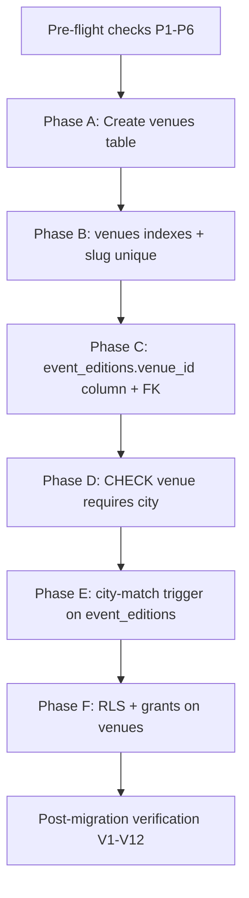
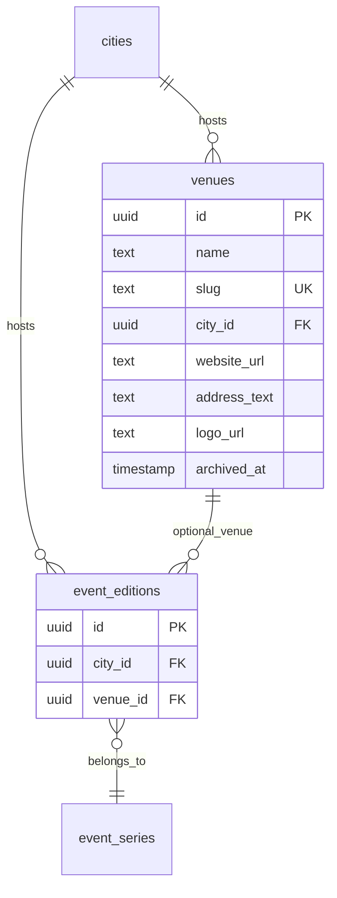
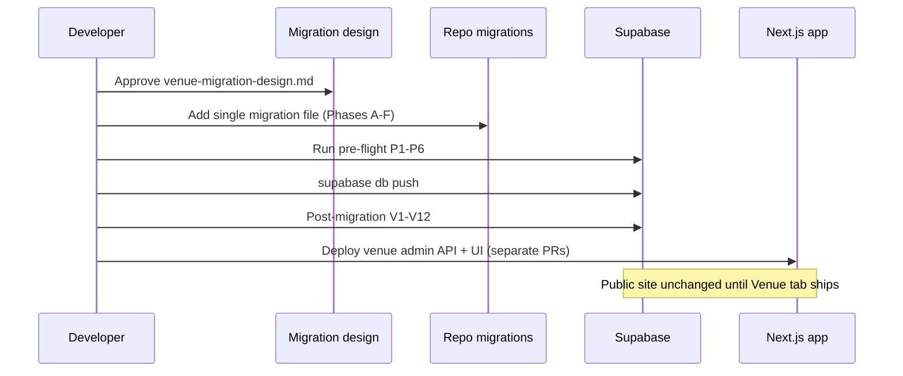

# EventPixels Venue — Migration Design Document

**Status:** Approved  
**Version:** v1  
**Last updated:** 2026-06-25  
**Prerequisites:** [Venue Design](./venue-design.md) (approved), [Phase — Venue v1 Scope](./phase-venue-scope.md) (approved)

This document defines the **migration plan, ordering, dependencies, constraints, RLS, and rollout strategy** for Venue v1. It does **not** contain SQL.

For entity boundaries and product rules, see [venue-design.md](./venue-design.md). For application deliverables, see [phase-venue-scope.md](./phase-venue-scope.md).

---

## 1. Migration goals

| Goal | Success criteria |
|------|------------------|
| Add reusable venue catalog | `venues` table with approved v1 columns |
| Link editions to venues optionally | Nullable `event_editions.venue_id` FK |
| Protect historical event data | `ON DELETE RESTRICT` on edition→venue and venue→city FKs; no cascade that drops editions |
| Enforce geographic consistency | Edition `city_id` matches venue `city_id` when `venue_id` is set (DB + app) |
| Public read for marketing embeds | RLS: anon/authenticated `SELECT` on `venues`; no client writes |
| Archive-only lifecycle | `archived_at` column; no hard-delete path in v1 |
| Zero automatic data mutation | No backfill of `venue_id`; existing editions unchanged |
| Safe production rollout | Pre-flight checks pass; marketing site unaffected until app deploy |

---

## 2. Pre-migration verification (read-only)

Run **before** any DDL is applied. Block migration if checks fail.

| # | Check | Expected | On failure |
|---|-------|----------|------------|
| P1 | `public.cities` exists with `id` PK | Table present | Stop — `venues.city_id` FK unsafe |
| P2 | `public.event_editions` exists with `city_id` column | Column present (nullable OK) | Stop — city-match rules incomplete |
| P3 | Orphan `event_editions.city_id` values | **0 rows** where `city_id` IS NOT NULL and not in `cities` | Stop — clean data before FK-related triggers |
| P4 | `event_editions` RLS pattern | RLS enabled; anon/authenticated SELECT | Note — mirror for `venues` |
| P5 | `event_series` / `companies` catalog RLS | Public SELECT, no client writes | Pattern reference for `venues` |
| P6 | Existing `event_editions` row count | Record baseline | Post-migration: same count; all `venue_id` NULL |

**Live data verdict:** Migration is **additive only** — no existing column types change, no row updates required. P3 is the only data-quality gate.

---

## 3. Migration dependency graph



### 3.1 External dependencies

| Dependency | Required by |
|------------|-------------|
| `public.cities` | `venues.city_id` FK |
| `public.event_editions` | `event_editions.venue_id` FK |
| Supabase Storage `COMPANY_LOGO_BUCKET` | **Not** migration — app deploy for logo upload |

### 3.2 Ordering rationale

1. Create `venues` **before** adding `event_editions.venue_id` (FK target must exist).
2. Add `venue_id` column **before** city-match trigger (trigger references both tables).
3. Apply RLS **after** table and column exist.

No circular FK problem in v1.

---

## 4. Migration phases (detailed)

### Phase A — `venues` table

**Purpose:** First-class venue catalog entity.

**Depends on:** P1 (`cities`).

**Columns:**

| Column | Type (conceptual) | Nullable | Default | Notes |
|--------|-------------------|----------|---------|-------|
| `id` | uuid | NO | `gen_random_uuid()` | PK |
| `name` | text | NO | — | Display name |
| `slug` | text | NO | — | Globally unique |
| `city_id` | uuid | NO | — | FK → `cities.id` |
| `website_url` | text | YES | — | |
| `address_text` | text | YES | — | |
| `logo_url` | text | YES | — | Storage URL or path; no DB object |
| `archived_at` | `timestamp without time zone` | YES | — | NULL = active; **match catalog nullable timestamps** |
| `created_at` | `timestamp without time zone` | NO | `now()` | Match `event_editions` / `event_series` catalog columns |
| `updated_at` | `timestamp without time zone` | NO | `now()` | **Application-maintained** on admin writes — see §4.1.1 |

**Explicitly excluded:** `description`, `latitude`, `longitude`, `google_place_id`, map URL, capacity, type.

**Constraints:**

| Type | Definition |
|------|------------|
| PK | `id` |
| FK | `city_id` → `cities.id` **ON DELETE RESTRICT** |
| NOT NULL | `name`, `slug`, `city_id`, `created_at`, `updated_at` |

**Duplicate names:** **No** `UNIQUE (name, city_id)` — duplicate names in same city are allowed (admin warning only per design).

**ON DELETE RESTRICT on `city_id`:** Prevents deleting a `cities` row that still has venues. City admin is out of scope; protects referential integrity.

#### 4.1.1 Timestamp and `updated_at` conventions (locked)

| Column | Type | Maintenance |
|--------|------|-------------|
| `archived_at` | `timestamp without time zone` | Set/cleared by archive/unarchive admin routes |
| `created_at` | `timestamp without time zone` | DB default `now()` on insert |
| `updated_at` | `timestamp without time zone` | **Application** sets on every admin write (PATCH, archive, unarchive, logo upload) |

**No** `BEFORE UPDATE` trigger on `venues` for `updated_at` — matches `event_series` admin pattern (existing catalog migrations do not add per-table `updated_at` triggers; admin server modules own the touch).

---

### Phase B — `venues` indexes

**Purpose:** Query performance for admin list, picker, and joins.

| Index | Columns | Type | Rationale |
|-------|---------|------|-----------|
| `venues_slug_unique` | `slug` | **UNIQUE** | Globally unique slug (design locked) |
| `venues_city_id_idx` | `city_id` | B-tree | Edition venue picker filters by city |
| `venues_active_by_city_idx` | `city_id` | Partial: `WHERE archived_at IS NULL` | Active-venue picker (preferred over standalone `archived_at` index) |
| `venues_archived_at_idx` | `archived_at` | B-tree (optional) | Admin “Show archived” list — add if list queries are slow |

**Recommendation:** Partial index on `(city_id) WHERE archived_at IS NULL` is the highest-value index for picker hot path.

---

### Phase C — `event_editions.venue_id`

**Purpose:** Optional link from edition to venue.

**Depends on:** Phase A (`venues` exists).

**Column addition:**

| Table | Column | Nullable | References |
|-------|--------|----------|------------|
| `event_editions` | `venue_id` | YES | `venues.id` |

**FK behavior (locked):**

| FK | ON DELETE | Rationale |
|----|-----------|-----------|
| `event_editions.venue_id` → `venues.id` | **RESTRICT** | If a venue row were deleted, editions must not lose FK silently; v1 has no delete, but RESTRICT protects historical `event_editions` rows |

**No `ON DELETE SET NULL`:** Would mask destructive deletes; inconsistent with historical-fidelity design.

**Index:**

| Index | Columns | Rationale |
|-------|---------|-----------|
| `event_editions_venue_id_idx` | `venue_id` | Linked-edition counts; venue detail joins |

**Post-migration data state:** All existing rows have `venue_id = NULL` (column default NULL; no UPDATE script).

---

### Phase D — CHECK: venue requires city on edition

**Purpose:** Enforce rule: `venue_id` may not be set without `city_id`.

**Table:** `event_editions`

**Constraint (conceptual):**

```
venue_id IS NULL  OR  city_id IS NOT NULL
```

**Depends on:** Phase C (`venue_id` column exists).

**Rationale:** Geographic anchor is edition `city_id`; venue is optional refinement within that city.

---

### Phase E — City-match enforcement (locked)

When `event_editions.venue_id` IS NOT NULL, `event_editions.city_id` must equal `venues.city_id` for the referenced venue. A `CHECK` constraint cannot reference another table — enforcement uses **both** layers below.

| Layer | Mechanism | Scope |
|-------|-----------|-------|
| **Database** | `BEFORE INSERT OR UPDATE` trigger on `event_editions` | When `NEW.venue_id IS NOT NULL`: require `NEW.city_id IS NOT NULL` and `NEW.city_id = (SELECT city_id FROM venues WHERE id = NEW.venue_id)` |
| **Application** | Admin API validation on edition create/update | Same rules; user-facing error messages |
| **Database** | Phase D CHECK | `venue_id` implies `city_id` present |

**Trigger failure message:** Raise exception with clear text (e.g. edition city must match venue city).

**Application-only in v1 (not trigger):**

| Rule | Layer |
|------|-------|
| Cannot **newly attach** archived venue (`venues.archived_at IS NOT NULL`) | Application |
| Cannot change `venues.city_id` when editions linked | **Application only** — venue admin API rejects; no DB trigger on `venues` in v1 |
| Duplicate venue name warning | Application |

**Deferred to v1.1 (optional):** `BEFORE UPDATE` trigger on `venues` rejecting `city_id` changes when linked editions exist.

---

### Phase F — RLS and grants on `venues`

**Purpose:** Public read for edition Venue tab embeds; admin writes via service role only.

**Pattern:** Mirror `event_series` / `event_editions` from [20260514180000_rls_tiered_sponsors_public_reads.sql](../supabase/migrations/20260514180000_rls_tiered_sponsors_public_reads.sql).

| Role | Access |
|------|--------|
| `anon` | `SELECT` (policy: `USING (true)`) |
| `authenticated` | `SELECT` (policy: `USING (true)`) |
| `anon`, `authenticated` | **No** INSERT, UPDATE, DELETE |
| `service_role` | Bypasses RLS (admin API) |

**Actions:**

1. `ALTER TABLE venues ENABLE ROW LEVEL SECURITY`
2. Create `venues_select_anon_all` and `venues_select_authenticated_all` policies
3. `REVOKE ALL` on `venues` from `anon`, `authenticated`
4. `GRANT SELECT` on `venues` to `anon`, `authenticated`

**Archive visibility:** RLS does **not** filter `archived_at`. Public SELECT returns archived venues when embedded via `event_editions.venue_id` (historical pages). Picker exclusion is **application query** (`WHERE archived_at IS NULL`), not RLS.

**No hard delete in v1:** Do not grant DELETE to service role via policies; admin API simply omits delete. RESTRICT FKs provide additional safety if DELETE were attempted.

---

## 5. Constraint summary (quick reference)

| Table | Constraint | Type |
|-------|------------|------|
| `venues` | `id` | PK |
| `venues` | `slug` | UNIQUE |
| `venues` | `city_id` → `cities.id` | FK, ON DELETE RESTRICT |
| `venues` | `name`, `slug`, `city_id`, timestamps | NOT NULL |
| `venues` | `(name, city_id)` | **Not unique** (warnings only) |
| `event_editions` | `venue_id` → `venues.id` | FK, nullable, ON DELETE RESTRICT |
| `event_editions` | `venue_id IS NULL OR city_id IS NOT NULL` | CHECK |
| `event_editions` | city = venue city when `venue_id` set | TRIGGER (Phase E) |
| `venues` | RLS enabled; SELECT for anon/auth | Security |

---

## 6. Entity relationship (post-migration)



---

## 7. Archive lifecycle (database perspective)

| Action | Database behavior |
|--------|-------------------|
| Archive | `UPDATE venues SET archived_at = now()` via admin API |
| Unarchive | `UPDATE venues SET archived_at = NULL` |
| Hard delete | **Not supported** — no admin path; `ON DELETE RESTRICT` if editions reference venue |
| Edition keeps `venue_id` after archive | **Allowed** — no FK change on archive |
| Public read of archived venue | **Allowed** — RLS SELECT unrestricted; embed via edition |
| New edition attachment to archived venue | **Blocked in app** — not RLS (would break historical UPDATE paths) |

**Index interaction:** Archived rows drop out of partial index `WHERE archived_at IS NULL`; picker queries use that index.

---

## 8. Logo storage (migration boundary)

Logo assets are **not** stored in Postgres beyond `venues.logo_url` text.

| Aspect | Migration | Application (later) |
|--------|-----------|---------------------|
| Column | `venues.logo_url` nullable text | — |
| Storage bucket | **No DDL** | Reuse `COMPANY_LOGO_BUCKET` |
| Object path (locked) | — | `venues/{venueId}/logo.{ext}` |
| Pattern reference | — | Event Series logo (`eventSeriesLogoStorage.ts`) |

**Migration author:** Do **not** create buckets, storage policies, or storage RLS in the venue migration.

**Storage policy (locked):** Confirm `COMPANY_LOGO_BUCKET` policies allow `venues/*` object paths during **application implementation** ([phase-venue-scope.md](./phase-venue-scope.md) §4) — out of scope for this migration design.

---

## 9. Rollout strategy

### 9.1 Deployment sequence



### 9.2 Environment order

| Step | Environment | Action |
|------|-------------|--------|
| 1 | Local / branch DB | Pre-flight → apply migration → verify |
| 2 | Staging (if available) | Apply migration; smoke test admin API |
| 3 | Production | Pre-flight → apply migration |
| 4 | Production | Deploy application code per [phase-venue-scope.md](./phase-venue-scope.md) |

**Rule:** Apply migration **before** or **with** first code that reads/writes `venues` or `event_editions.venue_id`.

### 9.3 Data rollout (locked)

| Rule | Policy |
|------|--------|
| Backfill `event_editions.venue_id` | **No** |
| Seed venues from existing data | **No** |
| Existing editions | `venue_id` remains NULL until manual admin assignment |
| Existing city/location display | Unchanged |

### 9.4 Feature exposure

| Layer | After migration alone |
|-------|------------------------|
| Database | Empty `venues` table; `venue_id` column all NULL |
| Public marketing site | **No change** — no code reads `venue_id` yet |
| Admin | **No change** until app deploy |

No feature flag required for public traffic pre-app-deploy.

---

## 10. Migration file strategy (locked)

**Single migration file** — one timestamped file in `supabase/migrations/` containing Phases A–F in order.

| Property | Value |
|----------|-------|
| Files | **1** (not split) |
| Contents | Phases A → B → C → D → E → F |
| Filename pattern | `YYYYMMDDHHMMSS_venues_v1.sql` (timestamp at authoring time) |

Split migrations (table first, `venue_id` second) are **not** used for v1.

---

## 11. Post-migration verification checklist

### Schema checks (V1–V6)

| # | Verification | Method |
|---|--------------|--------|
| V1 | `venues` table exists with approved columns | `\d venues` or MCP `list_tables` |
| V2 | `event_editions.venue_id` exists, nullable | Column inspection |
| V3 | `venues.slug` unique index exists | Catalog inspection |
| V4 | `venues_city_id` / partial active index exists | Catalog inspection |
| V5 | `event_editions_venue_id_idx` exists | Catalog inspection |
| V6 | CHECK `venue_id → city_id` exists | Catalog inspection |

### RLS checks (V7–V8)

| # | Verification | Method |
|---|--------------|--------|
| V7 | RLS enabled on `venues`; SELECT policies for anon + authenticated | `pg_tables.rowsecurity` + policy list |
| V8 | Anon can SELECT `venues`; anon INSERT denied | Supabase client smoke test |

### City-match checks (V9–V10)

| # | Verification | Method |
|---|--------------|--------|
| V9 | Insert edition with `venue_id` and mismatched `city_id` fails | Service role or API test → expect error |
| V10 | Insert edition with `venue_id` and matching `city_id` succeeds | Service role test |
| V11 | Insert edition with `venue_id` and NULL `city_id` fails | CHECK + trigger |

### Archive behavior checks (V12–V14)

| # | Verification | Method |
|---|--------------|--------|
| V12 | Archive venue (`archived_at` set) — row still SELECTable | Anon SELECT by id |
| V13 | Edition with archived `venue_id` still readable | Join embed test |
| V14 | `DELETE FROM venues` where editions reference → RESTRICT error | Service role test (expect failure) |

### Regression (V15)

| # | Verification | Method |
|---|--------------|--------|
| V15 | All existing `event_editions` rows have `venue_id IS NULL` | `COUNT(*) WHERE venue_id IS NOT NULL` = 0 post-migration |

---

## 12. Rollback strategy

| Scenario | Rollback action | Data impact |
|----------|-----------------|-------------|
| Migration failed mid-file | Fix SQL; re-run in transaction | No partial state if transactional |
| Migration applied; app not deployed | Schema only; optional drop migration | No user-facing impact |
| App bugs after deploy | Fix app forward | Venue rows may exist; editions may have `venue_id` |
| Must fully revert schema | New migration: drop `event_editions.venue_id`, drop trigger, drop `venues` | **Loses venue data** if any created |

**Production rule:** Prefer forward fixes. Full schema revert only if zero production venue rows and zero non-null `venue_id`.

**Rollback order (if required):**

1. Drop city-match trigger on `event_editions`
2. Drop CHECK constraint
3. Drop `event_editions.venue_id` column
4. Drop `venues` table

---

## 13. Risks and mitigations

| Risk | Likelihood | Mitigation |
|------|------------|------------|
| Orphan `event_editions.city_id` (P3) | Low | Pre-flight check; fix before migrate |
| City-match trigger blocks legitimate bulk ops | Low | Trigger only fires when `venue_id` IS NOT NULL |
| Service role inserts inconsistent row bypassing app | Low | Trigger enforces match at DB layer |
| Accidental venue DELETE via SQL console | Low | RESTRICT FK + no delete API |
| Archived venue attached to new edition | Medium | App validation on edition write; document in API tests |
| `venues.city_id` changed when editions linked | Medium | **Application-only** in v1 — venue admin API rejects |
| Timestamp type mismatch | — | **Resolved** — `timestamp without time zone` for all venue timestamps |
| Logo bucket/path mismatch | Low | Storage policy confirmed at app deploy; not in migration |
| Partial index not used by query planner | Low | Verify picker query uses `archived_at IS NULL` predicate |

---

## 14. Resolved migration decisions

| # | Topic | Resolution (locked) |
|---|-------|-------------------|
| 1 | Migration file count | **Single file** — Phases A–F in one migration |
| 2 | City-match enforcement | **Database trigger** on `event_editions` **plus** application validation |
| 3 | `venues.city_id` when editions linked | **Application only** in v1 — no DB trigger on `venues` |
| 4 | `archived_at` type | `timestamp without time zone` — match catalog table conventions |
| 5 | `updated_at` behavior | Application sets on admin writes; **no** DB trigger — match `event_series` convention |
| 6 | Storage policy for `venues/*` | Confirm during **app implementation** — **not** in migration |

No open migration decisions remain.

---

## 15. What this migration explicitly does NOT include

| Item | When / where |
|------|----------------|
| SQL in this document | Migration file only |
| Application code | [phase-venue-scope.md](./phase-venue-scope.md) |
| `venue_id` backfill or venue seed data | Never in v1 |
| `UNIQUE (venues.name, city_id)` | Not planned — warnings only |
| Hard delete API or `ON DELETE CASCADE` to editions | Not in v1 |
| Coordinates, place IDs, map URLs | Not in schema |
| Supabase Storage bucket / `venues/*` policies | App implementation — not migration |
| RLS changes on `event_editions` | Unchanged |
| Exhibitors tables or tabs | Out of scope |
| Venue merge / dedupe schema | Out of scope |

---

## 16. Implementation checklist (migration author)

- [ ] Pre-flight P1–P6 documented in PR
- [ ] Single migration file Phases A–F in order
- [ ] `venues` columns match design doc exactly
- [ ] `slug` UNIQUE; **no** `(name, city_id)` UNIQUE
- [ ] FK `venues.city_id` → `cities` ON DELETE RESTRICT
- [ ] FK `event_editions.venue_id` → `venues` ON DELETE RESTRICT
- [ ] CHECK: `venue_id IS NULL OR city_id IS NOT NULL`
- [ ] City-match trigger on `event_editions`
- [ ] `archived_at`, `created_at`, `updated_at` use `timestamp without time zone`
- [ ] No `updated_at` DB trigger on `venues`
- [ ] Partial index `(city_id) WHERE archived_at IS NULL`
- [ ] RLS + grants mirror `event_series`
- [ ] No data backfill scripts in migration
- [ ] Post-migration V1–V15 recorded
- [ ] Application deploy plan noted in PR

---

## 17. Document maintenance

**Migration design approval (2026-06-25):** Status set to **Approved**. Remaining steps:

1. Author single migration SQL file per §10.
2. Run pre-flight P1–P6 and post-migration V1–V15.
3. Update [phase-venue-scope.md](./phase-venue-scope.md) §16 and [README.md](./README.md) when migration is applied.
4. Update [project-state.md](./project-state.md) when schema is live.

---

## 18. Related documents

| Document | Path |
|----------|------|
| Venue design (approved) | [venue-design.md](./venue-design.md) |
| Venue implementation scope (approved) | [phase-venue-scope.md](./phase-venue-scope.md) |
| Sponsor import migration (pattern reference) | [sponsor-import-migration-design.md](./sponsor-import-migration-design.md) |
| Sponsor import database design (style reference) | [sponsor-import-database-design.md](./sponsor-import-database-design.md) |
| Location scope | [phase-1.1-location-scope.md](./phase-1.1-location-scope.md) |
| Project state | [project-state.md](./project-state.md) |

---

**End of venue migration design (approved).**
